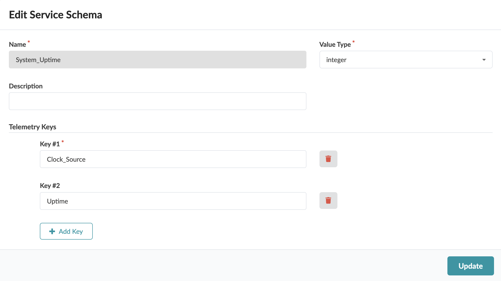
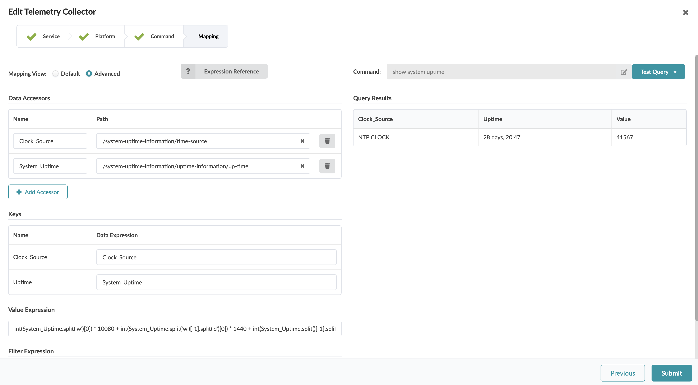

# Device Uptime

Table of Contents:
- [Device Uptime](#device-uptime)
  - [Description of the use-case](#description-of-the-use-case)
  - [Identification of the source data (raw data)](#identification-of-the-source-data-raw-data)
  - [Content](#content)
    - [Configlets](#configlets)
    - [Property Sets](#property-sets)
    - [Telemetry Service Schema](#telemetry-service-schema)
    - [Telemetry Collectors](#telemetry-collectors)
    - [Probes](#probes)
    - [Widgets](#widgets)
    - [Dashboards](#dashboards)

<br>

## Description of the use-case

- Collect device's system uptime for all devices in my blueprint, raise an anomaly if the device rebooted in the last 1h, one day, or one week. 
- Store the historical result so I can see when the anomalies occurred.

<br>

## Identification of the source data (raw data)

- CLI Command: `show system uptime` - [Junos documentation page](https://www.juniper.net/documentation/us/en/software/junos/junos-overview/topics/ref/command/show-system-uptime.html#:~:text=The%20show%20system%20uptime%20command%20by%20itself%20shows%20system%2Dwide,%7C%20re1%20%7C%20fpc0%20%7C%20all%20). 
- Sample Text Output:
```
Current time: 2023-12-14 11:31:56 UTC
Time Source:  LOCAL CLOCK 
System booted: 2023-10-30 17:31:27 UTC (6w2d 18:00 ago)
Protocols started: 2023-10-30 17:32:34 UTC (6w2d 17:59 ago)
Last configured: 2023-12-06 10:46:26 UTC (1w1d 00:45 ago) by aosadmin
11:31AM  up 44 days, 18 hrs, 0 users, load averages: 1.30, 0.95, 0.83
```

<details>
    <summary>Sample XML Output:</summary>

```xml
<rpc-reply xmlns:junos="http://xml.juniper.net/junos/23.2R1.14/junos">
    <system-uptime-information xmlns="http://xml.juniper.net/junos/23.2R0/junos">
        <current-time>
            <date-time junos:seconds="1702553555">2023-12-14 11:32:35 UTC</date-time>
        </current-time>
        <time-source> LOCAL CLOCK </time-source>
        <system-booted-time>
            <date-time junos:seconds="1698687087">2023-10-30 17:31:27 UTC</date-time>
            <time-length junos:seconds="3866468">6w2d 18:01</time-length>
        </system-booted-time>
        <protocols-started-time>
            <date-time junos:seconds="1698687154">2023-10-30 17:32:34 UTC</date-time>
            <time-length junos:seconds="3866401">6w2d 18:00</time-length>
        </protocols-started-time>
        <last-configured-time>
            <date-time junos:seconds="1701859586">2023-12-06 10:46:26 UTC</date-time>
            <time-length junos:seconds="693969">1w1d 00:46</time-length>
            <user>aosadmin</user>
        </last-configured-time>
        <uptime-information>
            <date-time junos:seconds="1702553555">11:32AM</date-time>
            <up-time junos:seconds="3866460">44 days, 18:01</up-time>
            <active-user-count junos:format="0 users">0</active-user-count>
            <load-average-1>1.24</load-average-1>
            <load-average-5>0.97</load-average-5>
            <load-average-15>0.84</load-average-15>
            <user-table>
            </user-table>
        </uptime-information>
    </system-uptime-information>
    <cli>
        <banner></banner>
    </cli>
</rpc-reply>
```
</details>
  
<br>

- Fields of interest:

| Field | Information |
| --- | --- |
| `Time Source` | Time source that the system is locked to. Possible values are `LOCAL CLOCK`, `NTP CLOCK`. |
| `System booted` | Time system was last booted. |

<br>

## Content

### Configlets
- No configlet  used in this example.

<br>

### Property Sets
- No Property Sets  used in this example.

<br>

### Telemetry Service Schema 
```
├── telemetry-service-definitions
    └── system-uptime-System_Uptime.json
```



<br>

### Telemetry Collectors
```
├── telemetry-collectors
    └── system-uptime-System_Uptime.json
```



- Pay attention to the expression used in the `Value` and the logic to convert the text string provided by the `/system-uptime-information/uptime-information/up-time` XML path into an integer value representing the total count of minutes. This conversion is required for the probe pipeline to be able to reason about the value and perfrom calculaiton on it so it can raise anoamlies in the specificed SLAs.
```python
int(re_search(r'(\d+)(?=w)', System_Uptime) or 0) * 10080 
+ int(re_search(r'(\d+)(?=\sd)', System_Uptime) or 0) * 1440 
+ int(re_search(r'(\d+)(?=:)', System_Uptime.split()[-1]) or 0) * 60 
+ int(re_search(r'(?<=:)(\d+)', System_Uptime.split()[-1]) or 0) if 'w' in System_Uptime or 'd' in System_Uptime or ':' in System_Uptime else int(re_search(r'(\d+)(?=\smins)', System_Uptime) or 0)
```
- The lentgh and complexity of the expression is due to the variety of different formats returned by the `/system-uptime-information/uptime-information/up-time` XML path, such as "24 days, 23:45", "1w2d 00:26:08", "2d 00:26:08", "00:26:08", "36 mins".  Therefore, the expression must be written in a way such that it can correctly handle different formats and make sure each part of the time (weeks, days, hours, and minutes) is accurately extracted and calculated.
  - **Week Calculation**: The expression first looks for a number followed by the letter `w`, indicating weeks. It uses a regular expression `(re_search(r'(\d+)(?=w)', System_Uptime))` to find this number. If found, this number is multiplied by `10080`, which is the number of minutes in a week.
  - **Day Calculation**: Similarly, it searches for a number followed by `d` (for days) using `re_search(r'(\d+)(?=\sd)', System_Uptime)`. If a day component is found, it multiplies this number by `1440`, the number of minutes in a day.
  - **Hour and Minute Calculation**: The expression then handles the time portion, which is expected in an `"hh:mm"` format. This is done by splitting the string on spaces and focusing on the last part `(System_Uptime.split()[-1])`, which should contain the time. It extracts hours using `re_search(r'(\d+)(?=:)', System_Uptime.split()[-1])` and minutes using `re_search(r'(?<=:)(\d+)', System_Uptime.split()[-1])`, multiplying hours by `60` to convert them to minutes.
  - **Conditional Logic**: The expression uses a conditional statement to check if `w`, `d`, or `:` are present in `System_Uptime`. If any of these characters are present, it processes the string as described above.
  - Handling `"xx mins"`Format: If none of the characters `('w', 'd', ':')` are present, the expression assumes the format might be a simple minute representation like `"xx mins"`. It then searches for a number followed by `" mins"` using `re_search(r'(\d+)(?=\smins)', System_Uptime)` and takes this value as the total minutes.
  - **Default Case**: In all these operations, if a particular time component (**weeks**, **days**, **hours**, **minutes**) is not found, or 0 is used to ensure that the expression defaults to `0` instead of causing an error.

<br>

### Probes
```
├── probes
    └── device-uptime.json
```
- Source Processor configuration:


- IBA Probe pipeline representaiton:
  - To implement the anomaly raising logic for reboot in last **1h** / **1 day** / **1 week** without duplicating the anomalies (i.e having a device which rebooted 45mn ago to appear in both 1h and 1day) we will configure the Range check processors in secitons: one section for uptime <= `60` mn, a second section for uptime > `60` mn and <= `1440` mn (total minutes count for a **day**) and a third seciton  for uptime > `1440` mn and <= `10080` mn (total minutes count for a **week**).


<br>

- IBA Probe stage view:


<br>

### Widgets
```
└── widgets
    ├── system-rebooted-in-last-day.json
    ├── system-rebooted-in-last-hour.json
    └── system-rebooted-in-last-week.json
```


<br>

### Dashboards

```
├── dashboards
    └── system-rebooted-in-last-history.json
```
