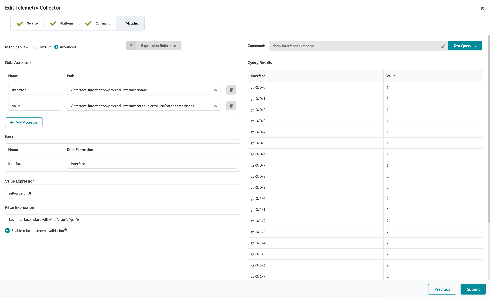

# Interface Flap

## Description of the use-case

- xxx
- xxx

## Identification of the source data (raw data)
- CLI Command: `show interface extensive` - [Junos documentation page](https://www.juniper.net/documentation/us/en/software/junos/interfaces-ethernet-switches/topics/ref/command/show-interfaces-extensive.html). 
- Sample Text Output:
```
Physical interface: gr-0/0/0, Enabled, Physical link is Up
  Interface index: 645, SNMP ifIndex: 503, Generation: 136
  Type: GRE, Link-level type: GRE, MTU: Unlimited, Speed: 800mbps
  Hold-times     : Up 0 ms, Down 0 ms
  Device flags   : Present Running
  Interface flags: Point-To-Point SNMP-Traps
  Statistics last cleared: Never
  Traffic statistics:
   Input  bytes  :                    0                    0 bps
   Output bytes  :                    0                    0 bps
   Input  packets:                    0                    0 pps
   Output packets:                    0                    0 pps
   IPv6 transit statistics:
   Input  bytes  :                    0
   Output bytes  :                    0
   Input  packets:                    0
   Output packets:                    0

Physical interface: pfe-0/0/0, Enabled, Physical link is Up
  Interface index: 648, SNMP ifIndex: 505, Generation: 139
  Type: Unspecified, Link-level type: Unspecified, MTU: 0, Clocking: Unspecified, Speed: 800mbps
  Device flags   : Present Running
  Link type      : Unspecified
  Link flags     : None
  Physical info  : Unspecified
  Hold-times     : Up 0 ms, Down 0 ms
  Current address: Unspecified, Hardware address: Unspecified
  Alternate link address: Unspecified
  Last flapped   : Never
  Statistics last cleared: Never
  Traffic statistics:
   Input  bytes  :                    0
   Output bytes  :                    0
   Input  packets:                    0
   Output packets:                    0
   IPv6 transit statistics:
   Input  bytes  :                    0
   Output bytes  :                    0
   Input  packets:                    0
   Output packets:                    0
  Input errors:
    Errors: 0, Drops: 0, Framing errors: 0, Runts: 0, Giants: 0, Policed discards: 0, Resource errors: 0
  Output errors:
    Carrier transitions: 0, Errors: 0, Drops: 0, MTU errors: 0, Resource errors: 0
...
<trimmed>
...
Physical interface: et-0/0/24, Enabled, Physical link is Up
  Interface index: 649, SNMP ifIndex: 550, Generation: 140
  Description: to.fw
  Link-level type: Ethernet, MTU: 9216, LAN-PHY mode, Speed: 40Gbps, BPDU Error: None, Loop Detect PDU Error: None, Ethernet-Switching Error: None, MAC-REWRITE Error: None, Loopback: Disabled, Source filtering: Disabled, Flow control: Disabled, Media type: Fiber
  Device flags   : Present Running
  Interface flags: SNMP-Traps Internal: 0x4000
  Link flags     : None
  CoS queues     : 8 supported, 8 maximum usable queues
  Hold-times     : Up 0 ms, Down 0 ms
  Current address: 80:ac:ac:2a:d7:d1, Hardware address: 80:ac:ac:2a:cf:06
  Ethernet segment value: 00:02:00:00:00:00:03:00:00:03, Mode: all-active
  Last flapped   : 2023-10-16 16:52:59 CEST (8w6d 17:24 ago)
  Statistics last cleared: Never
  Traffic statistics:
   Input  bytes  :            917594392                 1024 bps
   Output bytes  :       32313742686802              2688192 bps
   Input  packets:              7187555                    1 pps
   Output packets:          29695303198                 4463 pps
   IPv6 transit statistics:
   Input  bytes  :                    0
   Output bytes  :                    0
   Input  packets:                    0
   Output packets:                    0
  Input errors:
    Errors: 0, Drops: 0, Framing errors: 0, Runts: 0, Policed discards: 0, L3 incompletes: 0, L2 channel errors: 0, L2 mismatch timeouts: 0, FIFO errors: 0, Resource errors: 0
  Output errors:
    Carrier transitions: 3, Errors: 0, Drops: 0, Collisions: 0, Aged packets: 0, FIFO errors: 0, HS link CRC errors: 0, MTU errors: 0, Resource errors: 0
  Egress queues: 8 supported, 4 in use
  Queue counters:       Queued packets  Transmitted packets      Dropped packets
    0                      29689243233          29689243233                    0
    3                                0                    0                    0
    4                                0                    0                    0
    7                          6059698              6059698                    0
  Queue number:         Mapped forwarding classes
    0                   best-effort
    3                   fcoe
    4                   no-loss
    7                   network-control
  Active alarms  : None
  Active defects : None
  PCS statistics                      Seconds
    Bit errors                             1
    Errored blocks                         1
  Ethernet FEC statistics              Errors
    FEC Corrected Errors                    0
    FEC Uncorrected Errors                  0
    FEC Corrected Errors Rate               0
    FEC Uncorrected Errors Rate             0
  MAC statistics:                      Receive         Transmit
    Total octets                     917594392   32313742686802
    Total packets                      7187555      29695303198
    Unicast packets                    1172711      29689261892
    Broadcast packets                   406367               73
    Multicast packets                  5608477          6041233
    CRC/Align errors                         0                0
    FIFO errors                              0                0
    MAC control frames                       0                0
    MAC pause frames                         0                0
    Oversized frames                         0
    Jabber frames                            0
    Fragment frames                          0
    VLAN tagged frames                 1579078
    Code violations                          0
  MAC Priority Flow Control Statistics:
    Priority :  0                             0                0
    Priority :  1                             0                0
    Priority :  2                             0                0
    Priority :  3                             0                0
    Priority :  4                             0                0
    Priority :  5                             0                0
    Priority :  6                             0                0
    Priority :  7                             0                0
  PRBS Mode : Disabled
  Packet Forwarding Engine configuration:
    Destination slot: 0 (0x00)
  CoS information:
    Direction : Output
    CoS transmit queue               Bandwidth               Buffer Priority   Limit
                              %            bps     %           usec
    0 best-effort            15     6000000000    15              0      low    none
    3 fcoe                   35    14000000000    35              0      low    none
    4 no-loss                35    14000000000    35              0      low    none
    7 network-control        15     6000000000    15              0      low    none
  Interface transmit statistics: Disabled
  MACSec statistics:
    Output
        Secure Channel Transmitted
        Protected Packets               : 0
        Encrypted Packets               : 0
        Protected Bytes                 : 0
        Encrypted Bytes                 : 0
     Input
        Secure Channel Received
        Accepted Packets                : 0
        Validated Bytes                 : 0
        Decrypted Bytes                 : 0
...
<trimmed>
...
```
<details>
    <summary>Sample XML Output:</summary>

```xml
<rpc-reply xmlns:junos="http://xml.juniper.net/junos/22.4R0/junos">
    <interface-information xmlns="http://xml.juniper.net/junos/22.4R0/junos-interface" junos:style="normal">
        <physical-interface>
            <name>gr-0/0/0</name>
            <admin-status junos:format="Enabled">up</admin-status>
            <oper-status>up</oper-status>
            <local-index>645</local-index>
            <snmp-index>503</snmp-index>
            <generation>136</generation>
            <if-type>GRE</if-type>
            <link-level-type>GRE</link-level-type>
            <mtu>Unlimited</mtu>
            <speed>800mbps</speed>
            <up-hold-time>0</up-hold-time>
            <down-hold-time>0</down-hold-time>
            <if-device-flags>
                <ifdf-present/>
                <ifdf-running/>
            </if-device-flags>
            <ifd-specific-config-flags>
            </ifd-specific-config-flags>
            <if-config-flags>
                <iff-point-to-point/>
                <iff-snmp-traps/>
            </if-config-flags>
            <statistics-cleared>Never</statistics-cleared>
            <traffic-statistics junos:style="verbose">
                <input-bytes>0</input-bytes>
                <input-bps>0</input-bps>
                <output-bytes>0</output-bytes>
                <output-bps>0</output-bps>
                <input-packets>0</input-packets>
                <input-pps>0</input-pps>
                <output-packets>0</output-packets>
                <output-pps>0</output-pps>
                <ipv6-transit-statistics>
                    <input-bytes>0</input-bytes>
                    <output-bytes>0</output-bytes>
                    <input-packets>0</input-packets>
                    <output-packets>0</output-packets>
                </ipv6-transit-statistics>
            </traffic-statistics>
        </physical-interface>
        <physical-interface>
            <name>pfe-0/0/0</name>
            <admin-status junos:format="Enabled">up</admin-status>
            <oper-status>up</oper-status>
            <local-index>648</local-index>
            <snmp-index>505</snmp-index>
            <generation>139</generation>
            <if-type>Unspecified</if-type>
            <link-level-type>Unspecified</link-level-type>
            <mtu>0</mtu>
            <speed>800mbps</speed>
            <clocking>Unspecified</clocking>
            <if-device-flags>
                <ifdf-present/>
                <ifdf-running/>
            </if-device-flags>
            <ifd-specific-config-flags>
            </ifd-specific-config-flags>
            <if-config-flags>
            </if-config-flags>
            <link-type>Unspecified</link-type>
            <if-media-flags>
                <ifmf-none/>
            </if-media-flags>
            <physical-information>Unspecified</physical-information>
            <up-hold-time>0</up-hold-time>
            <down-hold-time>0</down-hold-time>
            <current-physical-address>Unspecified</current-physical-address>
            <hardware-physical-address>Unspecified</hardware-physical-address>
            <alternate-physical-address>Unspecified</alternate-physical-address>
            <interface-flapped junos:seconds="0">Never</interface-flapped>
            <statistics-cleared>Never</statistics-cleared>
            <traffic-statistics junos:style="verbose">
                <input-bytes>0</input-bytes>
                <output-bytes>0</output-bytes>
                <input-packets>0</input-packets>
                <output-packets>0</output-packets>
                <ipv6-transit-statistics>
                    <input-bytes>0</input-bytes>
                    <output-bytes>0</output-bytes>
                    <input-packets>0</input-packets>
                    <output-packets>0</output-packets>
                </ipv6-transit-statistics>
            </traffic-statistics>
            <input-error-list>
                <input-errors>0</input-errors>
                <input-drops>0</input-drops>
                <framing-errors>0</framing-errors>
                <input-runts>0</input-runts>
                <input-giants>0</input-giants>
                <input-discards>0</input-discards>
                <input-resource-errors>0</input-resource-errors>
            </input-error-list>
            <output-error-list>
                <carrier-transitions>0</carrier-transitions>
                <output-errors>0</output-errors>
                <output-drops>0</output-drops>
                <mtu-errors>0</mtu-errors>
                <output-resource-errors>0</output-resource-errors>
            </output-error-list>
        <physical-interface>
            <name>et-0/0/24</name>
            <admin-status junos:format="Enabled">up</admin-status>
            <oper-status>up</oper-status>
            <local-index>649</local-index>
            <snmp-index>550</snmp-index>
            <generation>140</generation>
            <description>to.fw</description>
            <link-level-type>Ethernet</link-level-type>
            <mtu>9216</mtu>
            <sonet-mode>LAN-PHY</sonet-mode>
            <source-filtering>disabled</source-filtering>
            <speed>40Gbps</speed>
            <eth-switch-error>none</eth-switch-error>
            <bpdu-error>none</bpdu-error>
            <ld-pdu-error>none</ld-pdu-error>
            <l2pt-error>none</l2pt-error>
            <loopback>disabled</loopback>
            <if-flow-control>disabled</if-flow-control>
            <if-media-type>Fiber</if-media-type>
            <if-device-flags>
                <ifdf-present/>
                <ifdf-running/>
            </if-device-flags>
            <ifd-specific-config-flags>
                <internal-flags>0x100000</internal-flags>
            </ifd-specific-config-flags>
            <if-config-flags>
                <iff-snmp-traps/>
                <internal-flags>0x4000</internal-flags>
            </if-config-flags>
            <if-media-flags>
                <ifmf-none/>
            </if-media-flags>
            <physical-interface-cos-information>
                <physical-interface-cos-hw-max-queues>8</physical-interface-cos-hw-max-queues>
                <physical-interface-cos-use-max-queues>8</physical-interface-cos-use-max-queues>
            </physical-interface-cos-information>
            <up-hold-time>0</up-hold-time>
            <down-hold-time>0</down-hold-time>
            <current-physical-address>80:ac:ac:2a:d7:d1</current-physical-address>
            <hardware-physical-address>80:ac:ac:2a:cf:06</hardware-physical-address>
            <esi-value>00:02:00:00:00:00:03:00:00:03</esi-value>
            <esi-mode>all-active</esi-mode>
            <interface-flapped junos:seconds="5419968">2023-10-16 16:52:59 CEST (8w6d 17:32 ago)</interface-flapped>
            <statistics-cleared>Never</statistics-cleared>
            <traffic-statistics junos:style="verbose">
                <input-bytes>917670462</input-bytes>
                <input-bps>1024</input-bps>
                <output-bytes>32313870891611</output-bytes>
                <output-bps>2529808</output-bps>
                <input-packets>7188130</input-packets>
                <input-pps>1</input-pps>
                <output-packets>29697034242</output-packets>
                <output-pps>4170</output-pps>
                <ipv6-transit-statistics>
                    <input-bytes>0</input-bytes>
                    <output-bytes>0</output-bytes>
                    <input-packets>0</input-packets>
                    <output-packets>0</output-packets>
                </ipv6-transit-statistics>
            </traffic-statistics>
            <input-error-list>
                <input-errors>0</input-errors>
                <input-drops>0</input-drops>
                <framing-errors>0</framing-errors>
                <input-runts>0</input-runts>
                <input-discards>0</input-discards>
                <input-l3-incompletes>0</input-l3-incompletes>
                <input-l2-channel-errors>0</input-l2-channel-errors>
                <input-l2-mismatch-timeouts>0</input-l2-mismatch-timeouts>
                <input-fifo-errors>0</input-fifo-errors>
                <input-resource-errors>0</input-resource-errors>
            </input-error-list>
            <output-error-list>
                <carrier-transitions>3</carrier-transitions>
                <output-errors>0</output-errors>
                <output-collisions>0</output-collisions>
                <output-drops>0</output-drops>
                <aged-packets>0</aged-packets>
                <mtu-errors>0</mtu-errors>
                <hs-link-crc-errors>0</hs-link-crc-errors>
                <output-fifo-errors>0</output-fifo-errors>
                <output-resource-errors>0</output-resource-errors>
            </output-error-list>
            <queue-counters junos:style="brief">
                <interface-cos-short-summary>
                    <intf-cos-queue-type>Egress queues</intf-cos-queue-type>
                    <intf-cos-num-queues-supported>8</intf-cos-num-queues-supported>
                    <intf-cos-num-queues-in-use>4</intf-cos-num-queues-in-use>
                </interface-cos-short-summary>
                <queue>
                    <queue-number>0</queue-number>
                    <forwarding-class-name>best-effort</forwarding-class-name>
                    <queue-counters-queued-packets>29690976297</queue-counters-queued-packets>
                    <queue-counters-trans-packets>29690976297</queue-counters-trans-packets>
                    <queue-counters-total-drop-packets>0</queue-counters-total-drop-packets>
                </queue>
                <queue>
                    <queue-number>3</queue-number>
                    <forwarding-class-name>fcoe</forwarding-class-name>
                    <queue-counters-queued-packets>0</queue-counters-queued-packets>
                    <queue-counters-trans-packets>0</queue-counters-trans-packets>
                    <queue-counters-total-drop-packets>0</queue-counters-total-drop-packets>
                </queue>
                <queue>
                    <queue-number>4</queue-number>
                    <forwarding-class-name>no-loss</forwarding-class-name>
                    <queue-counters-queued-packets>0</queue-counters-queued-packets>
                    <queue-counters-trans-packets>0</queue-counters-trans-packets>
                    <queue-counters-total-drop-packets>0</queue-counters-total-drop-packets>
                </queue>
                <queue>
                    <queue-number>7</queue-number>
                    <forwarding-class-name>network-control</forwarding-class-name>
                    <queue-counters-queued-packets>6060500</queue-counters-queued-packets>
                    <queue-counters-trans-packets>6060500</queue-counters-trans-packets>
                    <queue-counters-total-drop-packets>0</queue-counters-total-drop-packets>
                </queue>
            </queue-counters>
            <queue-num-forwarding-class-name-map>
                <queue-number>0</queue-number>
                <forwarding-class-name>best-effort</forwarding-class-name>
            </queue-num-forwarding-class-name-map>
            <queue-num-forwarding-class-name-map>
                <queue-number>3</queue-number>
                <forwarding-class-name>fcoe</forwarding-class-name>
            </queue-num-forwarding-class-name-map>
            <queue-num-forwarding-class-name-map>
                <queue-number>4</queue-number>
                <forwarding-class-name>no-loss</forwarding-class-name>
            </queue-num-forwarding-class-name-map>
            <queue-num-forwarding-class-name-map>
                <queue-number>7</queue-number>
                <forwarding-class-name>network-control</forwarding-class-name>
            </queue-num-forwarding-class-name-map>
            <active-alarms>
                <interface-alarms>
                    <alarm-not-present/>
                </interface-alarms>
            </active-alarms>
            <active-defects>
                <interface-alarms>
                    <alarm-not-present/>
                </interface-alarms>
            </active-defects>
            <ethernet-pcs-statistics junos:style="verbose">
                <bit-error-seconds>1</bit-error-seconds>
                <errored-blocks-seconds>1</errored-blocks-seconds>
            </ethernet-pcs-statistics>
            <ethernet-fec-mode junos:style="verbose">
                <enabled_fec_mode></enabled_fec_mode>
            </ethernet-fec-mode>
            <ethernet-fec-statistics junos:style="verbose">
                <fec_ccw_count>0</fec_ccw_count>
                <fec_nccw_count>0</fec_nccw_count>
                <fec_ccw_error_rate>0</fec_ccw_error_rate>
                <fec_nccw_error_rate>0</fec_nccw_error_rate>
            </ethernet-fec-statistics>
            <ethernet-mac-statistics junos:style="verbose">
                <input-bytes>917670462</input-bytes>
                <output-bytes>32313870891611</output-bytes>
                <input-packets>7188130</input-packets>
                <output-packets>29697034242</output-packets>
                <input-unicasts>1172713</input-unicasts>
                <output-unicasts>29690992136</output-unicasts>
                <input-broadcasts>406403</input-broadcasts>
                <output-broadcasts>73</output-broadcasts>
                <input-multicasts>5609014</input-multicasts>
                <output-multicasts>6042033</output-multicasts>
                <input-crc-errors>0</input-crc-errors>
                <output-crc-errors>0</output-crc-errors>
                <input-fifo-errors>0</input-fifo-errors>
                <output-fifo-errors>0</output-fifo-errors>
                <input-mac-control-frames>0</input-mac-control-frames>
                <output-mac-control-frames>0</output-mac-control-frames>
                <input-mac-pause-frames>0</input-mac-pause-frames>
                <output-mac-pause-frames>0</output-mac-pause-frames>
                <input-oversized-frames>0</input-oversized-frames>
                <input-jabber-frames>0</input-jabber-frames>
                <input-fragment-frames>0</input-fragment-frames>
                <input-vlan-tagged-frames>1579116</input-vlan-tagged-frames>
                <input-code-violations>0</input-code-violations>
            </ethernet-mac-statistics>
            <ethernet-mac-pfc-statistics junos:style="verbose">
                <mac-pfc-dot1p>0</mac-pfc-dot1p>
                <input-mac-pfc-frames>0</input-mac-pfc-frames>
                <output-mac-pfc-frames>0</output-mac-pfc-frames>
            </ethernet-mac-pfc-statistics>
            <ethernet-mac-pfc-statistics junos:style="verbose">
                <mac-pfc-dot1p>1</mac-pfc-dot1p>
                <input-mac-pfc-frames>0</input-mac-pfc-frames>
                <output-mac-pfc-frames>0</output-mac-pfc-frames>
            </ethernet-mac-pfc-statistics>
            <ethernet-mac-pfc-statistics junos:style="verbose">
                <mac-pfc-dot1p>2</mac-pfc-dot1p>
                <input-mac-pfc-frames>0</input-mac-pfc-frames>
                <output-mac-pfc-frames>0</output-mac-pfc-frames>
            </ethernet-mac-pfc-statistics>
            <ethernet-mac-pfc-statistics junos:style="verbose">
                <mac-pfc-dot1p>3</mac-pfc-dot1p>
                <input-mac-pfc-frames>0</input-mac-pfc-frames>
                <output-mac-pfc-frames>0</output-mac-pfc-frames>
            </ethernet-mac-pfc-statistics>
            <ethernet-mac-pfc-statistics junos:style="verbose">
                <mac-pfc-dot1p>4</mac-pfc-dot1p>
                <input-mac-pfc-frames>0</input-mac-pfc-frames>
                <output-mac-pfc-frames>0</output-mac-pfc-frames>
            </ethernet-mac-pfc-statistics>
            <ethernet-mac-pfc-statistics junos:style="verbose">
                <mac-pfc-dot1p>5</mac-pfc-dot1p>
                <input-mac-pfc-frames>0</input-mac-pfc-frames>
                <output-mac-pfc-frames>0</output-mac-pfc-frames>
            </ethernet-mac-pfc-statistics>
            <ethernet-mac-pfc-statistics junos:style="verbose">
                <mac-pfc-dot1p>6</mac-pfc-dot1p>
                <input-mac-pfc-frames>0</input-mac-pfc-frames>
                <output-mac-pfc-frames>0</output-mac-pfc-frames>
            </ethernet-mac-pfc-statistics>
            <ethernet-mac-pfc-statistics junos:style="verbose">
                <mac-pfc-dot1p>7</mac-pfc-dot1p>
                <input-mac-pfc-frames>0</input-mac-pfc-frames>
                <output-mac-pfc-frames>0</output-mac-pfc-frames>
            </ethernet-mac-pfc-statistics>
            <ethernet-prbs-mode junos:style="verbose">
                <prbs_mode>Disabled</prbs_mode>
            </ethernet-prbs-mode>
            <pfe-information>
                <destination-slot>0</destination-slot>
                <destination-mask>0x00</destination-mask>
            </pfe-information>
            <cos-header/>
            <cos-information>
                <cos-stream-information>
                    <cos-direction>Output</cos-direction>
                    <cos-queue-configuration>
                        <cos-queue-number>0</cos-queue-number>
                        <cos-queue-forwarding-class>best-effort</cos-queue-forwarding-class>
                        <cos-queue-bandwidth>15</cos-queue-bandwidth>
                        <cos-queue-bandwidth-bps>6000000000</cos-queue-bandwidth-bps>
                        <cos-queue-buffer>15</cos-queue-buffer>
                        <cos-queue-buffer-bytes>0</cos-queue-buffer-bytes>
                        <cos-queue-priority>low</cos-queue-priority>
                        <cos-queue-limit>none</cos-queue-limit>
                    </cos-queue-configuration>
                    <cos-queue-configuration>
                        <cos-queue-number>3</cos-queue-number>
                        <cos-queue-forwarding-class>fcoe</cos-queue-forwarding-class>
                        <cos-queue-bandwidth>35</cos-queue-bandwidth>
                        <cos-queue-bandwidth-bps>14000000000</cos-queue-bandwidth-bps>
                        <cos-queue-buffer>35</cos-queue-buffer>
                        <cos-queue-buffer-bytes>0</cos-queue-buffer-bytes>
                        <cos-queue-priority>low</cos-queue-priority>
                        <cos-queue-limit>none</cos-queue-limit>
                    </cos-queue-configuration>
                    <cos-queue-configuration>
                        <cos-queue-number>4</cos-queue-number>
                        <cos-queue-forwarding-class>no-loss</cos-queue-forwarding-class>
                        <cos-queue-bandwidth>35</cos-queue-bandwidth>
                        <cos-queue-bandwidth-bps>14000000000</cos-queue-bandwidth-bps>
                        <cos-queue-buffer>35</cos-queue-buffer>
                        <cos-queue-buffer-bytes>0</cos-queue-buffer-bytes>
                        <cos-queue-priority>low</cos-queue-priority>
                        <cos-queue-limit>none</cos-queue-limit>
                    </cos-queue-configuration>
                    <cos-queue-configuration>
                        <cos-queue-number>7</cos-queue-number>
                        <cos-queue-forwarding-class>network-control</cos-queue-forwarding-class>
                        <cos-queue-bandwidth>15</cos-queue-bandwidth>
                        <cos-queue-bandwidth-bps>6000000000</cos-queue-bandwidth-bps>
                        <cos-queue-buffer>15</cos-queue-buffer>
                        <cos-queue-buffer-bytes>0</cos-queue-buffer-bytes>
                        <cos-queue-priority>low</cos-queue-priority>
                        <cos-queue-limit>none</cos-queue-limit>
                    </cos-queue-configuration>
                </cos-stream-information>
            </cos-information>
            <interface-transmit-statistics>Disabled</interface-transmit-statistics>
            <macsec-statistics>
                <macsec-tx-sc-protected>0</macsec-tx-sc-protected>
                <macsec-tx-sc-encrypted>0</macsec-tx-sc-encrypted>
                <macsec-tx-sc-protectedbytes>0</macsec-tx-sc-protectedbytes>
                <macsec-tx-sc-encryptedbytes>0</macsec-tx-sc-encryptedbytes>
                <macsec-rx-sc-ok>0</macsec-rx-sc-ok>
                <macsec-rx-sc-validatedbytes>0</macsec-rx-sc-validatedbytes>
                <macsec-rx-sc-decryptedbytes>0</macsec-rx-sc-decryptedbytes>
            </macsec-statistics>
            <logical-interface>
                <name>et-0/0/24.0</name>
                <local-index>570</local-index>
                <snmp-index>541</snmp-index>
                <generation>568</generation>
                <if-config-flags>
                    <iff-up/>
                    <iff-snmp-traps/>
                    <internal-flags>0x24024000</internal-flags>
                </if-config-flags>
                <encapsulation>Ethernet-Bridge</encapsulation>
                <policer-overhead>
                </policer-overhead>
                <traffic-statistics junos:style="verbose" junos:indent="2" >
                    <input-bytes>11610622</input-bytes>
                    <output-bytes>13586579</output-bytes>
                    <input-packets>30397</input-packets>
                    <output-packets>30396</output-packets>
                </traffic-statistics>
                <local-traffic-statistics>
                    <input-bytes>11610622</input-bytes>
                    <output-bytes>13586579</output-bytes>
                    <input-packets>30397</input-packets>
                    <output-packets>30396</output-packets>
                </local-traffic-statistics>
                <transit-traffic-statistics>
                    <input-bytes>0</input-bytes>
                    <input-bps>0</input-bps>
                    <output-bytes>0</output-bytes>
                    <output-bps>0</output-bps>
                    <input-packets>0</input-packets>
                    <input-pps>0</input-pps>
                    <output-packets>0</output-packets>
                    <output-pps>0</output-pps>
                </transit-traffic-statistics>
                <filter-information>
                </filter-information>
                <address-family>
                    <address-family-name>aenet</address-family-name>
                    <ae-bundle-name>ae1.0</ae-bundle-name>
                    <generation>685</generation>
                    <route-table>0</route-table>
                </address-family>
            </logical-interface>
        </physical-interface>
```
</details>
  
<br>

- Fields of interest:

| Field | Information |
| --- | --- |
| `Interface` | Interface name. |
| `Carrier transitions` | Count of state transitions for an interface. |


> [!TIP]
> In this use-case we will consider an interface flap as a carrier transitions count of 2.


## Content

### Configlets
- No configlets used in this example.

### Property Sets
- No Property Sets used in this example.

### Telemetry Service Schema 
```
telemetry-service-definitions
└── interface-flap-Interface_Flap
```


### Telemetry Collectors
```
telemetry-collectors
└── interface-flap-Interface_Flap
```


- Pay attention to the expression used in the `Value` which returns `0` if it does not finds a `value`. This differs from the usual `int(value)` because in this situaitons the expression that `Value` will translate to, the `interface-information/physical-interface/output-error-list/carrier-transitions` XML tag mught not always exist for every interface. Some interfaces might not have the XML tag or may have it but without any value. In this case an `int(value)` expression cannot be processed and we the `Test Query` button will return the following error message.

  - To prevent that, one way to solve it is to implement a logic whereby if the value does not exist the collector will still return `0`.
```python
int(value or 0)
```
- Pay attention to the expression used in the `Filter Expression` and the logic to filter out from the collector's oputput all the rows for which the interface name does not start with any of the following prefixes: `et-`, `xe-` or `ge-`. That way the collector's output is cleaned from any non physical interface which is returned by the CLI command such as `pfe-`, `pfh-`, `gre`, `ipip`, `.local.`, etc.. The filter expression field allows acts on the vertical dimention of the collecotr's output table, by filtering entries (rows) in that table. Be aware that this filtering happens last in the process, in other words only after the accessors/keys/values mapping took place.
```python
key['Interface'].startswith(("et-", "xe-", "ge-"))
```

### Probes
```
probes
└── interface-flap.json
```
- Source Processor configuration:


- IBA Probe pipeline representaiton:


- Below a view from the first output stage:


- Below a view from the second output stage:


- Below a view from the third output stage:


### Widgets
```
widgets
├── xxx.json
└── xxx.json
```

- Configuration of the first widget: 


- Configuration of the second widget:
  


### Dashboards
```
dashboards
└── interface-flap.json
```

