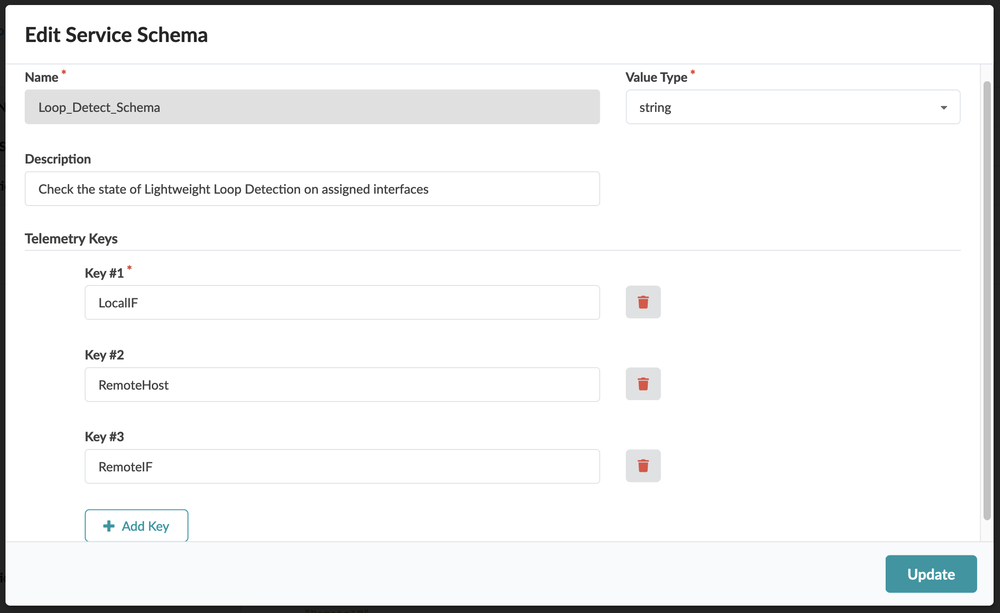
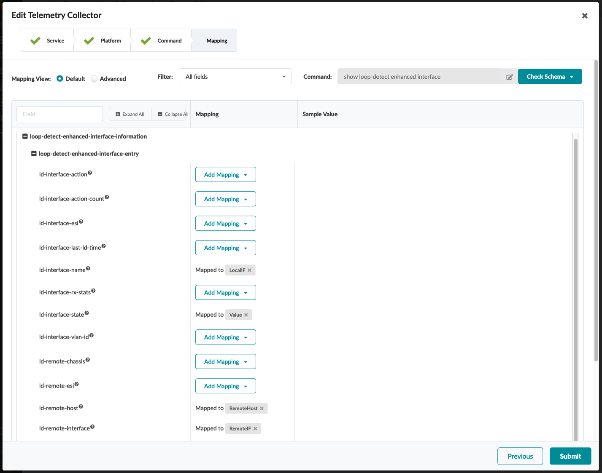
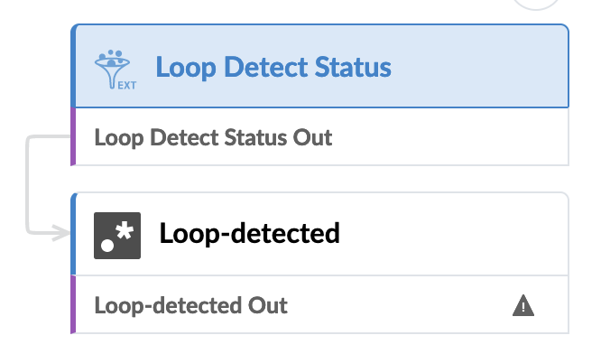
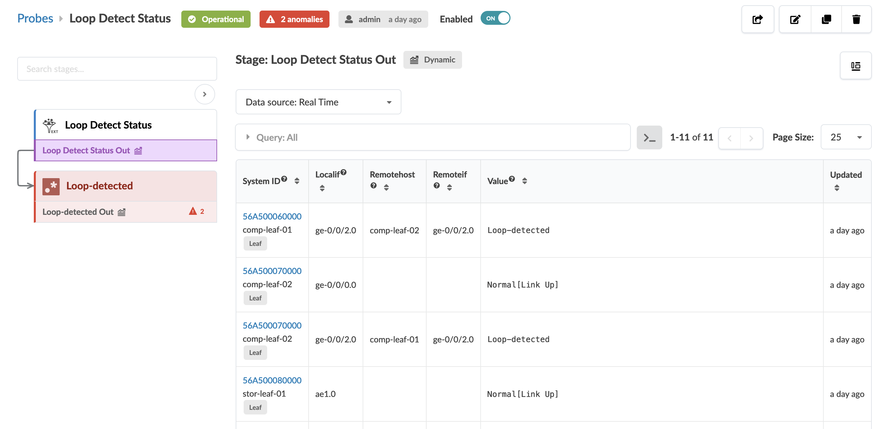
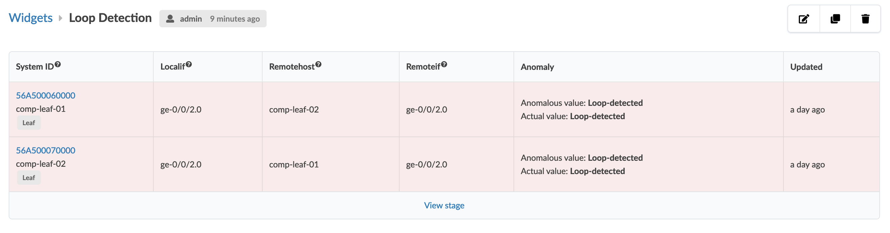

# Lightweight Loop Detection in Junos/EVO

## Table of Contents
- [Description of the use case](#description-of-the-use-case)
- [Requirements](#requirements)
- [Identification of source data (raw data)](#identification-of-the-source-data-raw-data)
- [Content](#content)
  - [Configlets](#configlets)
  - [Property Sets](#property-sets)
  - [Telemetry Service Schema](#telemetry-service-schema)
  - [Telemetry Collectors](#telemetry-collectors)
  - [Probes](#probes)
    - [Probe pipeline structure](#probe-pipeline-structure)
    - [Probe processor detail](#probe-processor-details)
  - [Widgets](#widgets)

## Description of the use case
- Collect the results of the command `show loop-detect enhanced interface`
  from all leaf and access devices in the blueprint.
- Raise an anomaly if the `Current status` field of any interface is equal to
  `Loop-detected`.
- Store the historical results so the operator can see when the anomalies
  occurred.

## Requirements
Lightweight loop detection must be enabled on all devices of role leaf and
access.  All interfaces of type `family ethernet-switching` that include the
monitoring VLAN must be configured for loop detection.  You can use the
example configlet and property set included here, or you can create your own.

## Identification of the source data (raw data)
- CLI command:  `show loop-detect enhanced interface` - [Junos documentation](https://www.juniper.net/documentation/us/en/software/junos/evpn-vxlan/topics/concept/evpn-vxlan-lightweight-leaf-server-loop-detection.html)
- Sample text output:
```
Interface                  :ge-0/0/2.0
Vlan-id                    :1320
ESI                        :00:00:00:00:00:00:00:00:00:00
Current status             :Normal[Link Up]
Last loop-detect time      :Fri Mar 15 13:17:38 2024
Receive statistics         :1171
Action configured          :Interface-down
Action count               :2
Transmit Interval	   :10s
Revert Interval		   :120s
```

<details>
  <summary>Sample XML output:</summary>
```xml
  <rpc-reply xmlns:junos="http://xml.juniper.net/junos/23.2R1.14/junos">
    <loop-detect-enhanced-interface-information>
        <loop-detect-enhanced-interface-entry>
            <ld-interface-name>ge-0/0/2.0 </ld-interface-name>
            <ld-interface-vlan-id>1320 </ld-interface-vlan-id>
            <ld-interface-esi>00:00:00:00:00:00:00:00:00:00 </ld-interface-esi>
            <ld-interface-state>Normal[Link Up]</ld-interface-state>
            <ld-interface-last-ld-time>Fri Mar 15 13:17:38 2024
                 </ld-interface-last-ld-time>
                <ld-interface-rx-stats>1171 </ld-interface-rx-stats>
                <ld-interface-action>Interface-down</ld-interface-action>
                <ld-interface-action-count>2 </ld-interface-action-count>
                <ld-tx-interval>10s</ld-tx-interval>
                <ld-revert-interval>120</ld-revert-interval>
            </loop-detect-enhanced-interface-entry>
        </loop-detect-enhanced-interface-information>
        <cli>
            <banner></banner>
        </cli>
    </rpc-reply>
```
</details>
<br>

- Fields of interest:

| Field     | Information |
|-----------|-------------|
| Interface | The local interface on which loop detection is enabled |
| Current status | Identifies operation as `Normal` or `Loop-detected` |
| Remote Host* | Hostname of device contributing to the loop |
| Remote Interface* | Interface on remote host contributing to the loop |

Note that the `Remote Host` and `Remote Interface` fields are only visible in
the command output if a loop is detected by the local interface.

## Content
### Configlets
```
configlets
└── loop-detect_junos.j2
└── loop-detect_junos.json
```

- Providing both the raw Jinja2 of the configlet as well as the JSON-formatted
  version for ease of use.
  - If you don't care about the contents, just import the JSON version.
  - If you're curious, create a new configlet:
    - Config Style: Junos
    - Section: Top-Level, Hierarchical
    - Paste the Jinja2 file into Template Text
  - Note that the configlet hard-codes the behavior/action when a loop is
    detected to `interface-down`.  If you prefer the `laser-off` action, you
    can replace that manually in the Jinja2 template.
  - You will also need the property set included in the section below this one.
- Once you have the configlet and property set imported, you will need to add
  both to your blueprint
  - I recommend importing the property set first.  It's not critical, but it
    will eliminate some transient rendering errors that get flagged if you
    choose to import the configlet first.
  - When you import the configlet, be sure to assign it to all devices in the
    leaf and, if defined for the blueprint, access roles.

> [!IMPORTANT]
> This configlet is provided only as an example. Customize to your own
  environment and always run **Commit-Check** from the Uncommitted tab prior
  to a blueprint commit.  Before proceeding with the next steps, the configlet
  must be imported to the bluprint and successfully deployed with no deployment
  anomalies.

### Property Sets
```
property-sets
└── loop-detect_ps.json
└── loop-detect_ps.yaml
```

There are three setings that can be manipulated in the Property Set:
- `revert_int`:  How long after detecting a loop before the device
  automatically resumes operations on the interface.  The timer is expressed in
  units of seconds.  To keep an interface disabled until manually re-enabled,
  set the timer to 0.
- `tx_int`:  The rate at which the device sends loop-detect PDU's over the
  interface.  Valid choices are 1s, 10s, 1m, and 10m.
- `vlan_id`:  The VLAN ID that will be used for loop detection.  A VLAN with
  that VLAN ID must be assigned to all interfaces where  loop detection runs.
  Valid values are in the range 1-4094, inclusive.

The property set is included in both JSON and YAML formats as a convenience.
You are free to use either format.  The JSON-formatted file can be imported
via the REST API or the Apstra CLI utility.  The YAML-formatted file is meant
to be pasted into the content of a new Property Set created from the Web UI.

### Telemetry Service Schema
```
telemetry-service-definitions
└── loop-detect_service.json
```

The service schema defines three keys:
- `LocalIF`: Interface on the local device running loop detection
- `RemoteHost`:  If a loop is detected on `LocalIF`, the hostname of the far
  end device contributing to the loop.
- `RemoteIF`: If a loop is detected on `LocalIF`, the interface name on the
  far end device contributing to the loop.



### Telemetry Collectors
```
telemetry-collectors
└── loop-detect_collector.json
```

This collector parses the output of `show loop-detect enhanced interface`
(XML RPC `get-loop-detect-enhanced-interface-information`).  You can see from
the image below how the three keys defined in the service schema and the single
value we extract are mapped below.  The end result is a unique endpoint pair,
identified by (LocalHost, LocalIF, RemoteHost, RemoteIF) that may present a
loop condition.  When a loop condition exists, the value of
`ld-interface-state` will be `Loop-detected`.



### Probes
```
probes
└── loop-detect_collector.json
```
#### Probe pipeline structure


#### Probe processor details
Source processor configuration:


Output stage:


### Widgets
```
widgets
└── loop-detect_widget.json
```
The `Value` in the output stage is just the boolean true/false.  Because
we're only reporting anomalies (`Loop-detected`), and because the details in
the `Anomaly` output clearly state that a loop has been detected, the `Value`
isn't really necessary.

Widget configuration:


Widget output:

