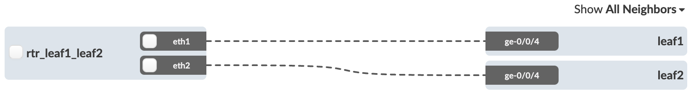
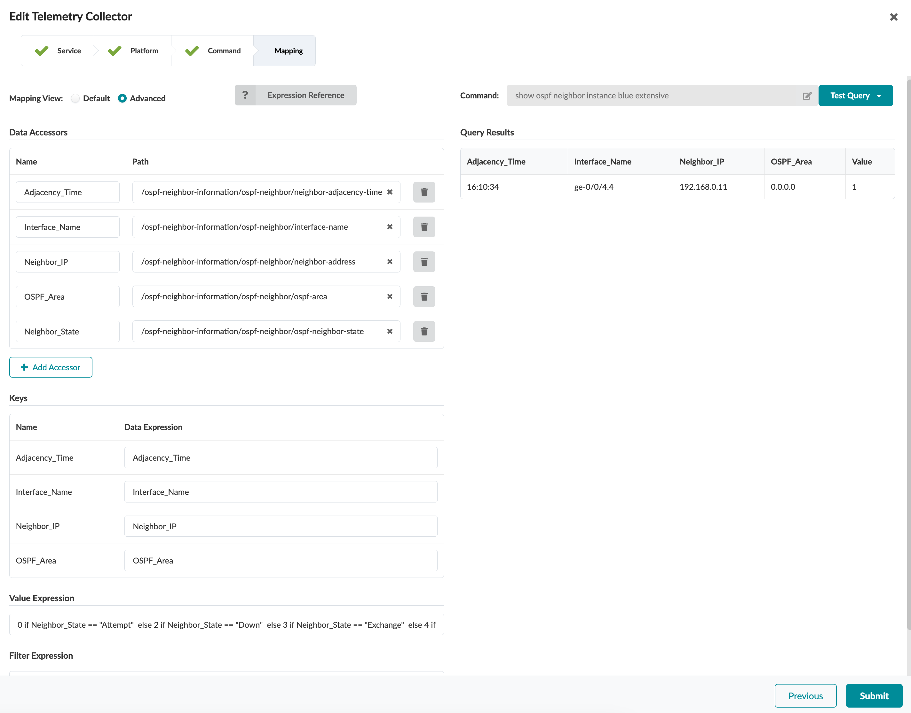
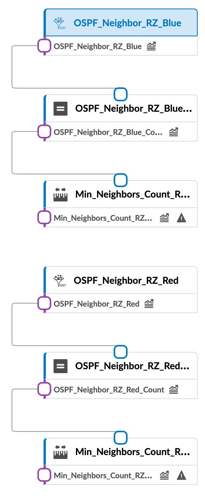
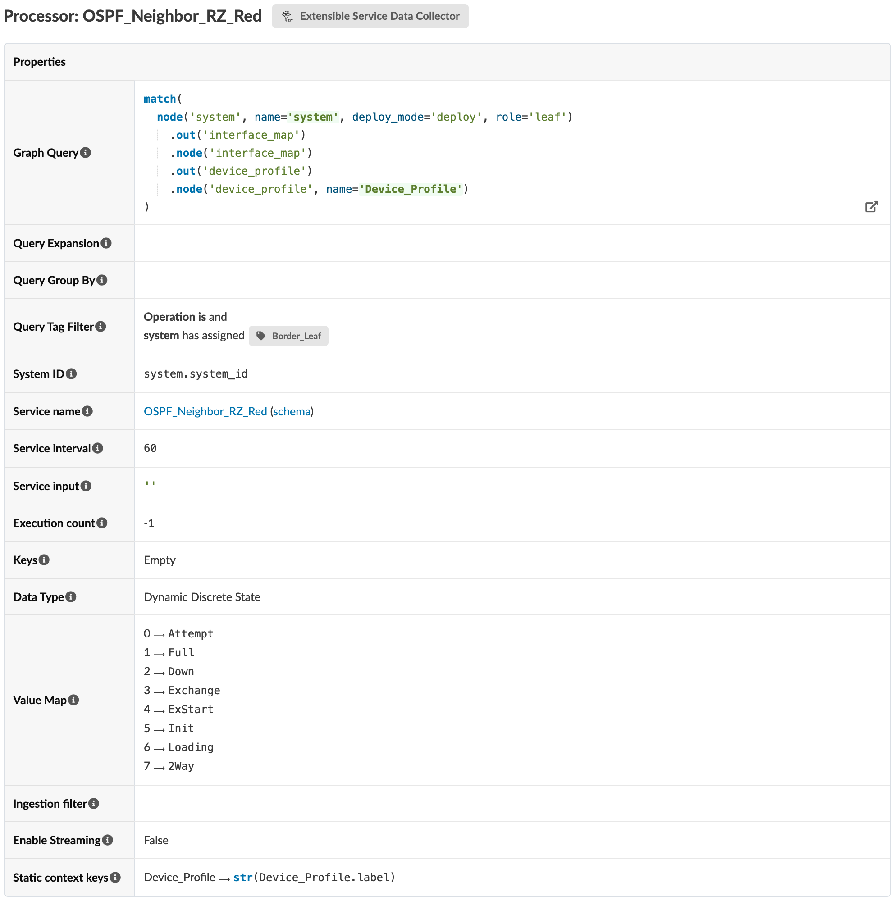
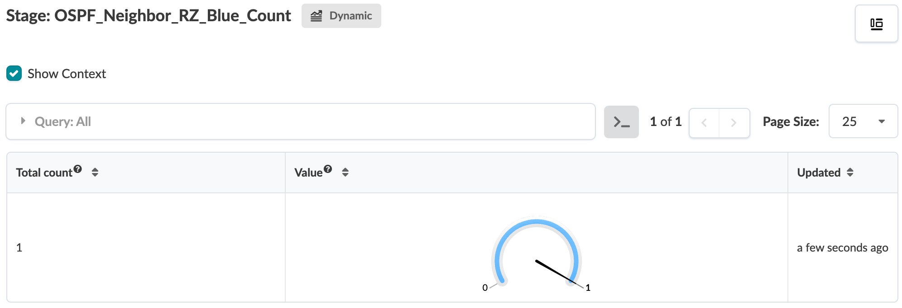
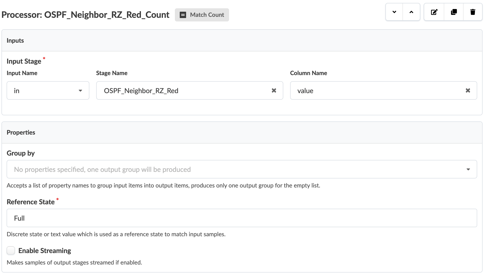

# OSPF Neighbor


Table of Contents:
- [OSPF Neighbor](#ospf-neighbor)
  - [Description of the use-case](#description-of-the-use-case)
  - [Identification of the source data (raw data)](#identification-of-the-source-data-raw-data)
  - [Content](#content)
    - [Configlets](#configlets)
    - [Property Sets](#property-sets)
    - [Telemetry Service Schema](#telemetry-service-schema)
    - [Telemetry Collectors](#telemetry-collectors)
    - [Probes](#probes)
      - [Probe pipeline structure](#probe-pipeline-structure)
      - [Probe processors details](#probe-processors-details)
    - [Widgets](#widgets)
    - [Dashboards](#dashboards)

<br>

## Description of the use-case

- Collect OSPF adjacencies on a per routing zone basis on all leafs tagged as `Border Leaf`. 
- Count the number of established adjacencies in `Full` state.
- Raise an anomaly if that count is <= 1. In other words I expect to have for each Routing_Zone two in `Full` state.

<br>

## Identification of the source data (raw data)

- CLI Command: `show ospf neighbor instance <routing-instance-name> extensive` - [Junos documentation page](https://www.juniper.net/documentation/us/en/software/junos/ospf/topics/ref/command/show-ospf-ospf3-neighbor.html). 
- Sample Text Output:
```
Address          Interface              State           ID               Pri  Dead
10.110.36.3      irb.1390               Full            10.252.0.7       128    34
  Area 0.0.0.0, opt 0x52, DR 10.110.36.62, BDR 10.110.36.2
  Up 5d 16:08:43, adjacent 5d 16:08:43
  Topology default (ID 0) -> Bidirectional
```
<details>
    <summary>Sample XML Output:</summary>

```xml
<rpc-reply xmlns:junos="http://xml.juniper.net/junos/23.2R1.14/junos">
    <ospf-neighbor-information xmlns="http://xml.juniper.net/junos/23.2R0/junos-routing">
        <ospf-neighbor>
            <neighbor-address>10.110.36.3</neighbor-address>
            <interface-name>irb.1390</interface-name>
            <ospf-neighbor-state>Full</ospf-neighbor-state>
            <neighbor-id>10.252.0.7</neighbor-id>
            <neighbor-priority>128</neighbor-priority>
            <activity-timer>38</activity-timer>
            <ospf-area>0.0.0.0</ospf-area>
            <options>0x52</options>
            <dr-address>10.110.36.62</dr-address>
            <bdr-address>10.110.36.2</bdr-address>
            <neighbor-up-time junos:seconds="490384">
                5d 16:13:04
            </neighbor-up-time>
            <neighbor-adjacency-time junos:seconds="490384">
                5d 16:13:04
            </neighbor-adjacency-time>
            <ospf-neighbor-topology>
                <ospf-topology-name>default</ospf-topology-name>
                <ospf-topology-id>0</ospf-topology-id>
                <ospf-neighbor-topology-state>Bidirectional</ospf-neighbor-topology-state>
            </ospf-neighbor-topology>
        </ospf-neighbor>
    </ospf-neighbor-information>
    <cli>
        <banner></banner>
    </cli>
</rpc-reply>
```
</details>
  
<br>

- Fields of interest:

| Field | Information |
| --- | --- |
| `Address` | OSPF neighbor IP. |
| `Interface` | Interface through which the neighbor is reachable. |
| `Area` | OSPF area that the neighbor is in. |
| `State` | State of the neighbor. Possible values will be the following enum: `Attempt`, `Down`, `Exchange`, `ExStart`, `Full`, `Init`, `Loading` or `2Way`. |
| `adjacent` | Length of time since the adjacency with the neighbor was established. |


> [!IMPORTANT]
> We must specfiy the routing-instance (VRF) in the CLI command, otherwise the command is executed only on the default routing instance and will return an `OSPF instance is not running` message if no OSPF is enabled on that instance. In this example we have OSPF routing enabled on two routing instances (two Routing zones in Apstra terms) therefore we will design the probe composed of two pipelines, on for each routing zone. Each Pipeline will have its own telemetry service since we must specifiy the routing-instance name in the CLI command.

<br>

## Content

### Configlets
```
configlets
└── ospf-for-border-leaf.json
```


- For ease of readability, the configlet content is listed below. To describe what this configlet does at a high-level: It strats by iterating over the Device-Context, inside the `interface` list and identifies all physical interfaces tagged with `OSPF`. We are using this tag to mark the interfaces on which we want to enbale OSPF routing, i.e the external facing-interfaces. From there the second-part of the conffiglet identifies all sub-interfaces member of those physical interfaces and build an internal JSON structure named `filtered_interfaces` merging information from those sub-interfaces and other data provided by the property-set. That created JSON structure has then everything needed for the final part of the configlet which is rendering the required OSPF configuration. A corresponding configuraiton must also be handled for the remotely connected device, the external router. Since that is outisde of the scope of Apstra's management we are not including its OSPF configuraiton here.
- Notes on some elements used in this configlet:
  - The configlet uses the concept of a `namespace` which allows you to make a variable globally available even if that variable has been set and assigned a value inside a loop. In Jinja if you assign a variable inside the for loop, the assignment value is lost when you exit the loop. If you need to set some values within a loop but allow them to be visible outside of the loop, you need to rely on the jinja namespace functionality.
  - The configlet uses `json_query` function which allows you to run a jmespath query against a JSON data structure. JMESPath is a powerful expression-based query language for extracting data from complex JSON structures. Config template users can make use of JMESPath expressions to collect bulk query information from a complex resource allocation tree structure. This function is similar to the ansible `json_query` plugin. A JMESPath tutorial can be found at https://jmespath.org/tutorial.html. Additional JMESPath examples can be found at https://jmespath.org/examples.html 


```python





    
        
        
    





  







    
        
    



routing-instances {
    {{ routing_zone }} {
        protocols {
            ospf {
                area {{ routing_zone_details.area }} {
                    
                        
                    interface {{ intf.intfName }}
                        
                    
                }
            }
        }
    }
}

```

To apply this configlet at the blueprint level, we will leverage another tag, at the system-level this time, and specify that we want this configlet to be pushed to any system tagged as `Border Leaf`. This will ensure that we are not pushing the configlet to any compute-leaf but only to subset of the leafs, those acting as Border leafs. In the blueprint used for this example we have the following topology between the Border-Leafs `leaf1` and `leaf2` and the external router.

<br> 



<br> 

Given that, we had the following tags model. `Border Leaf` system tag applied on `leaf1` and `leaf2`, and `OSPF` interface tag applied on `ge-0/0/4` on each one of the two tagged leafs.


<br> 

Apply the configlet on systems with tag `Border Leaf`.


<br>

Before committing the changes, use the **Commit Check** feature to verify the validy of the config and introspect the incremental configuraiton changes.


<br>

> [!IMPORTANT]
> This configlet is provided only as an example. Customise to your own environement and always run **Commit-Check** from the Uncommitted tab prior to a blueprint commit.
> Before proceeding with the next steps, the configlet must be imported to the bluprint and successfully deployed with no deployement anomalies.

<br>

### Property Sets
```
configlets
└── ospf-neighbor-ps.json
```


The semantic of the property-set in this example is to indicate what routing zone we want to enable OSPF peering for and with which OSPF area.

<br>

### Telemetry Service Schema 
```
telemetry-service-definitions
├── ospf-neighbor-rz-blue-OSPF_Neighbor_RZ_Blue.json
└── ospf-neighbor-rz-red-OSPF_Neighbor_RZ_Red.json
```
As mentioned in the "Identification of the source data" section, the CLI command being routing-zone specific, we need two distinct telemetry services, hence two distinct service schemas. Even if the content of the service schemas will be identical, their name acintg as a primary key for the telemetry service collector itself, it must be unique.

<br>

Service Schema for the Blue Routing Zone:


-  Service Schema for the Red Routing Zone:


- The reason why the schemas are defined with a value type of **Integer** and not String is because we would like to represent the OSPF neighbour states as Discrete states in the IBA probe which requires a mapping based on integer values, that will be further explained in the next section.

<br>

### Telemetry Collectors
```
telemetry-collectors
├── ospf-neighbor-rz-blue-OSPF_Neighbor_RZ_Blue.json
└── ospf-neighbor-rz-red-OSPF_Neighbor_RZ_Red.json
```
Service collector for the Blue Routing Zone:



Service collector for the Blue Routing Zone:
 


Pay attention to the accessor value `Neighbor_State`. This is not one of the keys defined in the service schema. It is an accessor key which purpose is internal to the collector logic. It is used to capture a specific xPath, `/ospf-neighbor-information/ospf-neighbor/ospf-neighbor-state` in this case, for further processing by the `Value` field. `Value` is then defined with a python expression to convert the string value coming from `Neighbor_State` into an integer value. That integer value will then be leveraged by the "Value Map" processor attribute of the `Extensible_Service_Data_Collector_Processor` IBA procesor  and publish it in the probe pipeline as an Enum.
Note that the selection of the integer values for any specific string value is totaly arbitrary. It is up to the collector and probe author to determine any schema as long as that schema is the same on the IBA side since the data will need to be converted back to string values (See next section for probe's configuration).

```python
0 if Neighbor_State == "Attempt" 
else 2 if Neighbor_State == "Down" 
else 3 if Neighbor_State == "Exchange" 
else 4 if Neighbor_State == "ExStart" 
else 5 if Neighbor_State == "Init" 
else 6 if Neighbor_State == "Loading" 
else 7 if Neighbor_State == "2Way" 
else 1 if Neighbor_State == "Full" 
else None
```
> [!IMPORTANT]
> Python based expressions are supported as long as they are expressed in a one-liner. For example to express an `If This Than That` condition, it will need to be slightly tweaked to be `That if This`, or `That If This Else SomeThingElse`. In other words, the conditionnal logic should be expressed as `<value_if_true> if <condition> else <value_if_false>`.

<br>

### Probes

#### Probe pipeline structure

<br>



<br>

#### Probe processors details
```
probes
└── ospf-neighbour-check.json
```
Source Processor configuration:
- Considering the keys defined in the `OSPF_Neighbor` service cannot be derived from the graph, we need to define the probe using a **Dynamic Stages** approach. With that, the IBA processors series, i.e rows in the output stage, are controlled by the collector instead of being controlled by the graph query like for **Static Stages** approach. The count of those series dynamically reacts to the collector's output. It is only required to map the system_ID to a to a graph node's property. Other collectors key do not requires any mapping to the Graph. To define the probe as  **Dynamic Stages** one we will choose a data type of `Dynamic Discrete State`, because our service value data type is `integer`.

Source processor configuration for the Blue Routing Zone:


<br>

Output stage for the Blue Source processor:


<br>

Source processor configuration for the Red Routing Zone:



<br>

Output stage for the Red Source processor:


<br>

Match Count Processor configuration for the Blue Routing Zone:


<br>

Output stage for the Blue Match Count processor:



<br>

Match Count Processor configuration for the Red Routing Zone:



<br>

Output stage for the Red Match Count processor:


<br>

Range Processor configuration for the Blue Routing Zone:


<br>

Output stage for the Blue Range processor:


<br>

Range Processor configuration for the Red Routing Zone:


<br>

Output stage for the Red Range processor:


<br>

### Widgets
```
widgets
├── min-neighbors-count-rz-blue.json
├── min-neighbors-count-rz-red.json
├── ospf-neighbor-rz-blue.json
└── ospf-neighbor-rz-red.json
```

Widget configuration to display the output of the Range processor for Routing Zone Blue (This is the stage with anomaly raising capabilities):


<br>

Widget configuration to display the output of the Range processor for Routing Zone Red (This is the stage with anomaly raising capabilities):


<br>

Widget configuration to display the output of the Source processor for Routing Zone Blue:


<br>

Widget configuration to display the output of the Source processor for Routing Zone Red:


<br>

### Dashboards
```
dashboards
└── ospf-neighbour-check.json
```

Dashboard in a Happy Path scenario (All Routing Zones have 2 OSPF adjacencies in `Full` State):


<br>

Dashboard in a Happy Path scenario (Not all Routing Zones have 2 OSPF adjacencies in `Full` State):


