# OPSF Neighbor


Table of Contents:
- [OPSF Neighbor](#opsf-neighbor)
  - [Description of the use-case](#description-of-the-use-case)
  - [Identification of the source data (raw data)](#identification-of-the-source-data-raw-data)
  - [Content](#content)
    - [Configlets](#configlets)
    - [Property Sets](#property-sets)
    - [Telemetry Service Schema](#telemetry-service-schema)
    - [Telemetry Collectors](#telemetry-collectors)
    - [Probes](#probes)
    - [Widgets](#widgets)
    - [Dashboards](#dashboards)

<br>

## Description of the use-case

- Colect OSPF adjacencies and raise an anomaly if you have less than two OSPF neighbour in Full state on each Border-Leaf.

<br>

## Identification of the source data (raw data)

- CLI Command: `show ospf neighbor instance <routing-instance-name> extensive` - [Junos documentation page](https://www.juniper.net/documentation/us/en/software/junos/ospf/topics/ref/command/show-ospf-ospf3-neighbor.html). 
- Sample Text Output:
```
Address          Interface              State           ID               Pri  Dead
10.110.36.3      irb.1390               Full            10.252.0.7       128    34
  Area 0.0.0.0, opt 0x52, DR 10.110.36.62, BDR 10.110.36.2
  Up 5d 16:08:43, adjacent 5d 16:08:43
  Topology default (ID 0) -> Bidirectional
10.110.36.62     irb.1390               Full            192.168.255.255  128    31
  Area 0.0.0.0, opt 0x52, DR 10.110.36.62, BDR 10.110.36.2
  Up 1w1d 00:14:44, adjacent 1w1d 00:14:43
  Topology default (ID 0) -> Bidirectional
```
<details>
    <summary>Sample XML Output:</summary>

```xml
<rpc-reply xmlns:junos="http://xml.juniper.net/junos/23.2R1.14/junos">
    <ospf-neighbor-information xmlns="http://xml.juniper.net/junos/23.2R0/junos-routing">
        <ospf-neighbor>
            <neighbor-address>10.110.36.3</neighbor-address>
            <interface-name>irb.1390</interface-name>
            <ospf-neighbor-state>Full</ospf-neighbor-state>
            <neighbor-id>10.252.0.7</neighbor-id>
            <neighbor-priority>128</neighbor-priority>
            <activity-timer>38</activity-timer>
            <ospf-area>0.0.0.0</ospf-area>
            <options>0x52</options>
            <dr-address>10.110.36.62</dr-address>
            <bdr-address>10.110.36.2</bdr-address>
            <neighbor-up-time junos:seconds="490384">
                5d 16:13:04
            </neighbor-up-time>
            <neighbor-adjacency-time junos:seconds="490384">
                5d 16:13:04
            </neighbor-adjacency-time>
            <ospf-neighbor-topology>
                <ospf-topology-name>default</ospf-topology-name>
                <ospf-topology-id>0</ospf-topology-id>
                <ospf-neighbor-topology-state>Bidirectional</ospf-neighbor-topology-state>
            </ospf-neighbor-topology>
        </ospf-neighbor>
        <ospf-neighbor>
            <neighbor-address>10.110.36.62</neighbor-address>
            <interface-name>irb.1390</interface-name>
            <ospf-neighbor-state>Full</ospf-neighbor-state>
            <neighbor-id>192.168.255.255</neighbor-id>
            <neighbor-priority>128</neighbor-priority>
            <activity-timer>32</activity-timer>
            <ospf-area>0.0.0.0</ospf-area>
            <options>0x52</options>
            <dr-address>10.110.36.62</dr-address>
            <bdr-address>10.110.36.2</bdr-address>
            <neighbor-up-time junos:seconds="692345">
                1w1d 00:19:05
            </neighbor-up-time>
            <neighbor-adjacency-time junos:seconds="692344">
                1w1d 00:19:04
            </neighbor-adjacency-time>
            <ospf-neighbor-topology>
                <ospf-topology-name>default</ospf-topology-name>
                <ospf-topology-id>0</ospf-topology-id>
                <ospf-neighbor-topology-state>Bidirectional</ospf-neighbor-topology-state>
            </ospf-neighbor-topology>
        </ospf-neighbor>
    </ospf-neighbor-information>
    <cli>
        <banner></banner>
    </cli>
</rpc-reply>
```
</details>
  
<br>

- Fields of interest:

| Field | Information |
| --- | --- |
| `Address` | OSPF neighbor IP. |
| `Interface` | Interface through which the neighbor is reachable. |
| `Area` | OSPF area that the neighbor is in. |
| `State` | State of the neighbor. Possible values will be the following enum: `Attempt`, `Down`, `Exchange`, `ExStart`, `Full`, `Init`, `Loading` or `2Way`. |
| `adjacent` | Length of time since the adjacency with the neighbor was established. |


> [!IMPORTANT]
> We must specfiy the routing-instance (VRF) in the CLI command, otherwise the command is executed only on the default routing instance and will return an `OSPF instance is not running` message if no OSPF is enabled on that instance.

<br>

## Content

### Configlets
```
configlets
└── ospf-configlet.json
```
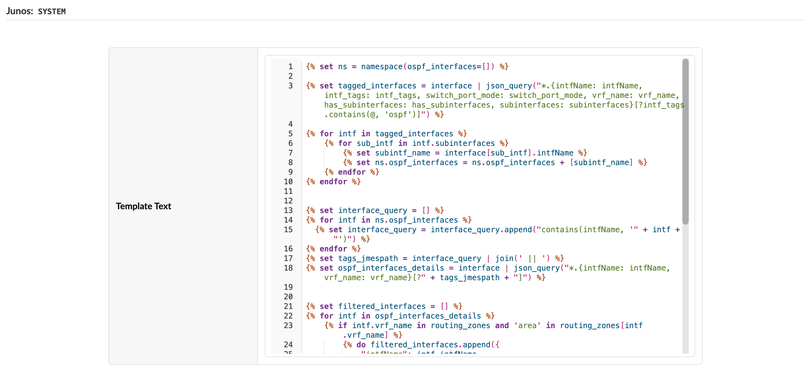

- For ease of reasability, the configlet content is listed below:

```python





    
        
        
    





  







    
        
    



routing-instances {
    {{ routing_zone }} {
        protocols {
            ospf {
                area {{ routing_zone_details.area }} {
                    
                        
                    interface {{ intf.intfName }}
                        
                    
                }
            }
        }
    }
}

```

This configlet leverages tags applied at the system level (`Border Leaf` tag to identify the leafs acting as Border leafs) as well as at the interface level (`OSPF` tag to identify the interfaces to enble OSPF routing on).

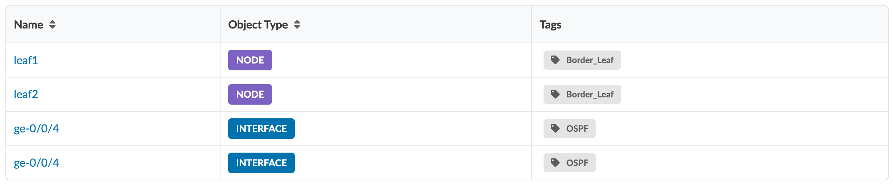

<br> 

Apply the configlet on systems with tag `Border Leaf`

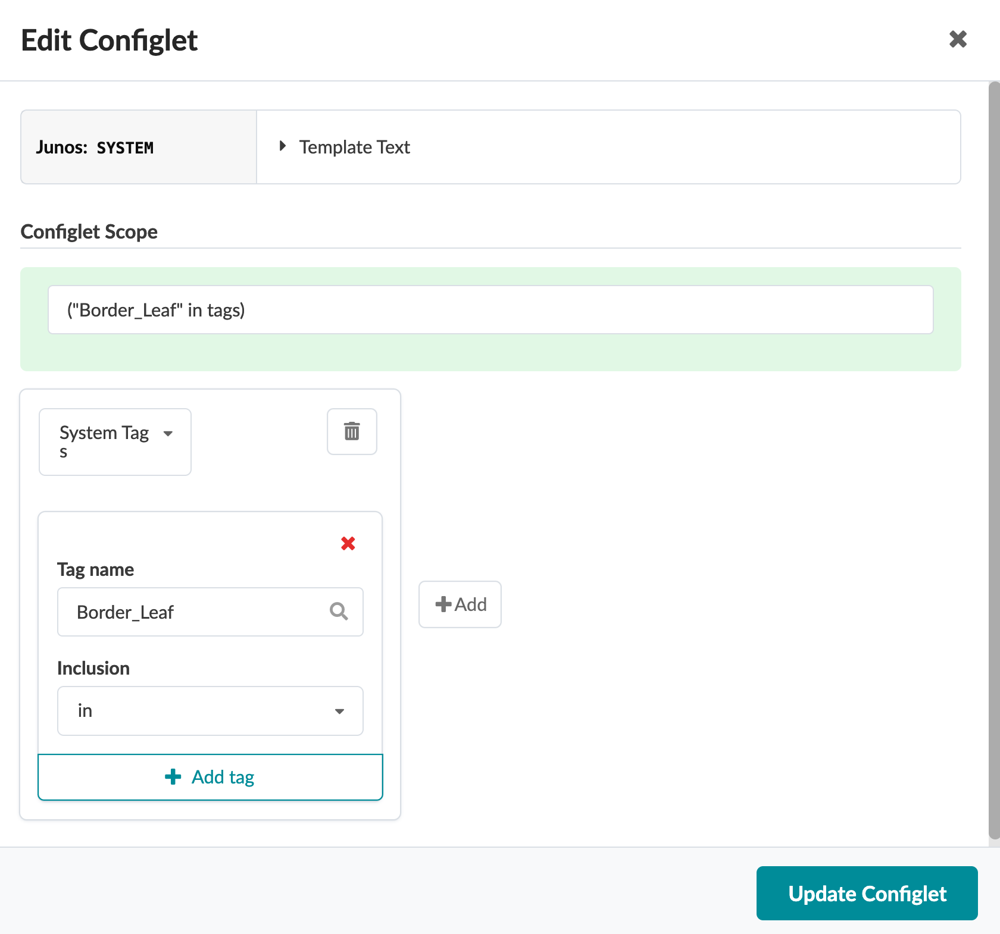

<br>

Before committing the changes, use the **Commit Check** feature to verify the validy of the config and introspect the incremental configuraiton changes


<br>

> [!IMPORTANT]
> This configilet is provided only as an example. Customise to your own environement and always run Commit-Check from the Uncommitted tab prior to a blueprint commit.
> 
> The configlet must be successfully imported to the bluprint and committed before proceeding with the following steps.

<br>

### Property Sets
```
configlets
└── ospf-ps.json
```


<br>

### Telemetry Service Schema 
```
telemetry-service-definitions
└── ospf-neighbor-OSPF_Neighbor.json
```
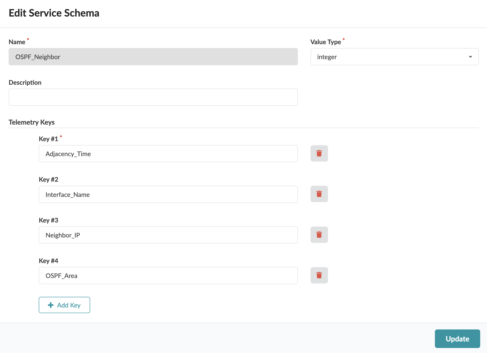

<br>

### Telemetry Collectors
```
telemetry-collectors
└── ospf-neighbor-OSPF_Neighbor.json
```


Pay attention to the expression used in the `Value` and the logic to convert the text string provided by the `/ospf-neighbor-information/ospf-neighbor/ospf-neighbor-state` XML path into an integer value which will then be converted back to an enum using the "Value map" processor property of the `Extensible_Service_Data_Collector_Processor` IBA procesor (See probe's configuration).
> [!IMPORTANT]
> Python based expressions are supported as long as they are expressed in a one-liner. For example to express an `if this than that` conditional, it will have to be wirtten in the format: `<value_if_true> if <condition> else <value_if_false>`.
```python
0 if Neighbor_State == "Attempt" 
else 2 if Neighbor_State == "Down" 
else 3 if Neighbor_State == "Exchange" 
else 4 if Neighbor_State == "ExStart" 
else 5 if Neighbor_State == "Init" 
else 6 if Neighbor_State == "Loading" 
else 7 if Neighbor_State == "2Way" 
else 1 if Neighbor_State == "Full" 
else None
```

<br>

### Probes
```
probes
└── ospf-neighbour-check.json
```
Source Processor configuration:
- Considering the keys defined in the `OSPF_Neighbor` service cannot be derived from the graph, we need to define the probe using a **Dynamic Stages** approach. With that, the IBA processors series, i.e rows in the output stage, are controlled by the collector instead of being controlled by the graph query like for **Static Stages** approach. The count of those series dynamically reacts to the collector's output. It is only required to map the system_ID to a to a graph node's property. Other collectors key do not requires any mapping to the Graph. To define the probe as  **Dynamic Stages** one we will choose a data type of `Dynamic Discrete State`, because our service value data type is `integer`.

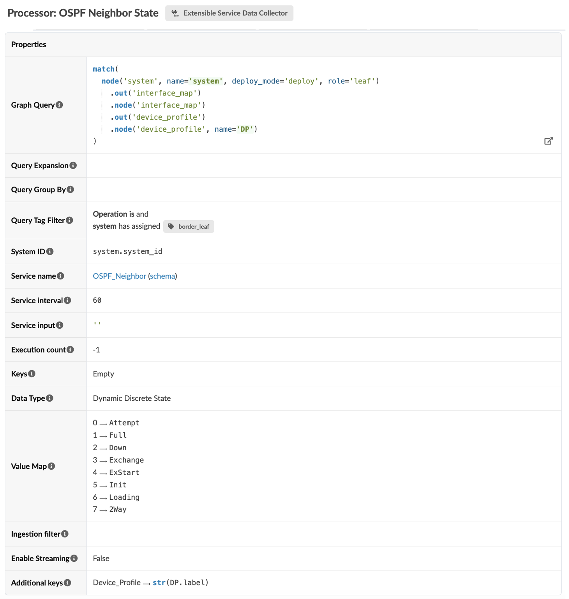

<br>

Output stage:

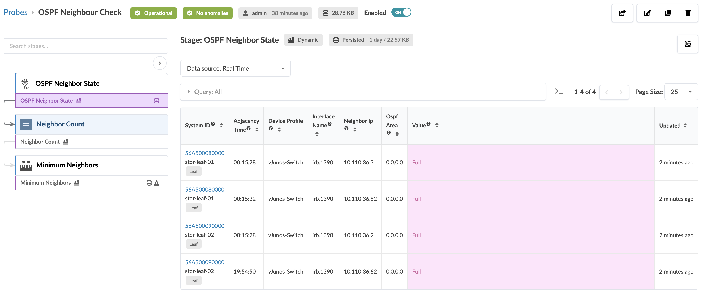

<br>

Output stage:

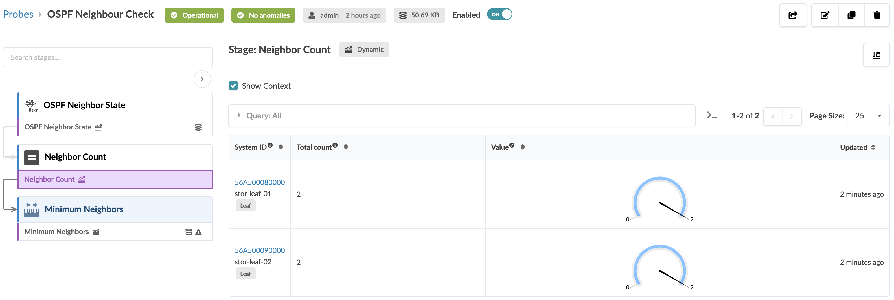

<br>

Output stage:

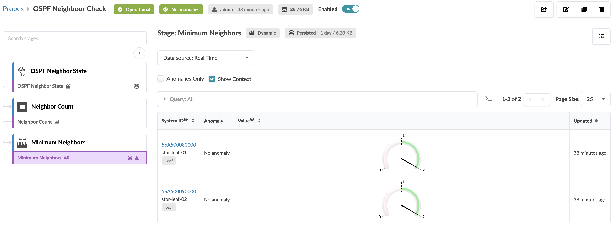

<br>

Putting it all together - Probe pipeline representation:

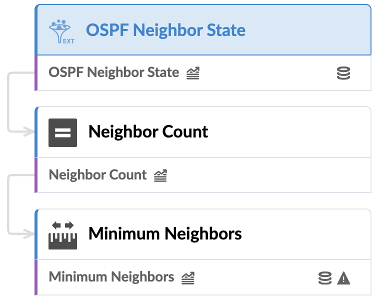

<br>

### Widgets
```
widgets
├── ospf-neighbor-count-per-border-leaf.json
└── ospf-neighbor-state.json
```

<br>

Configuration of the first widget: 

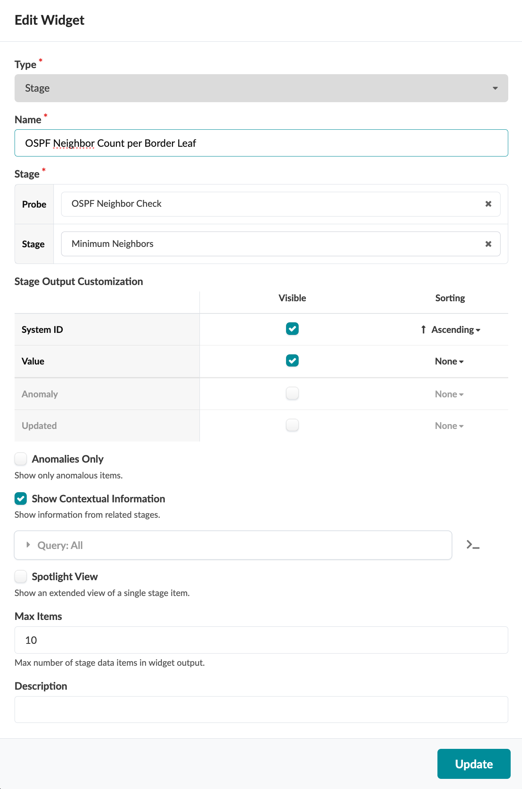

<br>

Configuration of the second widget:
  
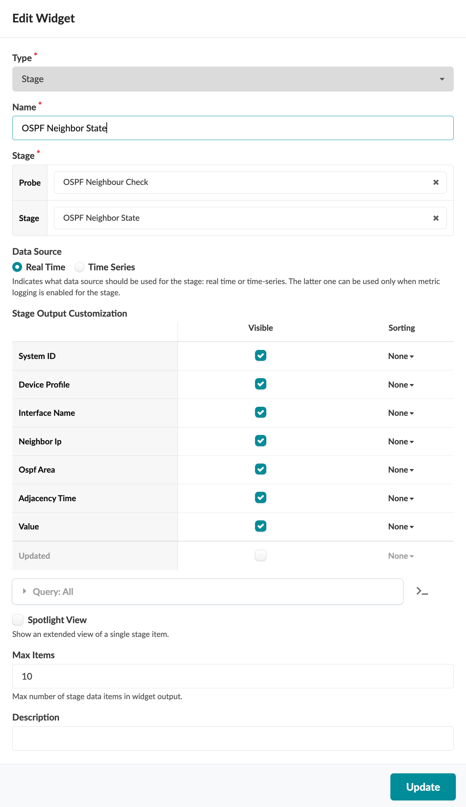

<br>

### Dashboards
```
dashboards
└── ospf-adjacencies-on-border-leafs.json
```

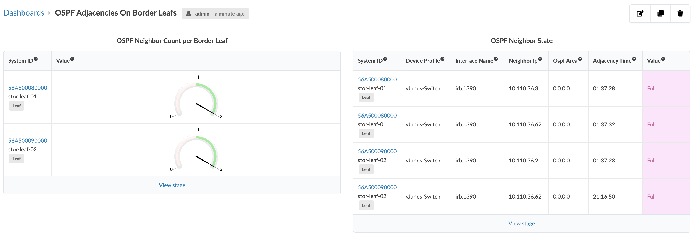