# OS_Version_Compliance_Check

Table of Contents:
- [OS\_Version\_Compliance\_Check](#os_version_compliance_check)
  - [Description of the use-case](#description-of-the-use-case)
  - [Identification of the source data (raw data)](#identification-of-the-source-data-raw-data)
  - [Content](#content)
    - [Configlets](#configlets)
    - [Property Sets](#property-sets)
    - [Telemetry Service Schema](#telemetry-service-schema)
    - [Telemetry Collectors](#telemetry-collectors)
    - [Probes](#probes)
    - [Widgets](#widgets)
    - [Dashboards](#dashboards)

<br>

## Description of the use-case
- Collect OS versions from all managed devices in the blueprint and compare them to a defined policy of rules including:
  - Rule_1: Checking the NOS versions conforms to the guidelines for EVPN hardened releaes: `XX.{2|4}R2+`. Example: `22.2R2` and `22.4R3`satisify the rule but `23.2R1` or `22.1R2` do not.
  - Rule_2: Checking none of the devices runs a version listed in the "Excluded" ones. This list is an operator maintained ones, with the help of Juniper (Support/Account Team/etc..) containing versions which are conforming to the general guidelines for hardened versions but but have been flagged as not usable, possiblely due to exceesive number of bugs or security issues.
- Use Property-Set to let the user provides the policy inputs.

<br>

## Identification of the source data (raw data)
- CLI Command: `show version` - [Junos documentation page](https://www.juniper.net/documentation/us/en/software/junos/cli-reference/topics/ref/command/show-version.html). 
- Sample Text Output:
```
Hostname: leaf1
Model: ex9214
Junos: 22.2R3.15
JUNOS OS Kernel 64-bit  [20230303.4e45fe64_builder_stable_12_222]
JUNOS OS libs [20230303.4e45fe64_builder_stable_12_222]
JUNOS OS runtime [20230303.4e45fe64_builder_stable_12_222]
JUNOS OS time zone information [20230303.4e45fe64_builder_stable_12_222]
JUNOS network stack and utilities [20230322.135429_builder_junos_222_r3]
JUNOS libs [20230322.135429_builder_junos_222_r3]
JUNOS OS libs compat32 [20230303.4e45fe64_builder_stable_12_222]
JUNOS OS 32-bit compatibility [20230303.4e45fe64_builder_stable_12_222]
JUNOS libs compat32 [20230322.135429_builder_junos_222_r3]
JUNOS runtime [20230322.135429_builder_junos_222_r3]
JUNOS Packet Forwarding Engine Simulation Package [20230322.135429_builder_junos_222_r3]
JUNOS sflow mx [20230322.135429_builder_junos_222_r3]
JUNOS py extensions [20230322.135429_builder_junos_222_r3]
JUNOS py base [20230322.135429_builder_junos_222_r3]
JUNOS OS vmguest [20230303.4e45fe64_builder_stable_12_222]
JUNOS OS crypto [20230303.4e45fe64_builder_stable_12_222]
JUNOS OS boot-ve files [20230303.4e45fe64_builder_stable_12_222]
JUNOS na telemetry [22.2R3.15]
Junos vmguest package [20230322.135429_builder_junos_222_r3]
JUNOS mx libs compat32 [20230322.135429_builder_junos_222_r3]
JUNOS mx runtime [20230322.135429_builder_junos_222_r3]
JUNOS RPD Telemetry Application [22.2R3.15]
JUNOS Routing mpls-oam-basic [20230322.135429_builder_junos_222_r3]
JUNOS Routing mpls-oam-advanced [20230322.135429_builder_junos_222_r3]
JUNOS Routing lsys [20230322.135429_builder_junos_222_r3]
JUNOS Routing controller-internal [20230322.135429_builder_junos_222_r3]
JUNOS Routing controller-external [20230322.135429_builder_junos_222_r3]
JUNOS Routing 32-bit Compatible Version [20230322.135429_builder_junos_222_r3]
JUNOS Routing aggregated [20230322.135429_builder_junos_222_r3]
Redis [20230322.135429_builder_junos_222_r3]
JUNOS probe utility [20230322.135429_builder_junos_222_r3]
JUNOS common platform support [20230322.135429_builder_junos_222_r3]
JUNOS Openconfig [22.2R3.15]
JUNOS mtx network modules [20230322.135429_builder_junos_222_r3]
JUNOS modules [20230322.135429_builder_junos_222_r3]
JUNOS mx modules [20230322.135429_builder_junos_222_r3]
JUNOS mx libs [20230322.135429_builder_junos_222_r3]
JUNOS L2 RSI Scripts [20230322.135429_builder_junos_222_r3]
JUNOS SQL Sync Daemon [20230322.135429_builder_junos_222_r3]
JUNOS mtx Data Plane Crypto Support [20230322.135429_builder_junos_222_r3]
JUNOS daemons [20230322.135429_builder_junos_222_r3]
JUNOS mx daemons [20230322.135429_builder_junos_222_r3]
JUNOS Broadband Edge User Plane Apps [22.2R3.15]
JUNOS appidd-mx application-identification daemon [20230322.135429_builder_junos_222_r3]
JUNOS Simulation Linux Package [20230322.135429_builder_junos_222_r3]
JUNOS Simulation Package [20230322.135429_builder_junos_222_r3]
JUNOS Simulation Package [20230322.135429_builder_junos_222_r3]
JUNOS Services URL Filter package [20230322.135429_builder_junos_222_r3]
JUNOS Services TLB Service PIC package [20230322.135429_builder_junos_222_r3]
JUNOS Services Telemetry [20230322.135429_builder_junos_222_r3]
JUNOS Services TCP-LOG [20230322.135429_builder_junos_222_r3]
JUNOS Services SSL [20230322.135429_builder_junos_222_r3]
JUNOS Services SOFTWIRE [20230322.135429_builder_junos_222_r3]
JUNOS Services Stateful Firewall [20230322.135429_builder_junos_222_r3]
JUNOS Services RTCOM [20230322.135429_builder_junos_222_r3]
JUNOS Services RPM [20230322.135429_builder_junos_222_r3]
JUNOS Services PCEF package [20230322.135429_builder_junos_222_r3]
JUNOS Services NAT [20230322.135429_builder_junos_222_r3]
JUNOS Services Mobile Subscriber Service Container package [20230322.135429_builder_junos_222_r3]
JUNOS Services MobileNext Software package [20230322.135429_builder_junos_222_r3]
JUNOS Services Logging Report Framework package [20230322.135429_builder_junos_222_r3]
JUNOS Services LL-PDF Container package [20230322.135429_builder_junos_222_r3]
JUNOS Services Jflow Container package [20230322.135429_builder_junos_222_r3]
JUNOS Services Deep Packet Inspection package [20230322.135429_builder_junos_222_r3]
JUNOS Services IPSec [20230322.135429_builder_junos_222_r3]
JUNOS Services IDS [20230322.135429_builder_junos_222_r3]
JUNOS IDP Services [20230322.135429_builder_junos_222_r3]
JUNOS Services HTTP Content Management package [20230322.135429_builder_junos_222_r3]
JUNOS Services DNS Filter package (i386) [20230322.135429_builder_junos_222_r3] 
JUNOS Services Crypto [20230322.135429_builder_junos_222_r3]
JUNOS Services Captive Portal and Content Delivery Container package [20230322.135429_builder_junos_222_r3]
JUNOS Services COS [20230322.135429_builder_junos_222_r3]
JUNOS AppId Services [20230322.135429_builder_junos_222_r3]
JUNOS Services Application Level Gateways [20230322.135429_builder_junos_222_r3]
JUNOS Services AACL Container package [20230322.135429_builder_junos_222_r3]
JUNOS Extension Toolkit [20230322.135429_builder_junos_222_r3]
JUNOS Packet Forwarding Engine Support (aft) [20230322.135429_builder_junos_222_r3]
JUNOS Juniper Malware Removal Tool (JMRT) [1.0.0+20230322.135429_builder_junos_222_r3]
JUNOS J-Insight [20230322.135429_builder_junos_222_r3]
JUNOS Online Documentation [20230322.135429_builder_junos_222_r3]
JUNOS jail runtime [20230303.4e45fe64_builder_stable_12_222]
JUNOS FIPS mode utilities [20230322.135429_builder_junos_222_r3]
JUNOS dsa dsa [22.2R3.15]
```
<details>
    <summary>Sample XML Output:</summary>

```xml
<rpc-reply xmlns:junos="http://xml.juniper.net/junos/22.2R0/junos">
    <software-information>
        <host-name>leaf1</host-name>
        <product-model>ex9214</product-model>
        <product-name>ex9214</product-name>
        <junos-version>22.2R3.15</junos-version>
        <package-information>
            <name>os-kernel</name>
            <package-name>os-kernel-prd-x86-64-20230303.4e45fe64_builder_stable_12_222</package-name>
            <comment>JUNOS OS Kernel 64-bit  [20230303.4e45fe64_builder_stable_12_222]</comment>
        </package-information>
        <package-information>
            <name>os-libs</name>
            <package-name>os-libs-12-x86-64-20230303.4e45fe64_builder_stable_12_222</package-name>
            <comment>JUNOS OS libs [20230303.4e45fe64_builder_stable_12_222]</comment>
        </package-information>
        <package-information>
            <name>os-runtime</name>
            <package-name>os-runtime-x86-64-20230303.4e45fe64_builder_stable_12_222</package-name>
            <comment>JUNOS OS runtime [20230303.4e45fe64_builder_stable_12_222]</comment>
        </package-information>
        <package-information>
            <name>zoneinfo</name>
            <package-name>os-zoneinfo-20230303.4e45fe64_builder_stable_12_222</package-name>
            <comment>JUNOS OS time zone information [20230303.4e45fe64_builder_stable_12_222]</comment>
        </package-information>
        <package-information>
            <name>netstack</name>
            <package-name>junos-net-prd-x86-64-20230322.135429_builder_junos_222_r3</package-name>
            <comment>JUNOS network stack and utilities [20230322.135429_builder_junos_222_r3]</comment>
        </package-information>
        <package-information>
            <name>junos-libs</name>
            <package-name>junos-libs-x86-64-20230322.135429_builder_junos_222_r3</package-name>
            <comment>JUNOS libs [20230322.135429_builder_junos_222_r3]</comment>
        </package-information>
        <package-information>
            <name>os-libs-compat32</name>
            <package-name>os-libs-compat32-12-x86-64-20230303.4e45fe64_builder_stable_12_222</package-name>
            <comment>JUNOS OS libs compat32 [20230303.4e45fe64_builder_stable_12_222]</comment>
        </package-information>
        <package-information>
            <name>os-compat32</name>
            <package-name>os-compat32-x86-64-20230303.4e45fe64_builder_stable_12_222</package-name>
            <comment>JUNOS OS 32-bit compatibility [20230303.4e45fe64_builder_stable_12_222]</comment>
        </package-information>
        <package-information>
            <name>junos-libs-compat32</name>
            <package-name>junos-libs-compat32-x86-64-20230322.135429_builder_junos_222_r3</package-name>
            <comment>JUNOS libs compat32 [20230322.135429_builder_junos_222_r3]</comment>
        </package-information>
        <package-information>
            <name>junos-runtime</name>
            <package-name>junos-runtime-x86-32-20230322.135429_builder_junos_222_r3</package-name>
            <comment>JUNOS runtime [20230322.135429_builder_junos_222_r3]</comment>
        </package-information>
        <package-information>
            <name>vmguest</name>
            <package-name>jsim-pfe-x86-32-20230322.135429_builder_junos_222_r3</package-name>
            <comment>JUNOS Packet Forwarding Engine Simulation Package [20230322.135429_builder_junos_222_r3]</comment>
        </package-information>
        <package-information>
            <name>sflow-platform</name>
            <package-name>sflow-mx-x86-32-20230322.135429_builder_junos_222_r3</package-name>
            <comment>JUNOS sflow mx [20230322.135429_builder_junos_222_r3]</comment>
        </package-information>
        <package-information>
            <name>py-extensions</name>
            <package-name>py-extensions-x86-32-20230322.135429_builder_junos_222_r3</package-name>
            <comment>JUNOS py extensions [20230322.135429_builder_junos_222_r3]</comment>
        </package-information>
        <package-information>
            <name>py-base</name>
            <package-name>py-base-x86-32-20230322.135429_builder_junos_222_r3</package-name>
            <comment>JUNOS py base [20230322.135429_builder_junos_222_r3]</comment>
        </package-information>
        <package-information>
            <name>os-vmguest</name>
            <package-name>os-vmguest-x86-64-20230303.4e45fe64_builder_stable_12_222</package-name>
            <comment>JUNOS OS vmguest [20230303.4e45fe64_builder_stable_12_222]</comment>
        </package-information>
        <package-information>
            <name>os-crypto</name>
            <package-name>os-crypto-x86-64-20230303.4e45fe64_builder_stable_12_222</package-name>
            <comment>JUNOS OS crypto [20230303.4e45fe64_builder_stable_12_222]</comment>
        </package-information>
        <package-information>
            <name>os-boot-junos</name>
            <package-name>os-boot-junos-ve-x86-32-20230303.4e45fe64_builder_stable_12_222</package-name>
            <comment>JUNOS OS boot-ve files [20230303.4e45fe64_builder_stable_12_222]</comment>
        </package-information>
        <package-information>
            <name>na-telemetry</name>
            <package-name>na-telemetry-x86-32-22.2R3.15</package-name>
            <comment>JUNOS na telemetry [22.2R3.15]</comment>
        </package-information>
        <package-information>
            <name>junos-vmguest-nfx-3</name>
            <package-name>junos-vmguest-nfx-3-x86-64-20230322.135429_builder_junos_222_r3</package-name>
            <comment>Junos vmguest package [20230322.135429_builder_junos_222_r3]</comment>
        </package-information>
        <package-information>
            <name>junos-libs-compat32-platform</name>
            <package-name>junos-libs-compat32-mx-x86-64-20230322.135429_builder_junos_222_r3</package-name>
            <comment>JUNOS mx libs compat32 [20230322.135429_builder_junos_222_r3]</comment>
        </package-information>
        <package-information>
            <name>junos-runtime-platform</name>
            <package-name>junos-runtime-mx-x86-32-20230322.135429_builder_junos_222_r3</package-name>
            <comment>JUNOS mx runtime [20230322.135429_builder_junos_222_r3]</comment>
        </package-information>
        <package-information>
            <name>junos-rpd-telemetry-application</name>
            <package-name>junos-rpd-telemetry-application-x86-64-22.2R3.15</package-name>
            <comment>JUNOS RPD Telemetry Application [22.2R3.15]</comment>
        </package-information>
        <package-information>
            <name>junos-routing-mpls-oam-basic</name>
            <package-name>junos-routing-mpls-oam-basic-x86-64-20230322.135429_builder_junos_222_r3</package-name>
            <comment>JUNOS Routing mpls-oam-basic [20230322.135429_builder_junos_222_r3]</comment>
        </package-information>
        <package-information>
            <name>junos-routing-mpls-oam-advanced</name>
            <package-name>junos-routing-mpls-oam-advanced-x86-64-20230322.135429_builder_junos_222_r3</package-name>
            <comment>JUNOS Routing mpls-oam-advanced [20230322.135429_builder_junos_222_r3]</comment>
        </package-information>
        <package-information>
            <name>junos-routing-lsys</name>
            <package-name>junos-routing-lsys-x86-64-20230322.135429_builder_junos_222_r3</package-name>
            <comment>JUNOS Routing lsys [20230322.135429_builder_junos_222_r3]</comment>
        </package-information>
        <package-information>
            <name>junos-routing-controller-internal</name>
            <package-name>junos-routing-controller-internal-x86-64-20230322.135429_builder_junos_222_r3</package-name>
            <comment>JUNOS Routing controller-internal [20230322.135429_builder_junos_222_r3]</comment>
        </package-information>
        <package-information>
            <name>junos-routing-controller-external</name>
            <package-name>junos-routing-controller-external-x86-64-20230322.135429_builder_junos_222_r3</package-name>
            <comment>JUNOS Routing controller-external [20230322.135429_builder_junos_222_r3]</comment>
        </package-information>
        <package-information>
            <name>junos-routing-compat32</name>
            <package-name>junos-routing-compat32-x86-64-20230322.135429_builder_junos_222_r3</package-name>
            <comment>JUNOS Routing 32-bit Compatible Version [20230322.135429_builder_junos_222_r3]</comment>
        </package-information>
        <package-information>
            <name>junos-routing-aggregated</name>
            <package-name>junos-routing-aggregated-x86-64-20230322.135429_builder_junos_222_r3</package-name>
            <comment>JUNOS Routing aggregated [20230322.135429_builder_junos_222_r3]</comment>
        </package-information>
        <package-information>
            <name>junos-redis</name>
            <package-name>junos-redis-x86-32-20230322.135429_builder_junos_222_r3</package-name>
            <comment>Redis [20230322.135429_builder_junos_222_r3]</comment>
        </package-information>
        <package-information>
            <name>junos-probe</name>
            <package-name>junos-probe-x86-64-20230322.135429_builder_junos_222_r3</package-name>
            <comment>JUNOS probe utility [20230322.135429_builder_junos_222_r3]</comment>
        </package-information>
        <package-information>
            <name>junos-platform</name>
            <package-name>junos-platform-x86-32-20230322.135429_builder_junos_222_r3</package-name>
            <comment>JUNOS common platform support [20230322.135429_builder_junos_222_r3]</comment>
        </package-information>
        <package-information>
            <name>junos-openconfig</name>
            <package-name>junos-openconfig-x86-32-22.2R3.15</package-name>
            <comment>JUNOS Openconfig [22.2R3.15]</comment>
        </package-information>
        <package-information>
            <name>junos-net-platform</name>
            <package-name>junos-net-mtx-prd-x86-64-20230322.135429_builder_junos_222_r3</package-name>
            <comment>JUNOS mtx network modules [20230322.135429_builder_junos_222_r3]</comment>
        </package-information>
        <package-information>
            <name>junos-modules</name>
            <package-name>junos-modules-x86-64-20230322.135429_builder_junos_222_r3</package-name>
            <comment>JUNOS modules [20230322.135429_builder_junos_222_r3]</comment>
        </package-information>
        <package-information>
            <name>junos-modules-platform</name>
            <package-name>junos-modules-mx-x86-64-20230322.135429_builder_junos_222_r3</package-name>
            <comment>JUNOS mx modules [20230322.135429_builder_junos_222_r3]</comment>
        </package-information>
        <package-information>
            <name>junos-libs-platform</name>
            <package-name>junos-libs-mx-x86-64-20230322.135429_builder_junos_222_r3</package-name>
            <comment>JUNOS mx libs [20230322.135429_builder_junos_222_r3]</comment>
        </package-information>
        <package-information>
            <name>junos-l2-rsi</name>
            <package-name>junos-l2-rsi-20230322.135429_builder_junos_222_r3</package-name>
            <comment>JUNOS L2 RSI Scripts [20230322.135429_builder_junos_222_r3]</comment>
        </package-information>
        <package-information>
            <name>junos-jsqlsync</name>
            <package-name>junos-jsqlsync-x86-32-20230322.135429_builder_junos_222_r3</package-name>
            <comment>JUNOS SQL Sync Daemon [20230322.135429_builder_junos_222_r3]</comment>
        </package-information>
        <package-information>
            <name>junos-dp-crypto-support-platform</name>
            <package-name>junos-dp-crypto-support-mtx-x86-32-20230322.135429_builder_junos_222_r3</package-name>
            <comment>JUNOS mtx Data Plane Crypto Support [20230322.135429_builder_junos_222_r3]</comment>
        </package-information>
        <package-information>
            <name>junos-daemons</name>
            <package-name>junos-daemons-x86-64-20230322.135429_builder_junos_222_r3</package-name>
            <comment>JUNOS daemons [20230322.135429_builder_junos_222_r3]</comment>
        </package-information>
        <package-information>
            <name>junos-daemons-platform</name>
            <package-name>junos-daemons-mx-x86-64-20230322.135429_builder_junos_222_r3</package-name>
            <comment>JUNOS mx daemons [20230322.135429_builder_junos_222_r3]</comment>
        </package-information>
        <package-information>
            <name>junos-bbe-up</name>
            <package-name>junos-bbe-up-x86-64-22.2R3.15</package-name>
            <comment>JUNOS Broadband Edge User Plane Apps [22.2R3.15]</comment>
        </package-information>
        <package-information>
            <name>junos-appidd</name>
            <package-name>junos-appidd-mx-x86-32-20230322.135429_builder_junos_222_r3</package-name>
            <comment>JUNOS appidd-mx application-identification daemon [20230322.135429_builder_junos_222_r3]</comment>
        </package-information>
        <package-information>
            <name>jsim-wrlinux</name>
            <package-name>jsim-wrlinux-x86-32-20230322.135429_builder_junos_222_r3</package-name>
            <comment>JUNOS Simulation Linux Package [20230322.135429_builder_junos_222_r3]</comment>
        </package-information>
        <package-information>
            <name>jsim-pfe-vmx</name>
            <package-name>jsim-pfe-vmx-x86-32-20230322.135429_builder_junos_222_r3</package-name>
            <comment>JUNOS Simulation Package [20230322.135429_builder_junos_222_r3]</comment>
        </package-information>
        <package-information>
            <name>jsim-pfe-internal</name>
            <package-name>jsim-pfe-internal-x86-32-20230322.135429_builder_junos_222_r3</package-name>
            <comment>JUNOS Simulation Package [20230322.135429_builder_junos_222_r3]</comment>
        </package-information>
        <package-information>
            <name>jservices-urlf</name>
            <package-name>jservices-urlf-x86-32-20230322.135429_builder_junos_222_r3</package-name>
            <comment>JUNOS Services URL Filter package [20230322.135429_builder_junos_222_r3]</comment>
        </package-information>
        <package-information>
            <name>jservices-traffic-dird</name>
            <package-name>jservices-traffic-dird-x86-32-20230322.135429_builder_junos_222_r3</package-name>
            <comment>JUNOS Services TLB Service PIC package [20230322.135429_builder_junos_222_r3]</comment>
        </package-information>
        <package-information>
            <name>jservices-telemetry</name>
            <package-name>jservices-telemetry-x86-32-20230322.135429_builder_junos_222_r3</package-name>
            <comment>JUNOS Services Telemetry [20230322.135429_builder_junos_222_r3]</comment>
        </package-information>
        <package-information>
            <name>jservices-tcp-log</name>
            <package-name>jservices-tcp-log-x86-32-20230322.135429_builder_junos_222_r3</package-name>
            <comment>JUNOS Services TCP-LOG [20230322.135429_builder_junos_222_r3]</comment>
        </package-information>
        <package-information>
            <name>jservices-ssl</name>
            <package-name>jservices-ssl-x86-32-20230322.135429_builder_junos_222_r3</package-name>
            <comment>JUNOS Services SSL [20230322.135429_builder_junos_222_r3]</comment>
        </package-information>
        <package-information>
            <name>jservices-softwire</name>
            <package-name>jservices-softwire-x86-32-20230322.135429_builder_junos_222_r3</package-name>
            <comment>JUNOS Services SOFTWIRE [20230322.135429_builder_junos_222_r3]</comment>
        </package-information>
        <package-information>
            <name>jservices-sfw</name>
            <package-name>jservices-sfw-x86-32-20230322.135429_builder_junos_222_r3</package-name>
            <comment>JUNOS Services Stateful Firewall [20230322.135429_builder_junos_222_r3]</comment>
        </package-information>
        <package-information>
            <name>jservices-rtcom</name>
            <package-name>jservices-rtcom-x86-32-20230322.135429_builder_junos_222_r3</package-name>
            <comment>JUNOS Services RTCOM [20230322.135429_builder_junos_222_r3]</comment>
        </package-information>
        <package-information>
            <name>jservices-rpm</name>
            <package-name>jservices-rpm-x86-32-20230322.135429_builder_junos_222_r3</package-name>
            <comment>JUNOS Services RPM [20230322.135429_builder_junos_222_r3]</comment>
        </package-information>
        <package-information>
            <name>jservices-pcef</name>
            <package-name>jservices-pcef-x86-32-20230322.135429_builder_junos_222_r3</package-name>
            <comment>JUNOS Services PCEF package [20230322.135429_builder_junos_222_r3]</comment>
        </package-information>
        <package-information>
            <name>jservices-nat</name>
            <package-name>jservices-nat-x86-32-20230322.135429_builder_junos_222_r3</package-name>
            <comment>JUNOS Services NAT [20230322.135429_builder_junos_222_r3]</comment>
        </package-information>
        <package-information>
            <name>jservices-mss</name>
            <package-name>jservices-mss-x86-32-20230322.135429_builder_junos_222_r3</package-name>
            <comment>JUNOS Services Mobile Subscriber Service Container package [20230322.135429_builder_junos_222_r3]</comment>
        </package-information>
        <package-information>
            <name>jservices-mobile</name>
            <package-name>jservices-mobile-x86-32-20230322.135429_builder_junos_222_r3</package-name>
            <comment>JUNOS Services MobileNext Software package [20230322.135429_builder_junos_222_r3]</comment>
        </package-information>
        <package-information>
            <name>jservices-lrf</name>
            <package-name>jservices-lrf-x86-32-20230322.135429_builder_junos_222_r3</package-name>
            <comment>JUNOS Services Logging Report Framework package [20230322.135429_builder_junos_222_r3]</comment>
        </package-information>
        <package-information>
            <name>jservices-llpdf</name>
            <package-name>jservices-llpdf-x86-32-20230322.135429_builder_junos_222_r3</package-name>
            <comment>JUNOS Services LL-PDF Container package [20230322.135429_builder_junos_222_r3]</comment>
        </package-information>
        <package-information>
            <name>jservices-jflow</name>
            <package-name>jservices-jflow-x86-32-20230322.135429_builder_junos_222_r3</package-name>
            <comment>JUNOS Services Jflow Container package [20230322.135429_builder_junos_222_r3]</comment>
        </package-information>
        <package-information>
            <name>jservices-jdpi</name>
            <package-name>jservices-jdpi-x86-32-20230322.135429_builder_junos_222_r3</package-name>
            <comment>JUNOS Services Deep Packet Inspection package [20230322.135429_builder_junos_222_r3]</comment>
        </package-information>
        <package-information>
            <name>jservices-ipsec</name>
            <package-name>jservices-ipsec-x86-32-20230322.135429_builder_junos_222_r3</package-name>
            <comment>JUNOS Services IPSec [20230322.135429_builder_junos_222_r3]</comment>
        </package-information>
        <package-information>
            <name>jservices-ids</name>
            <package-name>jservices-ids-x86-32-20230322.135429_builder_junos_222_r3</package-name>
            <comment>JUNOS Services IDS [20230322.135429_builder_junos_222_r3]</comment>
        </package-information>
        <package-information>
            <name>jservices-idp</name>
            <package-name>jservices-idp-x86-32-20230322.135429_builder_junos_222_r3</package-name>
            <comment>JUNOS IDP Services [20230322.135429_builder_junos_222_r3]</comment>
        </package-information>
        <package-information>
            <name>jservices-hcm</name>
            <package-name>jservices-hcm-x86-32-20230322.135429_builder_junos_222_r3</package-name>
            <comment>JUNOS Services HTTP Content Management package [20230322.135429_builder_junos_222_r3]</comment>
        </package-information>
        <package-information>
            <name>jservices-dnsf</name>
            <package-name>jservices-dnsf-x86-32-20230322.135429_builder_junos_222_r3</package-name>
            <comment>JUNOS Services DNS Filter package (i386) [20230322.135429_builder_junos_222_r3] </comment>
        </package-information>
        <package-information>
            <name>jservices-crypto-base</name>
            <package-name>jservices-crypto-base-x86-32-20230322.135429_builder_junos_222_r3</package-name>
            <comment>JUNOS Services Crypto [20230322.135429_builder_junos_222_r3]</comment>
        </package-information>
        <package-information>
            <name>jservices-cpcd</name>
            <package-name>jservices-cpcd-x86-32-20230322.135429_builder_junos_222_r3</package-name>
            <comment>JUNOS Services Captive Portal and Content Delivery Container package [20230322.135429_builder_junos_222_r3]</comment>
        </package-information>
        <package-information>
            <name>jservices-cos</name>
            <package-name>jservices-cos-x86-32-20230322.135429_builder_junos_222_r3</package-name>
            <comment>JUNOS Services COS [20230322.135429_builder_junos_222_r3]</comment>
        </package-information>
        <package-information>
            <name>jservices-appid</name>
            <package-name>jservices-appid-x86-32-20230322.135429_builder_junos_222_r3</package-name>
            <comment>JUNOS AppId Services [20230322.135429_builder_junos_222_r3]</comment>
        </package-information>
        <package-information>
            <name>jservices-alg</name>
            <package-name>jservices-alg-x86-32-20230322.135429_builder_junos_222_r3</package-name>
            <comment>JUNOS Services Application Level Gateways [20230322.135429_builder_junos_222_r3]</comment>
        </package-information>
        <package-information>
            <name>jservices-aacl</name>
            <package-name>jservices-aacl-x86-32-20230322.135429_builder_junos_222_r3</package-name>
            <comment>JUNOS Services AACL Container package [20230322.135429_builder_junos_222_r3]</comment>
        </package-information>
        <package-information>
            <name>jsd-jet-1</name>
            <package-name>jsd-x86-32-22.2R3.15-jet-1</package-name>
            <comment>JUNOS Extension Toolkit [20230322.135429_builder_junos_222_r3]</comment>
        </package-information>
        <package-information>
            <name>jpfe-aft</name>
            <package-name>jpfe-aft-x86-32-20230322.135429_builder_junos_222_r3</package-name>
            <comment>JUNOS Packet Forwarding Engine Support (aft) [20230322.135429_builder_junos_222_r3]</comment>
        </package-information>
        <package-information>
            <name>jmrt-base</name>
            <package-name>jmrt-base-x86-64-20230322.135429_builder_junos_222_r3</package-name>
            <comment>JUNOS Juniper Malware Removal Tool (JMRT) [1.0.0+20230322.135429_builder_junos_222_r3]</comment>
        </package-information>
        <package-information>
            <name>jinsight</name>
            <package-name>jinsight-x86-32-22.2R3.15</package-name>
            <comment>JUNOS J-Insight [20230322.135429_builder_junos_222_r3]</comment>
        </package-information>
        <package-information>
            <name>jdocs</name>
            <package-name>jdocs-x86-32-20230322.135429_builder_junos_222_r3</package-name>
            <comment>JUNOS Online Documentation [20230322.135429_builder_junos_222_r3]</comment>
        </package-information>
        <package-information>
            <name>jail-runtime</name>
            <package-name>jail-runtime-x86-32-20230303.4e45fe64_builder_stable_12_222</package-name>
            <comment>JUNOS jail runtime [20230303.4e45fe64_builder_stable_12_222]</comment>
        </package-information>
        <package-information>
            <name>fips-mode</name>
            <package-name>fips-mode-x86-64-20230322.135429_builder_junos_222_r3</package-name>
            <comment>JUNOS FIPS mode utilities [20230322.135429_builder_junos_222_r3]</comment>
        </package-information>
        <package-information>
            <name>dsa</name>
            <package-name>dsa-x86-64-22.2R3.15</package-name>
            <comment>JUNOS dsa dsa [22.2R3.15]</comment>
        </package-information>
    </software-information>
    <cli>
        <banner></banner>
    </cli>
</rpc-reply>
```
</details>
  
<br>

- Fields of interest:

| Field | Information |
| --- | --- |
| `Hostname` | Hostname of the device |
| `Junos:` | This includes the actual OS version running in the device. |


> [!TIP]
> We are using the `Hostname` only to use it as a key in the source IBA processor. Since we will be using some advanced graph queries we will need to leverage static stages output. For that we need to have at least one service key wich can be derived from the graph. `Hostname` is a good candidate even though it won't be of much use in the probe's pipeline.

<br>

## Content

### Configlets
No configlets used in this example.

<br>

### Property Sets
```
├── property-sets
    └── compliance-check-for-iba.json
```
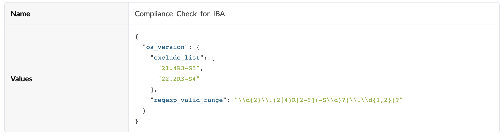

The property-set contains the following items:
- `regexp_valid_range`: Is a regular expression matching the EVPN hardened releases. For more help on how to interpret this regexp check this [link](https://regex101.com/r/13XYny/1).
- `exclude_list`: is an optionnal list of NOS versions to forbid.

<br>

> [!IMPORTANT]
> The property-set must be imported to the bluprint and committed before proceeding with the following steps.

<br>

### Telemetry Service Schema 
```
├── telemetry-service-definitions
    └── os-version-OS_Version.json
```


<br>

### Telemetry Collectors
```
├── telemetry-collectors
    └── os-version-OS_Version.json
```


<br>

> [!TIP]
> As mentioned in the "Identification of the source data (raw data)", the use of the `hostname` is only to be able to leverage Static stages in the IOBA processor.

<br>

### Probes
```
├── probes
    └── os-version-compliance-check.json
```

<br>


Source processor configuration:
- To define the probe as  **Static Stages** one we will choose a data type of `Text`, because our service value data type is `string`. By choosing this data type, we will be asked to map the key name `hostname` to a graph expression. We will simmply use the graph node property `hostname`, use the graph explorer to run the query and check the results.  


<br>

Output stage:

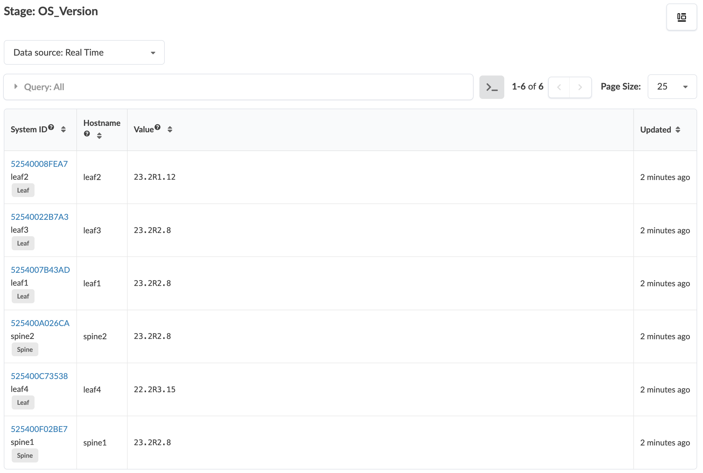

<br>

`Match_String` processor configuration to identify switches that are running versions not compliant with the hardened EVPN versions:


<br>

Output stage:

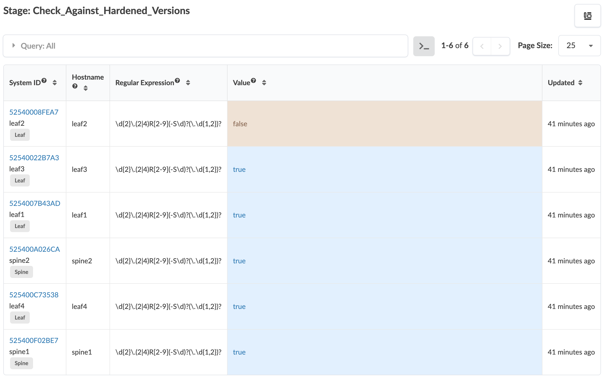

<br>

`Match_String` processor configuration to identify switches that are running versions from the excluded list:


<br>

Output stage:

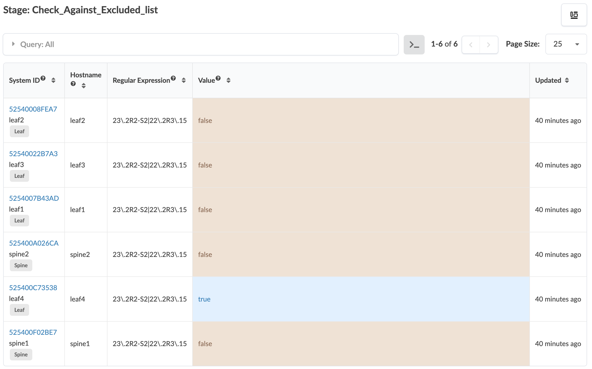

<br>

`State` processor configuration to raise an anomaly for switches running versions not compliant with the hardened EVPN versions:

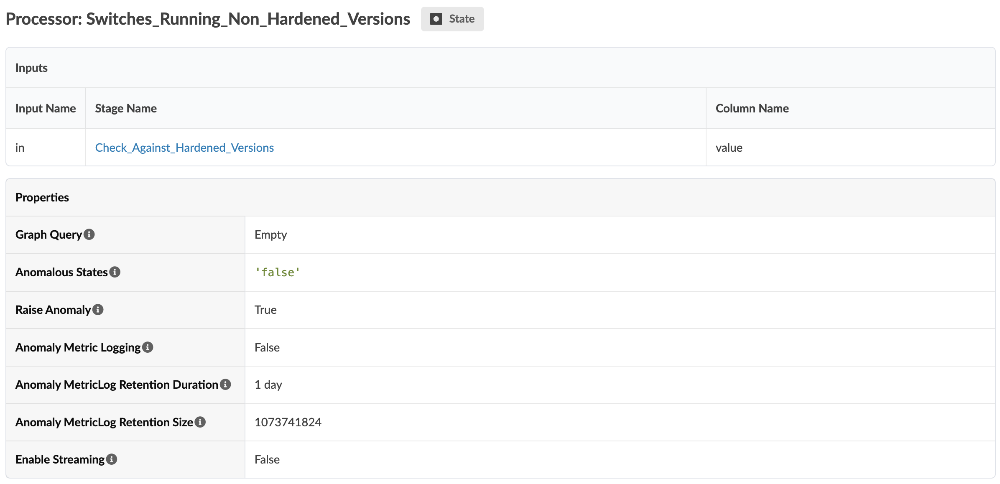

<br>

Output stage:

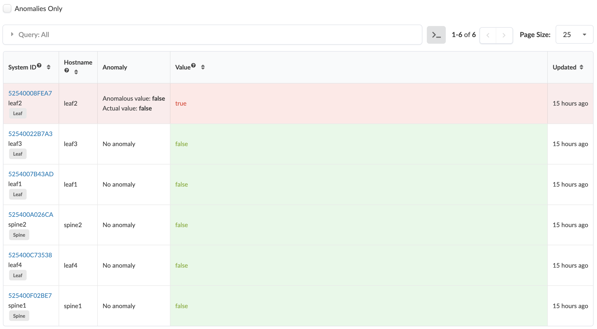


<br>

`State` processor configuration to raise an anomaly for switches running versions from the excluded list:


<br>

Output stage:


<br>

`Logical` processor configuration combining the presence of an anomaly from one cateogry or the other:


<br>

Output stage:

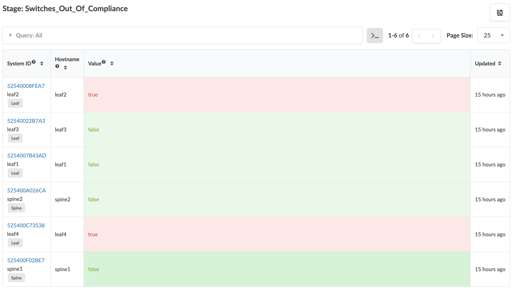

<br>

Putting it all together - Probe pipeline representation:

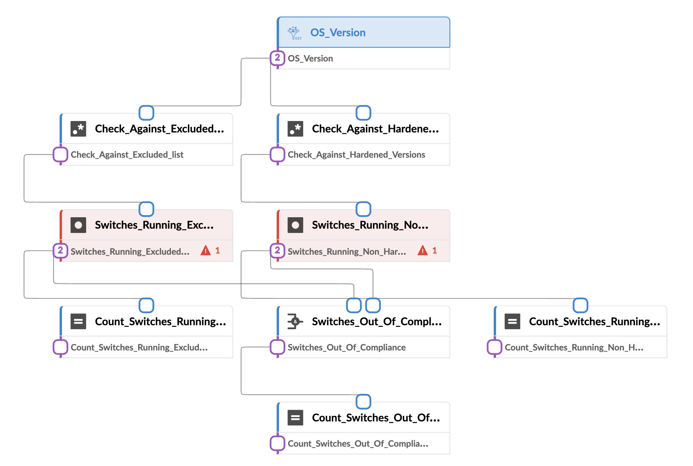

<br>


### Widgets
```
└── widgets
    ├── count-of-switches-not-running-hardened-versions.json
    ├── count-of-switches-running-excluded-versions.json
    ├── switches-not-running-hardened-versions.json
    ├── switches-running-excluded-versions.json
    └── total-count-of-switches-out-of-compliance.json
```

<br>

Configuration of the first widget: 


<br>

Configuration of the second widget:

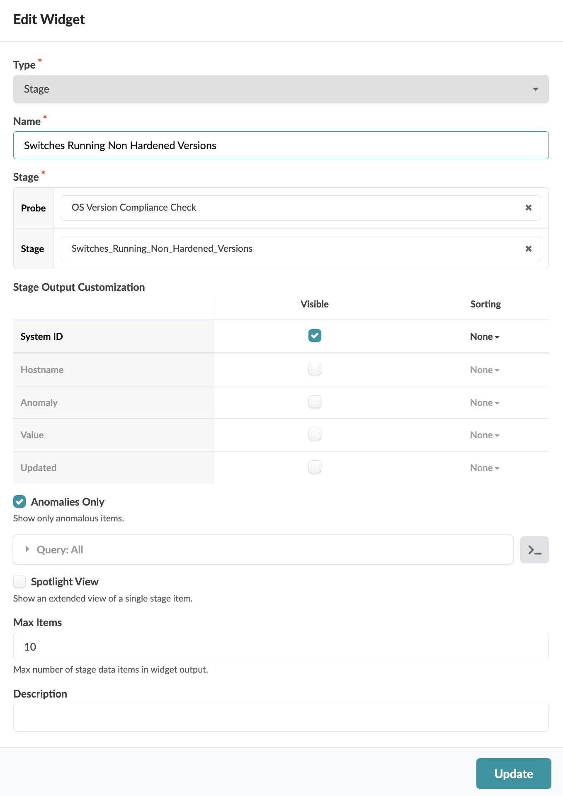

<br>

Configuration of the third widget: 

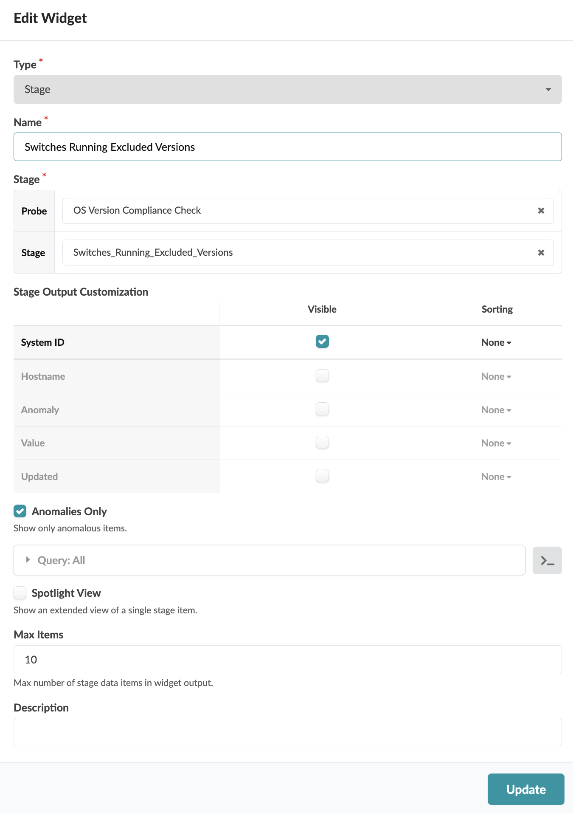

<br>

Configuration of the fourth widget: 

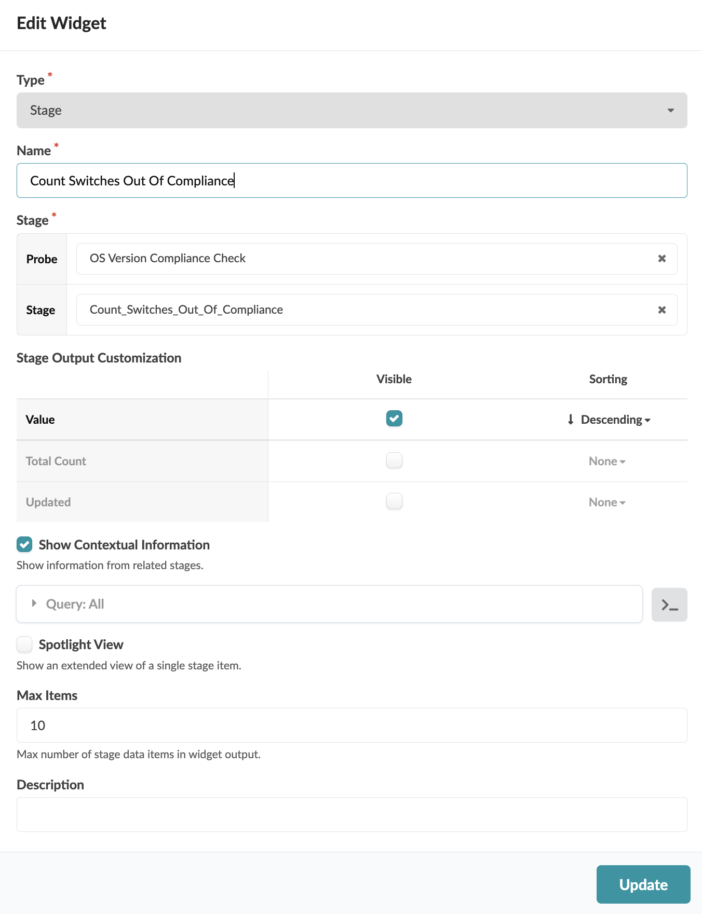

<br>

### Dashboards
```
├── dashboards
    └── os-version-compliance-check.json
```

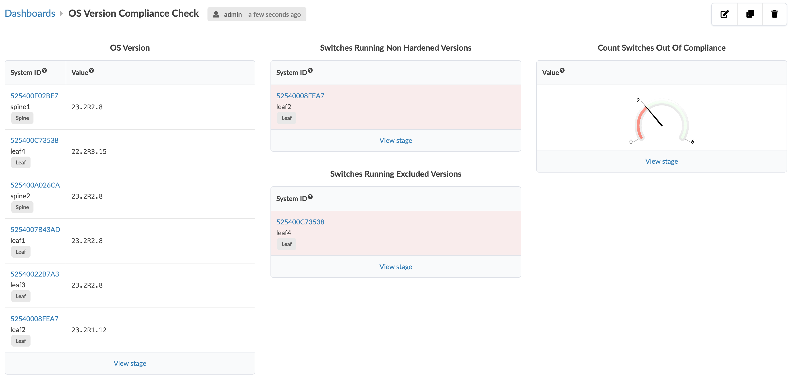