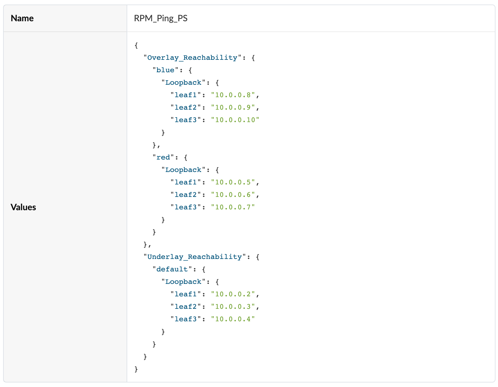
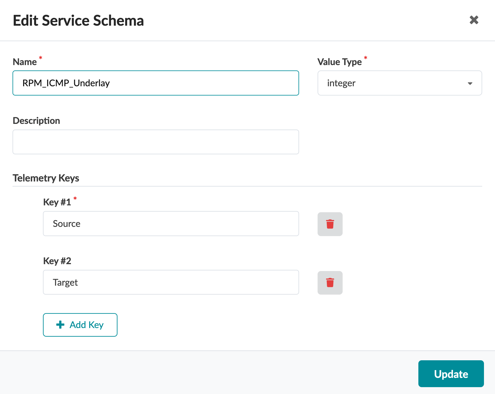
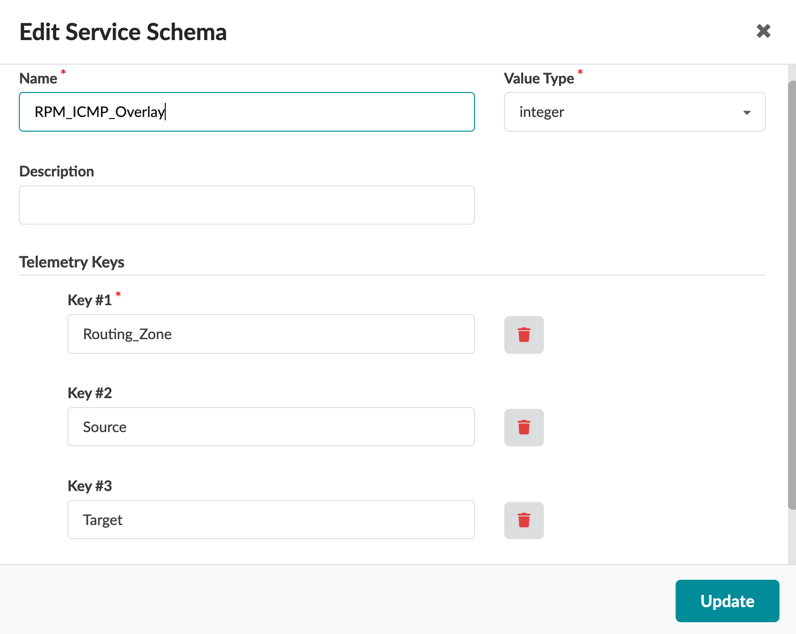
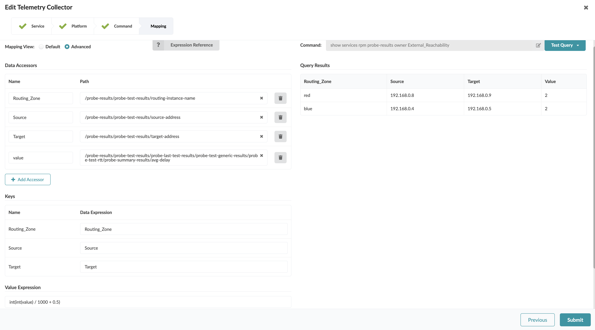
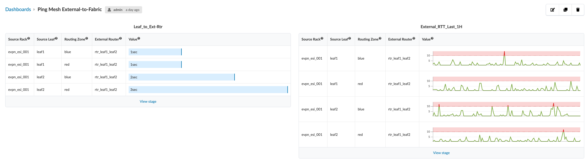

# Ping Mesh

Table of Contents:
- [Ping Mesh](#ping-mesh)
  - [Description of the use-case](#description-of-the-use-case)
  - [Identification of the source data (raw data)](#identification-of-the-source-data-raw-data)
  - [Content](#content)
    - [Configlets](#configlets)
    - [Property Sets](#property-sets)
    - [Telemetry Service Schema](#telemetry-service-schema)
    - [Telemetry Collectors](#telemetry-collectors)
    - [Probes](#probes)
      - [Probe pipeline structure](#probe-pipeline-structure)
      - [Probe processors details](#probe-processors-details)
    - [Widgets](#widgets)
    - [Dashboards](#dashboards)

<br>

## Description of the use-case

- Using a Configlet to enable Junos RPM probes funtionality, executing continuous PINGs to verify end-to-end reachability both intra-fabric (Underlay and Overlay) and external to the fabric (facing the External routers).
- Definition of three Telemetry services, each one collecting the results of a specific RPM probe: `Underlay_Reachbility`, `Overlay_Reachability` and `External_Reachability`.
- Creation of an IBA probe running those three services. Sepecific Graph Queries used in the source processor in order to match the services significant keys as well as defining additionnal keys to enrich the probe output with Graph context. Adding analytics processors (`Range`) to the probe to raise anomalies when measurements exceeds a defined threshold (expressed in seconds).
-  Different Widgets extracting different stages views from the IBA Probe. Widgets are grouped in Dashboards for easier consumption by the operator. 

<br>

## Identification of the source data (raw data)

- CLI Command: `show services rpm probe-results` - [Junos documentation page](https://www.juniper.net/documentation/us/en/software/junos/flow-monitoring/topics/ref/command/show-services-rpm-probe-results.html). 

- Sample Text Output
    ```
      Owner: Overlay_Reachability, Test: Overlay_red_leaf2
      Target address: 10.0.0.6, Source address: 10.0.0.5, Probe type: icmp-ping, Icmp-id: 23
      Routing Instance Name: red
      Test size: 5 probes
      Probe results:
        Response received
        Probe sent time: Fri Dec 15 17:33:51 2023
        Probe rcvd/timeout time: Fri Dec 15 17:33:51 2023, No hardware timestamps
        Rtt: 2414 usec, Round trip jitter: 91 usec
        Round trip interarrival jitter: 2741 usec
      Results over current test:
        Probes sent: 3, Probes received: 3, Loss percentage: 0.000000
        Measurement: Round trip time
          Samples: 3, Minimum: 2323 usec, Maximum: 2427 usec, Average: 2388 usec, Peak to peak: 104 usec, Stddev: 46 usec, Sum: 7164 usec
        Measurement: Positive round trip jitter
          Samples: 2, Minimum: 91 usec, Maximum: 223 usec, Average: 157 usec, Peak to peak: 132 usec, Stddev: 66 usec, Sum: 314 usec
        Measurement: Negative round trip jitter
          Samples: 1, Minimum: 104 usec, Maximum: 104 usec, Average: 104 usec, Peak to peak: 0 usec, Stddev: 0 usec, Sum: 104 usec
      Results over last test:
        Probes sent: 5, Probes received: 5, Loss percentage: 0.000000
        Test completed on Fri Dec 15 17:33:43 2023
        Measurement: Round trip time
          Samples: 5, Minimum: 2204 usec, Maximum: 2557 usec, Average: 2372 usec, Peak to peak: 353 usec, Stddev: 118 usec, Sum: 11859 usec
        Measurement: Positive round trip jitter
          Samples: 2, Minimum: 114 usec, Maximum: 144 usec, Average: 129 usec, Peak to peak: 30 usec, Stddev: 15 usec, Sum: 258 usec
        Measurement: Negative round trip jitter
          Samples: 3, Minimum: 17 usec, Maximum: 182 usec, Average: 123 usec, Peak to peak: 165 usec, Stddev: 75 usec, Sum: 370 usec
      Results over all tests:
        Probes sent: 486468, Probes received: 486181, Loss percentage: 0.058997
        Measurement: Round trip time
          Samples: 486181, Minimum: 1220 usec, Maximum: 327814 usec, Average: 3540 usec, Peak to peak: 326594 usec, Stddev: 6988 usec, Sum: 1721308691 usec
        Measurement: Positive round trip jitter
          Samples: 243486, Minimum: 0 usec, Maximum: 317054 usec, Average: 2568 usec, Peak to peak: 317054 usec, Stddev: 9086 usec, Sum: 625282130 usec
        Measurement: Negative round trip jitter
          Samples: 242694, Minimum: 1 usec, Maximum: 316191 usec, Average: 2576 usec, Peak to peak: 316190 usec, Stddev: 9161 usec, Sum: 625281915 usec

      Owner: Overlay_Reachability, Test: Overlay_red_leaf3
      Target address: 10.0.0.7, Source address: 10.0.0.5, Probe type: icmp-ping, Icmp-id: 23
      Routing Instance Name: red
      Test size: 5 probes
      Probe results:
        Response received
        Probe sent time: Fri Dec 15 17:33:51 2023
        Probe rcvd/timeout time: Fri Dec 15 17:33:51 2023, No hardware timestamps
        Rtt: 2356 usec, Round trip jitter: 31 usec
        Round trip interarrival jitter: 2871 usec
      Results over current test:
        Probes sent: 3, Probes received: 3, Loss percentage: 0.000000
        Measurement: Round trip time
          Samples: 3, Minimum: 2325 usec, Maximum: 2356 usec, Average: 2346 usec, Peak to peak: 31 usec, Stddev: 15 usec, Sum: 7037 usec
        Measurement: Positive round trip jitter
          Samples: 1, Minimum: 31 usec, Maximum: 31 usec, Average: 31 usec, Peak to peak: 0 usec, Stddev: 0 usec, Sum: 31 usec
        Measurement: Negative round trip jitter
          Samples: 2, Minimum: 31 usec, Maximum: 549 usec, Average: 290 usec, Peak to peak: 518 usec, Stddev: 259 usec, Sum: 580 usec
      Results over last test:
        Probes sent: 5, Probes received: 5, Loss percentage: 0.000000
        Test completed on Fri Dec 15 17:33:43 2023
        Measurement: Round trip time
          Samples: 5, Minimum: 2323 usec, Maximum: 2972 usec, Average: 2689 usec, Peak to peak: 649 usec, Stddev: 242 usec, Sum: 13444 usec
        Measurement: Positive round trip jitter
          Samples: 2, Minimum: 212 usec, Maximum: 582 usec, Average: 397 usec, Peak to peak: 370 usec, Stddev: 185 usec, Sum: 794 usec
        Measurement: Negative round trip jitter
          Samples: 3, Minimum: 43 usec, Maximum: 456 usec, Average: 301 usec, Peak to peak: 413 usec, Stddev: 184 usec, Sum: 904 usec
      Results over all tests:
        Probes sent: 486483, Probes received: 486428, Loss percentage: 0.011306
        Measurement: Round trip time
          Samples: 486428, Minimum: 1767 usec, Maximum: 347417 usec, Average: 4247 usec, Peak to peak: 345650 usec, Stddev: 6848 usec, Sum: 2065619493 usec
        Measurement: Positive round trip jitter
          Samples: 243471, Minimum: 0 usec, Maximum: 330144 usec, Average: 2619 usec, Peak to peak: 330144 usec, Stddev: 8875 usec, Sum: 637720518 usec
        Measurement: Negative round trip jitter
          Samples: 242956, Minimum: 1 usec, Maximum: 339985 usec, Average: 2625 usec, Peak to peak: 339984 usec, Stddev: 8976 usec, Sum: 637720941 usec
  ```
<details>
    <summary>Sample XML Output:</summary>

```xml
  <rpc-reply xmlns:junos="http://xml.juniper.net/junos/22.2R0/junos">
      <probe-results>
          <probe-test-results>
              <owner>Overlay_Reachability</owner>
              <test-name>Overlay_red_leaf2</test-name>
              <target-address>10.0.0.6</target-address>
              <source-address>10.0.0.5</source-address>
              <probe-type>icmp-ping</probe-type>
              <icmp-id>23</icmp-id>
              <routing-instance-name>red</routing-instance-name>
              <test-size junos:format="5 probes">
                  5
              </test-size>
              <probe-single-results junos:style="verbose">
                  <probe-status>Response received</probe-status>
                  <probe-sent-time junos:seconds="1702661696">
                      Fri Dec 15 17:34:56 2023
                  </probe-sent-time>
                  <probe-time junos:seconds="1702661696">
                      Fri Dec 15 17:34:56 2023
                  </probe-time>
                  <hardware-timestamp-status>No hardware timestamps</hardware-timestamp-status>
                  <rtt>2131</rtt>
                  <round-trip-jitter>-207</round-trip-jitter>
                  <round-trip-interarrival-jitter>4817</round-trip-interarrival-jitter>
              </probe-single-results>
              <probe-test-current-results>
                  <probe-test-generic-results>
                      <results-scope>current test</results-scope>
                      <probes-sent>5</probes-sent>
                      <probe-responses>5</probe-responses>
                      <loss-percentage>0.000000</loss-percentage>
                      <probe-test-rtt>
                          <probe-summary-results>
                              <probe-results-type>Round trip time</probe-results-type>
                              <samples>5</samples>
                              <min-delay junos:format="1929 usec">
                                  1929
                              </min-delay>
                              <max-delay junos:format="42995 usec">
                                  42995
                              </max-delay>
                              <avg-delay junos:format="10319 usec">
                                  10319
                              </avg-delay>
                              <jitter-delay junos:format="41066 usec">
                                  41066
                              </jitter-delay>
                              <stddev-delay junos:format="16339 usec">
                                  16339
                              </stddev-delay>
                              <sum-delay junos:format="51593 usec">
                                  51593
                              </sum-delay>
                          </probe-summary-results>
                      </probe-test-rtt>
                      <probe-test-positive-round-trip-jitter>
                          <probe-summary-results>
                              <probe-results-type>Positive round trip jitter</probe-results-type>
                              <samples>2</samples>
                              <min-delay junos:format="138 usec">
                                  138
                              </min-delay>
                              <max-delay junos:format="41066 usec">
                                  41066
                              </max-delay>
                              <avg-delay junos:format="20602 usec">
                                  20602
                              </avg-delay>
                              <jitter-delay junos:format="40928 usec">
                                  40928
                              </jitter-delay>
                              <stddev-delay junos:format="20464 usec">
                                  20464
                              </stddev-delay>
                              <sum-delay junos:format="41204 usec">
                                  41204
                              </sum-delay>
                          </probe-summary-results>
                      </probe-test-positive-round-trip-jitter>
                      <probe-test-negative-round-trip-jitter>
                          <probe-summary-results>
                              <probe-results-type>Negative round trip jitter</probe-results-type>
                              <samples>3</samples>
                              <min-delay junos:format="207 usec">
                                  207
                              </min-delay>
                              <max-delay junos:format="40795 usec">
                                  40795
                              </max-delay>
                              <avg-delay junos:format="13989 usec">
                                  13989
                              </avg-delay>
                              <jitter-delay junos:format="40588 usec">
                                  40588
                              </jitter-delay>
                              <stddev-delay junos:format="18957 usec">
                                  18957
                              </stddev-delay>
                              <sum-delay junos:format="41967 usec">
                                  41967
                              </sum-delay>
                          </probe-summary-results>
                      </probe-test-negative-round-trip-jitter>
                  </probe-test-generic-results>
              </probe-test-current-results>
              <probe-last-test-results>
                  <probe-test-generic-results>
                      <results-scope>last test</results-scope>
                      <probes-sent>5</probes-sent>
                      <probe-responses>5</probe-responses>
                      <loss-percentage>0.000000</loss-percentage>
                      <probe-last-test-info>
                          <last-test-time junos:seconds="1702661696">
                              Fri Dec 15 17:34:56 2023
                          </last-test-time>
                      </probe-last-test-info>
                      <probe-test-rtt>
                          <probe-summary-results>
                              <probe-results-type>Round trip time</probe-results-type>
                              <samples>5</samples>
                              <min-delay junos:format="1929 usec">
                                  1929
                              </min-delay>
                              <max-delay junos:format="42995 usec">
                                  42995
                              </max-delay>
                              <avg-delay junos:format="10319 usec">
                                  10319
                              </avg-delay>
                              <jitter-delay junos:format="41066 usec">
                                  41066
                              </jitter-delay>
                              <stddev-delay junos:format="16339 usec">
                                  16339
                              </stddev-delay>
                              <sum-delay junos:format="51593 usec">
                                  51593
                              </sum-delay>
                          </probe-summary-results>
                      </probe-test-rtt>
                      <probe-test-positive-round-trip-jitter>
                          <probe-summary-results>
                              <probe-results-type>Positive round trip jitter</probe-results-type>
                              <samples>2</samples>
                              <min-delay junos:format="138 usec">
                                  138
                              </min-delay>
                              <max-delay junos:format="41066 usec">
                                  41066
                              </max-delay>
                              <avg-delay junos:format="20602 usec">
                                  20602
                              </avg-delay>
                              <jitter-delay junos:format="40928 usec">
                                  40928
                              </jitter-delay>
                              <stddev-delay junos:format="20464 usec">
                                  20464
                              </stddev-delay>
                              <sum-delay junos:format="41204 usec">
                                  41204
                              </sum-delay>
                          </probe-summary-results>
                      </probe-test-positive-round-trip-jitter>
                      <probe-test-negative-round-trip-jitter>
                          <probe-summary-results>
                              <probe-results-type>Negative round trip jitter</probe-results-type>
                              <samples>3</samples>
                              <min-delay junos:format="207 usec">
                                  207
                              </min-delay>
                              <max-delay junos:format="40795 usec">
                                  40795
                              </max-delay>
                              <avg-delay junos:format="13989 usec">
                                  13989
                              </avg-delay>
                              <jitter-delay junos:format="40588 usec">
                                  40588
                              </jitter-delay>
                              <stddev-delay junos:format="18957 usec">
                                  18957
                              </stddev-delay>
                              <sum-delay junos:format="41967 usec">
                                  41967
                              </sum-delay>
                          </probe-summary-results>
                      </probe-test-negative-round-trip-jitter>
                  </probe-test-generic-results>
              </probe-last-test-results>
              <probe-test-global-results>
                  <probe-test-generic-results>
                      <results-scope>all tests</results-scope>
                      <probes-sent>486505</probes-sent>
                      <probe-responses>486218</probe-responses>
                      <loss-percentage>0.058992</loss-percentage>
                      <probe-test-rtt>
                          <probe-summary-results>
                              <probe-results-type>Round trip time</probe-results-type>
                              <samples>486218</samples>
                              <min-delay junos:format="1220 usec">
                                  1220
                              </min-delay>
                              <max-delay junos:format="327814 usec">
                                  327814
                              </max-delay>
                              <avg-delay junos:format="3540 usec">
                                  3540
                              </avg-delay>
                              <jitter-delay junos:format="326594 usec">
                                  326594
                              </jitter-delay>
                              <stddev-delay junos:format="6988 usec">
                                  6988
                              </stddev-delay>
                              <sum-delay junos:format="1721434735 usec">
                                  1721434735
                              </sum-delay>
                          </probe-summary-results>
                      </probe-test-rtt>
                      <probe-test-positive-round-trip-jitter>
                          <probe-summary-results>
                              <probe-results-type>Positive round trip jitter</probe-results-type>
                              <samples>243505</samples>
                              <min-delay junos:format="0 usec">
                                  0
                              </min-delay>
                              <max-delay junos:format="317054 usec">
                                  317054
                              </max-delay>
                              <avg-delay junos:format="2568 usec">
                                  2568
                              </avg-delay>
                              <jitter-delay junos:format="317054 usec">
                                  317054
                              </jitter-delay>
                              <stddev-delay junos:format="9086 usec">
                                  9086
                              </stddev-delay>
                              <sum-delay junos:format="625327103 usec">
                                  625327103
                              </sum-delay>
                          </probe-summary-results>
                      </probe-test-positive-round-trip-jitter>
                      <probe-test-negative-round-trip-jitter>
                          <probe-summary-results>
                              <probe-results-type>Negative round trip jitter</probe-results-type>
                              <samples>242712</samples>
                              <min-delay junos:format="1 usec">
                                  1
                              </min-delay>
                              <max-delay junos:format="316191 usec">
                                  316191
                              </max-delay>
                              <avg-delay junos:format="2576 usec">
                                  2576
                              </avg-delay>
                              <jitter-delay junos:format="316190 usec">
                                  316190
                              </jitter-delay>
                              <stddev-delay junos:format="9161 usec">
                                  9161
                              </stddev-delay>
                              <sum-delay junos:format="625327171 usec">
                                  625327171
                              </sum-delay>
                          </probe-summary-results>
                      </probe-test-negative-round-trip-jitter>
                  </probe-test-generic-results>
              </probe-test-global-results>
              <delay-thresh>0</delay-thresh>
              <jitter-thresh>0</jitter-thresh>
              <stddev-thresh>0</stddev-thresh>
              <loss-thresh-total>3</loss-thresh-total>
              <loss-thresh-succ>1</loss-thresh-succ>
          </probe-test-results>
          <probe-test-results>
              <owner>Overlay_Reachability</owner>
              <test-name>Overlay_red_leaf3</test-name>
              <target-address>10.0.0.7</target-address>
              <source-address>10.0.0.5</source-address>
              <probe-type>icmp-ping</probe-type>
              <icmp-id>23</icmp-id>
              <routing-instance-name>red</routing-instance-name>
              <test-size junos:format="5 probes">
                  5
              </test-size>
              <probe-single-results junos:style="verbose">
                  <probe-status>Response received</probe-status>
                  <probe-sent-time junos:seconds="1702661696">
                      Fri Dec 15 17:34:56 2023
                  </probe-sent-time>
                  <probe-time junos:seconds="1702661696">
                      Fri Dec 15 17:34:56 2023
                  </probe-time>
                  <hardware-timestamp-status>No hardware timestamps</hardware-timestamp-status>
                  <rtt>3189</rtt>
                  <round-trip-jitter>375</round-trip-jitter>
                  <round-trip-interarrival-jitter>4810</round-trip-interarrival-jitter>
              </probe-single-results>
              <probe-test-current-results>
                  <probe-test-generic-results>
                      <results-scope>current test</results-scope>
                      <probes-sent>5</probes-sent>
                      <probe-responses>5</probe-responses>
                      <loss-percentage>0.000000</loss-percentage>
                      <probe-test-rtt>
                          <probe-summary-results>
                              <probe-results-type>Round trip time</probe-results-type>
                              <samples>5</samples>
                              <min-delay junos:format="2814 usec">
                                  2814
                              </min-delay>
                              <max-delay junos:format="42943 usec">
                                  42943
                              </max-delay>
                              <avg-delay junos:format="10940 usec">
                                  10940
                              </avg-delay>
                              <jitter-delay junos:format="40129 usec">
                                  40129
                              </jitter-delay>
                              <stddev-delay junos:format="16002 usec">
                                  16002
                              </stddev-delay>
                              <sum-delay junos:format="54701 usec">
                                  54701
                              </sum-delay>
                          </probe-summary-results>
                      </probe-test-rtt>
                      <probe-test-positive-round-trip-jitter>
                          <probe-summary-results>
                              <probe-results-type>Positive round trip jitter</probe-results-type>
                              <samples>3</samples>
                              <min-delay junos:format="11 usec">
                                  11
                              </min-delay>
                              <max-delay junos:format="40077 usec">
                                  40077
                              </max-delay>
                              <avg-delay junos:format="13488 usec">
                                  13488
                              </avg-delay>
                              <jitter-delay junos:format="40066 usec">
                                  40066
                              </jitter-delay>
                              <stddev-delay junos:format="18802 usec">
                                  18802
                              </stddev-delay>
                              <sum-delay junos:format="40463 usec">
                                  40463
                              </sum-delay>
                          </probe-summary-results>
                      </probe-test-positive-round-trip-jitter>
                      <probe-test-negative-round-trip-jitter>
                          <probe-summary-results>
                              <probe-results-type>Negative round trip jitter</probe-results-type>
                              <samples>2</samples>
                              <min-delay junos:format="75 usec">
                                  75
                              </min-delay>
                              <max-delay junos:format="40054 usec">
                                  40054
                              </max-delay>
                              <avg-delay junos:format="20065 usec">
                                  20065
                              </avg-delay>
                              <jitter-delay junos:format="39979 usec">
                                  39979
                              </jitter-delay>
                              <stddev-delay junos:format="19990 usec">
                                  19990
                              </stddev-delay>
                              <sum-delay junos:format="40129 usec">
                                  40129
                              </sum-delay>
                          </probe-summary-results>
                      </probe-test-negative-round-trip-jitter>
                  </probe-test-generic-results>
              </probe-test-current-results>
              <probe-last-test-results>
                  <probe-test-generic-results>
                      <results-scope>last test</results-scope>
                      <probes-sent>5</probes-sent>
                      <probe-responses>5</probe-responses>
                      <loss-percentage>0.000000</loss-percentage>
                      <probe-last-test-info>
                          <last-test-time junos:seconds="1702661696">
                              Fri Dec 15 17:34:56 2023
                          </last-test-time>
                      </probe-last-test-info>
                      <probe-test-rtt>
                          <probe-summary-results>
                              <probe-results-type>Round trip time</probe-results-type>
                              <samples>5</samples>
                              <min-delay junos:format="2814 usec">
                                  2814
                              </min-delay>
                              <max-delay junos:format="42943 usec">
                                  42943
                              </max-delay>
                              <avg-delay junos:format="10940 usec">
                                  10940
                              </avg-delay>
                              <jitter-delay junos:format="40129 usec">
                                  40129
                              </jitter-delay>
                              <stddev-delay junos:format="16002 usec">
                                  16002
                              </stddev-delay>
                              <sum-delay junos:format="54701 usec">
                                  54701
                              </sum-delay>
                          </probe-summary-results>
                      </probe-test-rtt>
                      <probe-test-positive-round-trip-jitter>
                          <probe-summary-results>
                              <probe-results-type>Positive round trip jitter</probe-results-type>
                              <samples>3</samples>
                              <min-delay junos:format="11 usec">
                                  11
                              </min-delay>
                              <max-delay junos:format="40077 usec">
                                  40077
                              </max-delay>
                              <avg-delay junos:format="13488 usec">
                                  13488
                              </avg-delay>
                              <jitter-delay junos:format="40066 usec">
                                  40066
                              </jitter-delay>
                              <stddev-delay junos:format="18802 usec">
                                  18802
                              </stddev-delay>
                              <sum-delay junos:format="40463 usec">
                                  40463
                              </sum-delay>
                          </probe-summary-results>
                      </probe-test-positive-round-trip-jitter>
                      <probe-test-negative-round-trip-jitter>
                          <probe-summary-results>
                              <probe-results-type>Negative round trip jitter</probe-results-type>
                              <samples>2</samples>
                              <min-delay junos:format="75 usec">
                                  75
                              </min-delay>
                              <max-delay junos:format="40054 usec">
                                  40054
                              </max-delay>
                              <avg-delay junos:format="20065 usec">
                                  20065
                              </avg-delay>
                              <jitter-delay junos:format="39979 usec">
                                  39979
                              </jitter-delay>
                              <stddev-delay junos:format="19990 usec">
                                  19990
                              </stddev-delay>
                              <sum-delay junos:format="40129 usec">
                                  40129
                              </sum-delay>
                          </probe-summary-results>
                      </probe-test-negative-round-trip-jitter>
                  </probe-test-generic-results>
              </probe-last-test-results>
              <probe-test-global-results>
                  <probe-test-generic-results>
                      <results-scope>all tests</results-scope>
                      <probes-sent>486520</probes-sent>
                      <probe-responses>486465</probe-responses>
                      <loss-percentage>0.011305</loss-percentage>
                      <probe-test-rtt>
                          <probe-summary-results>
                              <probe-results-type>Round trip time</probe-results-type>
                              <samples>486465</samples>
                              <min-delay junos:format="1767 usec">
                                  1767
                              </min-delay>
                              <max-delay junos:format="347417 usec">
                                  347417
                              </max-delay>
                              <avg-delay junos:format="4246 usec">
                                  4246
                              </avg-delay>
                              <jitter-delay junos:format="345650 usec">
                                  345650
                              </jitter-delay>
                              <stddev-delay junos:format="6848 usec">
                                  6848
                              </stddev-delay>
                              <sum-delay junos:format="2065758151 usec">
                                  2065758151
                              </sum-delay>
                          </probe-summary-results>
                      </probe-test-rtt>
                      <probe-test-positive-round-trip-jitter>
                          <probe-summary-results>
                              <probe-results-type>Positive round trip jitter</probe-results-type>
                              <samples>243490</samples>
                              <min-delay junos:format="0 usec">
                                  0
                              </min-delay>
                              <max-delay junos:format="330144 usec">
                                  330144
                              </max-delay>
                              <avg-delay junos:format="2619 usec">
                                  2619
                              </avg-delay>
                              <jitter-delay junos:format="330144 usec">
                                  330144
                              </jitter-delay>
                              <stddev-delay junos:format="8875 usec">
                                  8875
                              </stddev-delay>
                              <sum-delay junos:format="637767537 usec">
                                  637767537
                              </sum-delay>
                          </probe-summary-results>
                      </probe-test-positive-round-trip-jitter>
                      <probe-test-negative-round-trip-jitter>
                          <probe-summary-results>
                              <probe-results-type>Negative round trip jitter</probe-results-type>
                              <samples>242974</samples>
                              <min-delay junos:format="1 usec">
                                  1
                              </min-delay>
                              <max-delay junos:format="339985 usec">
                                  339985
                              </max-delay>
                              <avg-delay junos:format="2625 usec">
                                  2625
                              </avg-delay>
                              <jitter-delay junos:format="339984 usec">
                                  339984
                              </jitter-delay>
                              <stddev-delay junos:format="8976 usec">
                                  8976
                              </stddev-delay>
                              <sum-delay junos:format="637767127 usec">
                                  637767127
                              </sum-delay>
                          </probe-summary-results>
                      </probe-test-negative-round-trip-jitter>
                  </probe-test-generic-results>
              </probe-test-global-results>
              <delay-thresh>0</delay-thresh>
              <jitter-thresh>0</jitter-thresh>
              <stddev-thresh>0</stddev-thresh>
              <loss-thresh-total>3</loss-thresh-total>
              <loss-thresh-succ>1</loss-thresh-succ>
          </probe-test-results>
      </probe-results>
      <cli>
          <banner></banner>
      </cli>
  </rpc-reply>
  ```
</details>
  
<br>

- Fields of interest:

| Field | Information |
| --- | --- |
| `Routing Instance Name` | Name of the configured routing instance in which the RPM probe is configured |
| `Source address` | Source address used by the RPM probe. |
| `Target address` | Destination address used by the RPM probe. |
| `Average Delay Time` | Average measurement Round trip time. Note this is a part of the fields dependant on the RPM Probe time. It appears for any RPM Probe of type ICMP, under the `probe-summary-results` path. |

<br>

## Content

### Configlets

```
├── configlets
    └── rpm-ping.json
```
Definition of a configlet with three seperate sections, each section defining a seperate RPM probe, in order to facilitate their maintainbility: 
- `Underlay_Reachbility`, 
- `Overlay_Reachability` 
- `External_Reachability`.

<br>

> [!IMPORTANT]
> This configilet is provided only as an example. Customise to your own environement and always run Commit-Check from the Uncommitted tab prior to a blueprint commit.
> 
> The configlet must be successfully imported to the bluprint and committed before proceeding with the following steps.

<br>

Configlet section for `Underlay Reachability` RPM probe: 


<br>

Configlet section for `Overlay Reachability` RPM probe: 


<br>

Configlet section for `External Reachability` RPM probe: 


<br>

### Property Sets

```
├── property-sets
    └── rpm-ping-ps.json
```



<br>

> [!IMPORTANT]
> The property-set must be successfully imported to the bluprint and committed before proceeding with the following steps.

<br>

### Telemetry Service Schema 
```
├── telemetry-service-definitions
    ├── rpm-icmp-external-RPM_ICMP_External.json
    ├── rpm-icmp-overlay-RPM_ICMP_Overlay.json
    └── rpm-icmp-underlay-RPM_ICMP_Underlay.json
```

<br>

Definition of the schema for the service collecting `Underlay Reachability` RPM probe results:



<br>

Definition of the schema for the service collecting `Overlay Reachability` RPM probe results:



<br>

Definition of the schema for the service collecting `External Reachability` RPM probe results:


<br>

### Telemetry Collectors
```
├── telemetry-collectors
    ├── rpm_icmp_external.json
    ├── rpm_icmp_overlay.json
    └── rpm_icmp_underlay.json
```

<br>

Definition of the collector for getting the results from the `Underlay Reachability` RPM probe:


<br>

Definition of the collector for getting the results from the `Overlay Reachability` RPM probe:


<br>

Definition of the collector for getting the results from the `External Reachability` RPM probe:



<br>

### Probes

#### Probe pipeline structure

<br>


<br>

#### Probe processors details
```
├── probes
│   └── ping-mesh.json
```

<br>

Source Processor configuration for `Underlay Reachability` RPM probe:


<br>

Stage output for `Underlay Reachability` RPM probe:


<br>

### Widgets
```
└── widgets
    ├── external-rtt-last-1h.json
    ├── leaf-to-ext-rtr.json
    ├── leaf-to-leaf-overlay.json
    ├── leaf-to-leaf-underlay.json
    ├── overlay-rtt-last-1h.json
    └── underlay-rtt-last-1h.json
```

<br>

Configuration of the first widget: 
<!--  -->

<br>

Configuration of the second widget: 
<!--  -->

<br>

Configuration of the third widget: 
<!--  -->

<br>

Configuration of the fourth widget: 
<!--  -->

<br>

Configuration of the fifth widget: 
<!--  -->

<br>

Configuration of the sixth widget: 


<br>

### Dashboards

```
├── dashboards
    ├── ping-mesh-external-to-fabric.json
    └── ping-mesh-intra-fabric.json
```

<br>

First dashboard: 


<br>

Second dashboard: 


