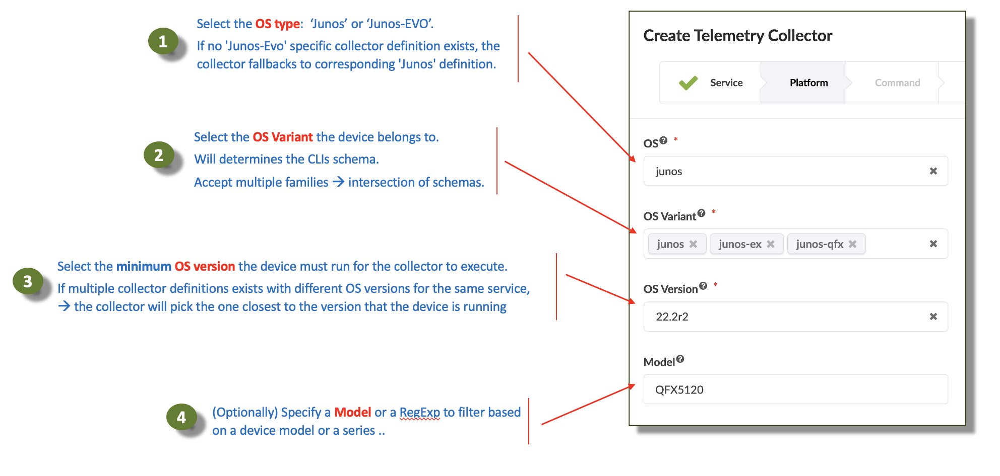

# Custom IBA Probes in Apstra

 

Table of Contents:
- [Custom IBA Probes in Apstra](#custom-iba-probes-in-apstra)
  - [Goal of this repository](#goal-of-this-repository)
  - [Content of this repository](#content-of-this-repository)
  - [How to use this repository?](#how-to-use-this-repository)
    - [For Apstra 5.0.0 onwards](#for-apstra-500-onwards)
    - [For Apstra 4.2.1](#for-apstra-421)
  - [How to contribute to this repository?](#how-to-contribute-to-this-repository)
  - [High-Level Architecture of IBA](#high-level-architecture-of-iba)
    - [Custom Telemetry Collectors](#custom-telemetry-collectors)

<!-- To do (WIP Mehdi):
- Interface flap
    - Report the observed bug on APIs for Widgets.

- Examples to add to the Roadmap
  - VRF Scale RFE-2016
  - "show pfe vxlan nh-usage" if any possible with some hacks, likely not !
  - Probe to monitor Route Table sizes - RIB/FIB > RFE-2511.
  - Monitor the Routing Engine status
-->

## Goal of this repository

**Learn through practical examples how to create a custom IBA probe, from the definition of a Custom Telemetry Collector to using it in a Custom IBA probe.**

Creating new IBA probe involves several parts of Apstra (Telemetry, GraphDB, IBA). Each part has a role to play, and the examples are selected and described with the ambition to show these different parts and how they come together. Going through the examples, you will notice some of them have more complexity at the collector level because we need to process the data in a certain way to make it effectively usable by the analytics capabilities of IBA. Other times you will find simple collectors but more sophisticated IBA probes because the use case requires the implementation of an advanced processing of this data to extract the desired insight.

> [!IMPORTANT]
> The examples in this repository are provided for educational purposes and are expected to be tested and customised to your specific needs before deploying them in your production blueprints.

## How to use this repository?

### For Apstra 5.0.0 onwards

https://github.com/user-attachments/assets/37a92316-0999-4fe5-8b03-9445c88adc1d

1) Always use the `main` branch when accessing this repository. Other branches contain work in progress.

2) Navigate to the release folder (5.0.0) of your chosen probe example.

3) Download the required files or use `git clone https://github.com/Juniper-SE/Apstra_IBA_Probes.git` to get the:
   - Service Schema file (contains both service schema and collector definitions)
   - Dashboard file (contains the dashboard, probes and widgets)

4) Import the files into your Apstra instance:

   a) Import Service Schema:
   - Navigate to Analytics > Service Registry in your Apstra instance
   - Click "Import Service Schema"
   - Select your downloaded service schema file
   - Confirm the import

   b) Import Dashboard:
   - Navigate to the Dashboard page in your Apstra instance
   - Click "Import Dashboard"
   - Select your downloaded dashboard file
   - Confirm the import

The collector will automatically start running once a probe begins consuming the service.

### For Apstra 4.2.1

1) Git clone the repository: `https://github.com/Juniper-SE/Apstra_IBA_Probes.git`.

2) Import the different JSON files in the `content` folder of any given example into your running Apstra instance. You can do this via:
   - "Import" buttons in the UI for most items
   - REST APIs for automation
   - Apstra-CLI utility

3) If using REST APIs, follow this sequence:
   1) Configlets
   2) Property-Sets
   3) telemetry-service-definitions
   4) telemetry-collectors
   5) probes
   6) widgets
   7) dashboards

4) For Apstra-CLI usage:
   1) Copy the content folder to a location mounted as a volume in your Apstra-CLI utility
   2) Execute `content import` command with the `--folder` argument

> [!IMPORTANT]
> For 4.2.1, ensure configlets and property-sets are pushed first, imported to the blueprint and successfully committed prior to moving to the next steps.

> [!IMPORTANT]
> In 4.2.1, IBA Widgets and Dashboards JSON definitions must include the Probe_ID and Blueprint_ID. Edit these files before importing.

## How to contribute to this repository?
1) Git clone the repository: `https://github.com/Juniper-SE/Apstra_IBA_Probes.git`
2) Move to the repository `cd Apstra_IBA_Probes` and create a new branch: `git checkout -b <Your-Branch-Name>`.

#### For Apstra 4.2.1:
```
VERSION="release_4.2.1"
PROBE_NAME="<Probe_Name>"
mkdir -p $VERSION/$PROBE_NAME/{Content/{configlets,dashboards,probes,property-sets,telemetry-collectors,telemetry-service-definitions,widgets},Images} && touch $VERSION/$PROBE_NAME/README.md
```

This will generate the following 4.2.1 hierarchies:
```
.
└── release_4.2.1
    └── <Probe_Name>
        ├── Content
        │   ├── configlets
        │   ├── dashboards
        │   ├── probes
        │   ├── property-sets
        │   ├── telemetry-collectors
        │   ├── telemetry-service-definitions
        │   └── widgets
        ├── Images
        └── README.md
```

#### For Apstra 5.0.0 onwards:
```
VERSION="release_5.0.0"
PROBE_NAME="<Probe_Name>"
mkdir -p $VERSION/$PROBE_NAME/{Content,Images} && touch $VERSION/$PROBE_NAME/README.md
```

This will generate the following 5.0.0 hierarchies:
```
.
└── release_5.0.0
    └── <Probe_Name>
        ├── Content
        ├── Images
        └── README.md
```

3) Start filling that newly created folder structure by populating every relevant section. This includes clear description of the use-case documented in the README files, copies of all the relevant JSON payloads extracted from your environment (You can use UI export buttons, API calls or apstra-cli `content export` command), any useful screen capture image, etc ... Check existing content for inspiration and follow the same structure.
 

4) Stage your changes as you progress: `git add <filename>` or `git add .` and commit them once you have a satisfactory version: `git commit -m "<provide-commit-message>"`.

5) Push your branch to origin `git push --set-upstream origin <Your-Branch-Name>`
- Branch protection rules: This repository has `main` branch set as a protected branch. It will not accept any direct push (see below). All commits must be made to a non-protected branch and submitted via a pull request against `Main` before they can be merged. This allows to scale the collaboration on this repository
```
user@mbp:~/Apstra_IBA_Probes (main *) $ gs
On branch main
Your branch is ahead of 'origin/main' by 1 commit.
  (use "git push" to publish your local commits)

nothing to commit, working tree clean
user@mbp:~/Apstra_IBA_Probes (main) $ git push
Enumerating objects: 5, done.
Counting objects: 100% (5/5), done.
Delta compression using up to 16 threads
Compressing objects: 100% (3/3), done.
Writing objects: 100% (3/3), 294 bytes | 294.00 KiB/s, done.
Total 3 (delta 2), reused 0 (delta 0), pack-reused 0
remote: Resolving deltas: 100% (2/2), completed with 2 local objects.
remote: Bypassed rule violations for refs/heads/main:
remote: 
remote: - Changes must be made through a pull request.
remote: 
remote: - Cannot change this locked branch
remote: 
To github.com:mab27/Apstra_IBA_Probes.git
   45100ac..55e363d  main -> main
```
6) Create a Pull Request against `main` branch.

<!-- ## High-Level Architecture of IBA
Link to new IBA Doc once complete -->

### Custom Telemetry Collectors

- Collector platform definition

 

  - Explanation of `OS Variant`.

| OS Variant | Models |
| --- | --- |
| `junos-qfx` | QFX5110<br>QFX5120<br>QFX5210<br>QFX10K<br>EX4650 |
| `junos-ex` | EX4400 |
| `junos` | vJunos-switch |
| `qfx-ms-fixed` | QFX5130<br>QFX5700<br>QFX5220 |
| `acx-f` | ACX7100<br>ACX7024 |
| `ptx1k` | PTX10001-36MR<br>vJunosEvolved |
| `ptx` | PTX10004 / 8 / 16 |
