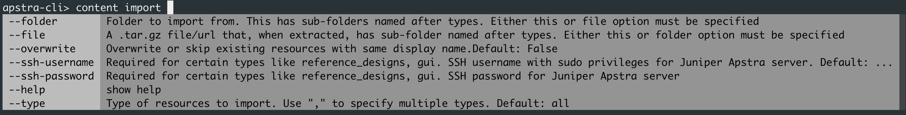
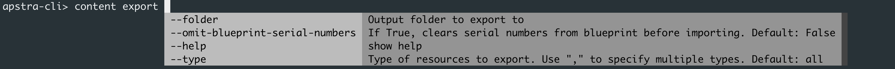

# Custom IBA Probes in Apstra
<br>
<br>

 


Table of Contents:
- [Custom IBA Probes in Apstra](#custom-iba-probes-in-apstra)
  - [Goal of this repository](#goal-of-this-repository)
  - [Content of this repository](#content-of-this-repository)
  - [How to use this repository?](#how-to-use-this-repository)
  - [How to contribute to this repository?](#how-to-contribute-to-this-repository)
  - [High-Level Architecture of IBA (WIP)](#high-level-architecture-of-iba-wip)
    - [Custom Telemetry Collectors](#custom-telemetry-collectors)

<!-- To do (WIP Mehdi):

- OPSF Neighbor Check
  - Enhance the configlet, leverage Device-Context and add a Property-set.
  - Enhance the probe to use State_Check processor to check for neighbour not in Full state.

- Interface flap
    - Report the bug on APIs for Widgets

- Interface Queue.
    - Find a device with running traffic to execute the command on, get the output and document it. 
    - Design the probe. 

- Github actions:
  - Investigate automation. Example check that .json files are proper JSON, check that Images directory only contains .png, check that a folder is in a gi ven sturcture.

- Examples to add (Roadmap field to make it public).
  - BFD telemetry (less important, since already documented)
  - RoCEv2  We should have a public roadmap 
  - VRF Scale https://apstrktr.atlassian.net/browse/RFE-2016
  - "show pfe vxlan nh-usage" if any possible with some hacks
  - Probe to monitor Route Table sizes - RIB/FIB > RFE-2511.
  - "show ddos-protection protocols" from UHS experience
  - Monitor the Routing Engine status
  - show system alarms or show chassis alarms (discussed with Boris)


-->


<br>

## Goal of this repository

**Learn thourgh practical examples how to create a custom IBA probe, from the definition of a Custom Telemetry Collector to using it in a Custom IBA probe.**

Creating new IBA probe involves several parts of Apstra (Telemetry, GraphDB, IBA). Each part has a role to play, the examples are selected and described with the ambition to show these different parts and how they come together. Going through the examples you will notice some of them have more complexity at the collector level because we need to process the data in a certain way to make it effectively usable by the analytics capabilities of IBA. Other times you will find simple collectors but more sophisticated IBA probes because the use case requires the implementation of an advanced processing of this data in order to extract the desired insight.

> [!IMPORTANT]
> The examples in this repository are provided for educational purposes and are expected to be tested and customised to your specific needs before deploying them in your production blueprints.

<br>

## Content of this repository
The following examples of IBA probes are listed in this repository.

1) [Ping Mesh](Ping_Mesh/release_4.2.1/README.md) 
2) [Device Uptime](Device_Uptime/release_4.2.1/README.md) 
3) [OSPF Neighbor](OSPF_Neighbor/release_4.2.1/README.md)
4) [Interface Flap](Interface_Flap/release_4.2.1/README.md)
5) [OS Version Compliance](OS_Version_Compliance/release_4.2.1/README.md)
6) [Interface Queue](Interface_Queue/release_4.2.1/README.md) <<< WIP

<br>

> [!IMPORTANT]
> The minimum Apstra release to run these examples is `4.2.1`

## How to use this repository?
1) Git clone the repository: `git clone git@github.com:mab27/Apstra_IBA_Probes.git`.
2) Import the different JSON files in the `content` folder of any given example into your running Apstra instance. You can do that via "import" buttons in the UI for most items, except the `telemetry-collectors` for which UI based import is a comming in the roadmap. Alternatively you can use REST APIs to automate pushing the files to your instance. If you use the REST APIs, a sequence must be followed to ensure the files are correctly accepted by the receiving Apstra instance: (1) **Configlets** --> (2) **Property-Sets** --> (3) **telemetry-service-definitions** --> (4) **telemetry-collectors** --> (5) **probes** --> (6) **widgets** --> and (7) **dashboards**. To make this process easiser you can use the Apstra-CLI utility, a wrappwer around Aprstra's API that delivers workflows including taking care of the right sequence during import of JSON payloads.
   1) Copy the content of `content` folder for the example your are an interested to a location that you mount as a volume of your Apstra-CLI utililty. See Apstra-CLI [documentaiton](https://www.juniper.net/documentation/us/en/software/apstra4.2/apstra-user-guide/topics/topic-map/apstra-cli.html) for more details on how ot use docker volume mount.
   2) From the Apstra-CLI prompt execute `content import` command by pasing the folder path through the `--folder` argument.


<br>

> [!IMPORTANT]
> Irrespective of the method you use to import the files (manually via the UI, APIs or Apstra-CLI) you need to ensure `configlets` and `property-sets` if they exist, are pushed first, imported to the blueprint and successfully committed prior to moving to the next steps. Any collector, probes, or other element must not be imported ot a blueprint if the underlying configlet/s and property-sets have not been committed ot the blueprint. If you use Apstra-CLI run an inport of `--type configlet` and `--type property-sets` first, before running the rest.

<br>

> [!IMPORTANT]
> Until `4.2.1` included, IBA Widgets and Dashboards JSON definitions must respectively include the Probe_ID and the Blueprint_ID (This will change in `5.0.0` to have a more loosely coupled design). Therefore, when importing the content into any `4.2.1` instance you must prior to that edit the JSON files for `widgets` and `dashboards` to include your Probe ID and Dashboard ID, otherwise this part of the `content import` will fail. 

<br>

## How to contribute to this repository?
1) Git clone the repository: `git clone git@github.com:mab27/Apstra_IBA_Probes.git`
2) Move to the repository `cd Apstra_IBA_Probes` and create a new branch: `git checkout -b <Your-Branch-Name>`.
> [!TIP]
> Name the branch after the change you are planning to do to facilitate its identification locally, when you work on it, and remotely when you later pusch it for collaboration and review. For example if you are creating a new probe, your branch name could be something like "Monitor metric foo on external links". If you are adding another release variant to existing probe because you want to benefit from the new feature enhancements, your branch name could be "release_5.0.0 for Ping Mesh".
3) Create the folder structure for your new Probe: `mkdir -p New_IBA_Probe_Example/release_X.Y.Z/{Content/{configlets,property-sets,telemetry-service-definitions,telemetry-collectors,probes,widgets,dashboards},Images} && touch New_IBA_Probe_Example/release_X.Y.Z/README.md`. It is important to follow this structure to streamline collaboraiton and testing. 
  - This will generate the following hierarchy:
```
├── IBA_Probe_Example
│   └── release_X.Y.Z
│       ├── Content
│       │   ├── configlets
│       │   ├── dashboards
│       │   ├── probes
│       │   ├── property-sets
│       │   ├── telemetry-collectors
│       │   ├── telemetry-service-definitions
│       │   └── widgets
│       ├── Images
│       └── README.md
```
4) Start filling that newly created folder structure by populating every relevant section. This includes clear description of the use-case docoumented in the README files, copies of all the relvant JSON payloads extracted from your environement (You can use UI export buttons, API calls or apstra-cli `content export` command), any useful screen capture image, etc ... Check existing content for inspiration and follow the same strucutre.
 
5) Stage your chnages as you progress: `git add <filename>` or `git add .` and commit them once you have a satisfacotry version: `git commit -m "<provide-commmit-message>"`.
6) Push your branch to origin `git push --set-upstream origin <Your-Branch-Name>`
> [!IMPORTANT]
> Note that this repositorty `main` branch is set as a protected branch. Hence contributions cannot be ade directly against this branch but rather through merging of feature branches after peer reviews. This allows to scale the collaboraiton on this repository.
7) Request a Pull Request and Merge Request.

<br>

## High-Level Architecture of IBA (WIP)
Explain the notion of Probe, Collector, Grpah Query ..

### Custom Telemetry Collectors

- Selection of the OS Variant (in the `Platform` tab of Custom Collector):
  - Junos:

| OS Variant | Models |
| --- | --- |
| `junos-qfx` | QFX5110<br>QFX5120<br>QFX5210<br>QFX10k<br>EX4650 |
| `junos-ex` | EX4400 |
| `junos` | vJunos-switch |

<br>

  - Junos-Evovled:

| OS Variant | Models |
| --- | --- |
| `qfx-ms-fixed` | QFX5130<br>QFX5700<br>QFX5220 |
| `acx-f` | ACX7100<br>ACX7024 |
| `ptx1k` | PTX10001-36MR |
| `ptx` | PTX10004 / 8 / 16 |
|  | vJunosEvolved |


> [!IMPORTANT]
> If no 'Junos-Evo' collector definition is defined, the collector will fallback to corresponding 'Junos' definition.”