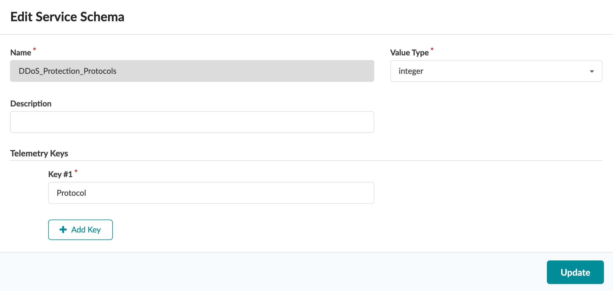
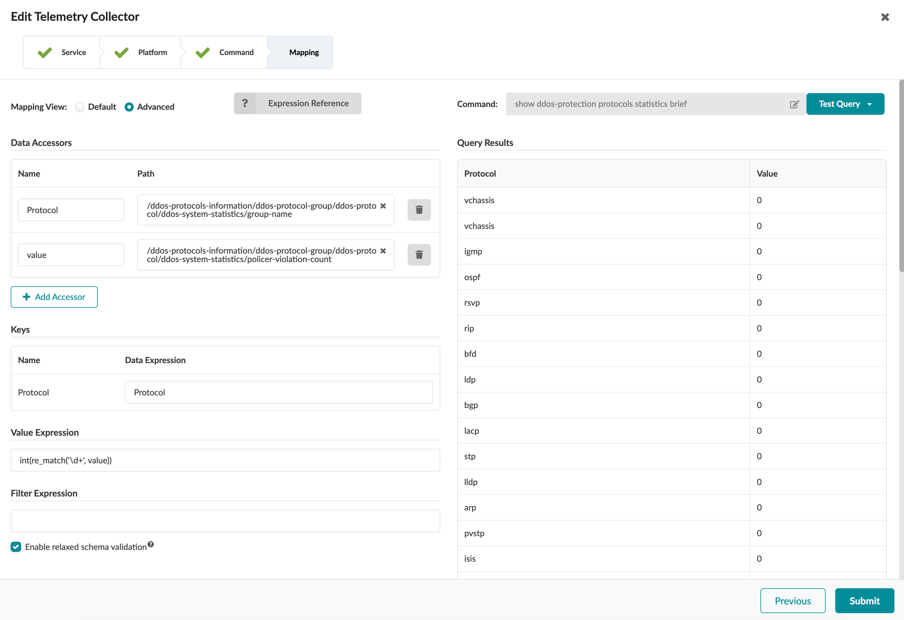
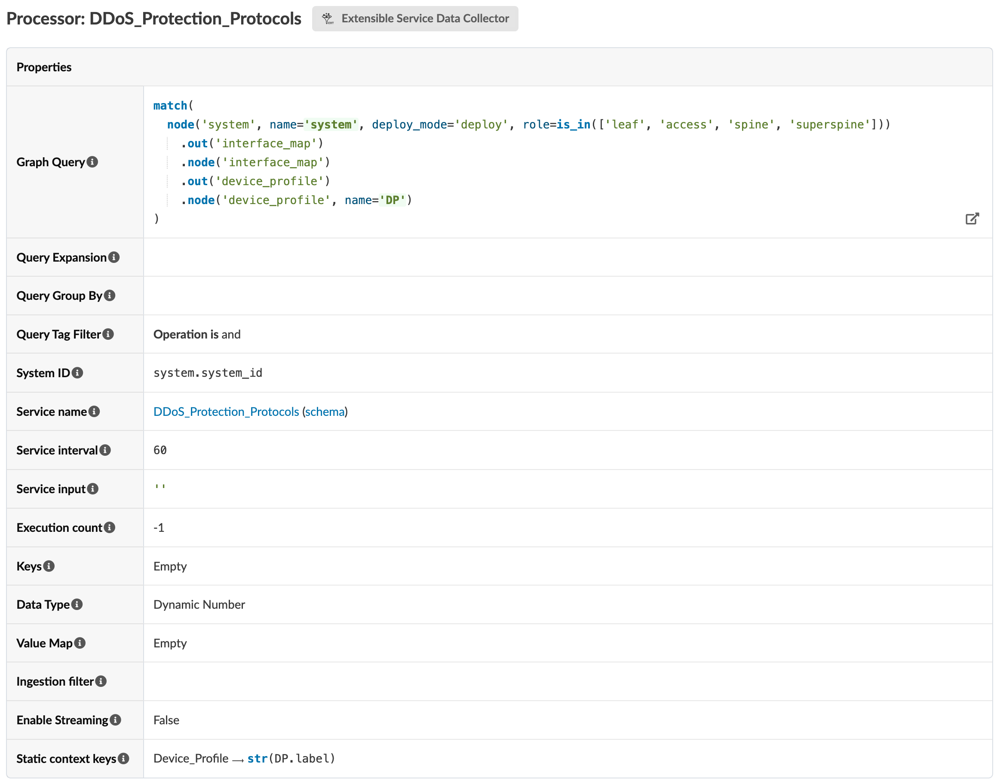
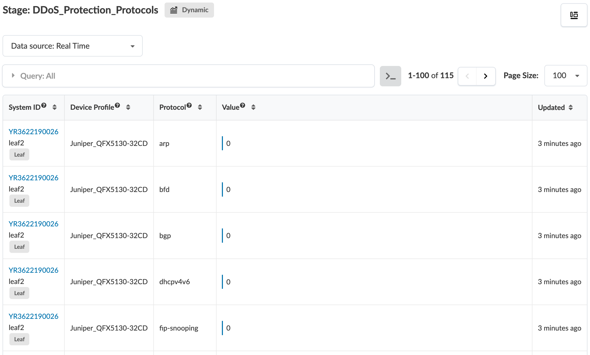
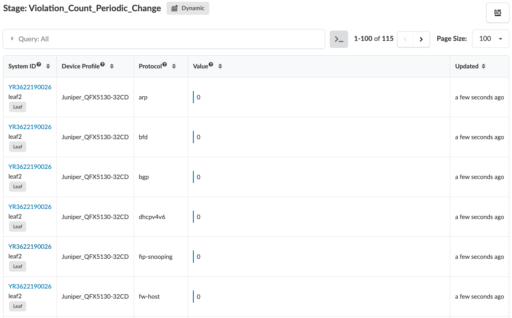
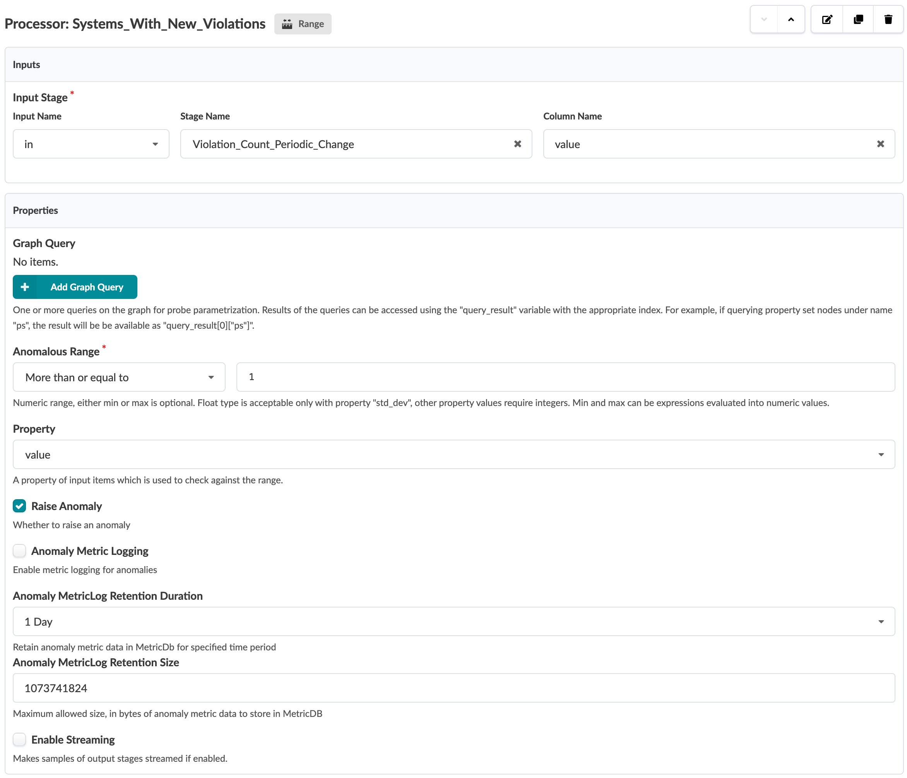
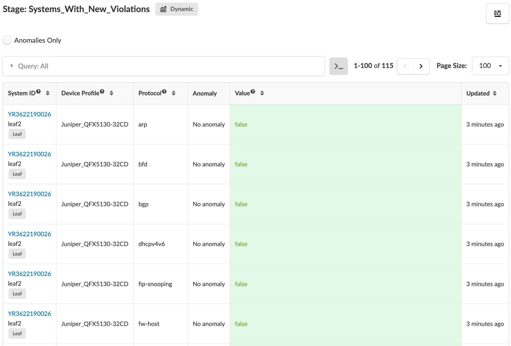

# DDoS Protection Protocols

Table of Contents:
- [DDoS Protection Protocols](#ddos-protection-protocols)
  - [Description of the use-case](#description-of-the-use-case)
  - [Identification of the source data (raw data)](#identification-of-the-source-data-raw-data)
  - [Content](#content)
    - [Configlets](#configlets)
    - [Property Sets](#property-sets)
    - [Telemetry Service Schema](#telemetry-service-schema)
    - [Telemetry Collectors](#telemetry-collectors)
    - [Probes](#probes)
      - [Probe pipeline structure](#probe-pipeline-structure)
      - [Probe processors details](#probe-processors-details)
    - [Widgets](#widgets)
    - [Dashboards](#dashboards)

<br>

## Description of the use-case

- Collect device's DDoS policer violation statistics for all protocols and raise an anomaly whenevr a protocol has an increment of the violation count. 
- Keep track of these anomalies in MetricDB so user can back in time and look for any protocol DDoS violation.

<br>

## Identification of the source data (raw data)

- CLI Command: `show ddos-protection protocols statistics biref` - [Junos documentation page](https://www.juniper.net/documentation/us/en/software/junos/cli-reference/topics/ref/command/show-ddos-protocols-statistics.html). 
- Sample Text Output:
```
Packet types: 47, Received traffic: 18, Currently violated: 0

Protocol    Packet      Received        Dropped        Rate     Violation State
group       type        (packets)       (packets)      (pps)    counts
vchassis    aggregate   0               0              0        0         ok   
vchassis    unclass..   0               0              0        0         ok   
igmp        aggregate   33921           0              0        0         ok   
ospf        aggregate   0               0              0        0         ok   
rsvp        aggregate   1251909         0              0        0         ok   
rip         aggregate   0               0              0        0         ok   
bfd         aggregate   3227751         0              1        0         ok   
ldp         aggregate   1251909         0              0        0         ok   
bgp         aggregate   1251909         0              0        0         ok   
lacp        aggregate   6344856         0              2        0         ok   
stp         aggregate   411995          0              0        0         ok   
lldp        aggregate   411995          0              0        0         ok   
arp         aggregate   5779            0              0        0         ok   
pvstp       aggregate   411995          0              0        0         ok   
isis        aggregate   0               0              0        0         ok   
ttl         aggregate   716             0              0        0         ok   
ip-opt      aggregate   0               0              0        0         ok   
redirect    aggregate   0               0              0        0         ok   
fw-host     aggregate   0               0              0        0         ok   
ntp         aggregate   0               0              0        0         ok   
ndpv6       aggregate   0               0              0        0         ok   
uncls       aggregate   0               0              0        0         ok   
l2pt        aggregate   0               0              0        0         ok   
vxlan       aggregate   4129            0              0        0         ok   
localnh     aggregate   14455           0              0        0         ok   
vcipc-udp   aggregate   0               0              0        0         ok   
sample-source aggregate 0               0              0        0         ok   
sample-dest aggregate   0               0              0        0         ok   
l3mtu-fail  aggregate   716             0              0        0         ok   
garp-reply  aggregate   0               0              0        0         ok   
ipmc-reserved aggregate 0               0              0        0         ok   
resolve     aggregate   1222328046      1202679308     0        1         ok   
l3dest-miss aggregate   0               0              0        0         ok   
l3nhop      aggregate   223             0              0        0         ok   
l3mc-sgvhit-icl aggregate 0             0              0        0         ok   
martian-address aggregate 0             0              0        0         ok   
urpf-fail   aggregate   0               0              0        0         ok   
ipmcast-miss aggregate  0               0              0        0         ok   
nonucast-switch aggregate 0             0              0        0         ok   
unknown-l2mc aggregate  0               0              0        0         ok   
fip-snooping aggregate  0               0              0        0         ok   
pim-data    aggregate   0               0              0        0         ok   
pim-ctrl    aggregate   0               0              0        0         ok   
ospf-hello  aggregate   0               0              0        0         ok   
dhcpv4v6    aggregate   14408           0              0        0         ok   
overlay     arp         30047749        0              0        0         ok   
overlay     ndpv6       0               0              0        0         ok   
```

<details>
    <summary>Sample XML Output:</summary>

```xml
<rpc-reply xmlns:junos="http://xml.juniper.net/junos/23.2R2.4/junos">
    <ddos-protocols-information xmlns="http://xml.juniper.net/junos/23.2R0/junos-jddosd" junos:style="statistics">
        <total-packet-types>47</total-packet-types>
        <packet-types-rcvd-packets>18</packet-types-rcvd-packets>
        <packet-types-in-violation>0</packet-types-in-violation>
        <ddos-protocol-group>
            <ddos-protocol>
                <ddos-system-statistics junos:style="brief">
                    <group-name>vchassis</group-name>
                    <packet-type>aggregate</packet-type>
                    <packet-received>0</packet-received>
                    <packet-dropped>0</packet-dropped>
                    <packet-arrival-rate>0</packet-arrival-rate>
                    <policer-violation-count>0</policer-violation-count>
                    <protocol-states>ok</protocol-states>
                </ddos-system-statistics>
            </ddos-protocol>
            <ddos-protocol>
                <ddos-system-statistics junos:style="brief">
                    <group-name>vchassis</group-name>
                    <packet-type>unclass..</packet-type>
                    <packet-received>0</packet-received>
                    <packet-dropped>0</packet-dropped>
                    <packet-arrival-rate>0</packet-arrival-rate>
                    <policer-violation-count>0</policer-violation-count>
                    <protocol-states>ok</protocol-states>
                </ddos-system-statistics>
            </ddos-protocol>
        </ddos-protocol-group>
        <ddos-protocol-group>
            <ddos-protocol>
                <ddos-system-statistics junos:style="brief">
                    <group-name>igmp</group-name>
                    <packet-type>aggregate</packet-type>
                    <packet-received>33922</packet-received>
                    <packet-dropped>0</packet-dropped>
                    <packet-arrival-rate>0</packet-arrival-rate>
                    <policer-violation-count>0</policer-violation-count>
                    <protocol-states>ok</protocol-states>
                </ddos-system-statistics>
            </ddos-protocol>
        </ddos-protocol-group>
        <ddos-protocol-group>
            <ddos-protocol>
                <ddos-system-statistics junos:style="brief">
                    <group-name>ospf</group-name>
                    <packet-type>aggregate</packet-type>
                    <packet-received>0</packet-received>
                    <packet-dropped>0</packet-dropped>
                    <packet-arrival-rate>0</packet-arrival-rate>
                    <policer-violation-count>0</policer-violation-count>
                    <protocol-states>ok</protocol-states>
                </ddos-system-statistics>
            </ddos-protocol>
        </ddos-protocol-group>
        <ddos-protocol-group>
            <ddos-protocol>
                <ddos-system-statistics junos:style="brief">
                    <group-name>rsvp</group-name>
                    <packet-type>aggregate</packet-type>
                    <packet-received>1251922</packet-received>
                    <packet-dropped>0</packet-dropped>
                    <packet-arrival-rate>0</packet-arrival-rate>
                    <policer-violation-count>0</policer-violation-count>
                    <protocol-states>ok</protocol-states>
                </ddos-system-statistics>
            </ddos-protocol>
        </ddos-protocol-group>
        <ddos-protocol-group>
            <ddos-protocol>
                <ddos-system-statistics junos:style="brief">
                    <group-name>rip</group-name>
                    <packet-type>aggregate</packet-type>
                    <packet-received>0</packet-received>
                    <packet-dropped>0</packet-dropped>
                    <packet-arrival-rate>0</packet-arrival-rate>
                    <policer-violation-count>0</policer-violation-count>
                    <protocol-states>ok</protocol-states>
                </ddos-system-statistics>
            </ddos-protocol>
        </ddos-protocol-group>
        <ddos-protocol-group>
            <ddos-protocol>
                <ddos-system-statistics junos:style="brief">
                    <group-name>bfd</group-name>
                    <packet-type>aggregate</packet-type>
                    <packet-received>3227782</packet-received>
                    <packet-dropped>0</packet-dropped>
                    <packet-arrival-rate>1</packet-arrival-rate>
                    <policer-violation-count>0</policer-violation-count>
                    <protocol-states>ok</protocol-states>
                </ddos-system-statistics>
            </ddos-protocol>
        </ddos-protocol-group>
        <ddos-protocol-group>
            <ddos-protocol>
                <ddos-system-statistics junos:style="brief">
                    <group-name>ldp</group-name>
                    <packet-type>aggregate</packet-type>
                    <packet-received>1251922</packet-received>
                    <packet-dropped>0</packet-dropped>
                    <packet-arrival-rate>0</packet-arrival-rate>
                    <policer-violation-count>0</policer-violation-count>
                    <protocol-states>ok</protocol-states>
                </ddos-system-statistics>
            </ddos-protocol>
        </ddos-protocol-group>
        <ddos-protocol-group>
            <ddos-protocol>
                <ddos-system-statistics junos:style="brief">
                    <group-name>bgp</group-name>
                    <packet-type>aggregate</packet-type>
                    <packet-received>1251922</packet-received>
                    <packet-dropped>0</packet-dropped>
                    <packet-arrival-rate>0</packet-arrival-rate>
                    <policer-violation-count>0</policer-violation-count>
                    <protocol-states>ok</protocol-states>
                </ddos-system-statistics>
            </ddos-protocol>
        </ddos-protocol-group>
        <ddos-protocol-group>
            <ddos-protocol>
                <ddos-system-statistics junos:style="brief">
                    <group-name>lacp</group-name>
                    <packet-type>aggregate</packet-type>
                    <packet-received>6344915</packet-received>
                    <packet-dropped>0</packet-dropped>
                    <packet-arrival-rate>2</packet-arrival-rate>
                    <policer-violation-count>0</policer-violation-count>
                    <protocol-states>ok</protocol-states>
                </ddos-system-statistics>
            </ddos-protocol>
        </ddos-protocol-group>
        <ddos-protocol-group>
            <ddos-protocol>
                <ddos-system-statistics junos:style="brief">
                    <group-name>stp</group-name>
                    <packet-type>aggregate</packet-type>
                    <packet-received>412000</packet-received>
                    <packet-dropped>0</packet-dropped>
                    <packet-arrival-rate>0</packet-arrival-rate>
                    <policer-violation-count>0</policer-violation-count>
                    <protocol-states>ok</protocol-states>
                </ddos-system-statistics>
            </ddos-protocol>
        </ddos-protocol-group>
        <ddos-protocol-group>
            <ddos-protocol>
                <ddos-system-statistics junos:style="brief">
                    <group-name>lldp</group-name>
                    <packet-type>aggregate</packet-type>
                    <packet-received>412000</packet-received>
                    <packet-dropped>0</packet-dropped>
                    <packet-arrival-rate>0</packet-arrival-rate>
                    <policer-violation-count>0</policer-violation-count>
                    <protocol-states>ok</protocol-states>
                </ddos-system-statistics>
            </ddos-protocol>
        </ddos-protocol-group>
        <ddos-protocol-group>
            <ddos-protocol>
                <ddos-system-statistics junos:style="brief">
                    <group-name>arp</group-name>
                    <packet-type>aggregate</packet-type>
                    <packet-received>5779</packet-received>
                    <packet-dropped>0</packet-dropped>
                    <packet-arrival-rate>0</packet-arrival-rate>
                    <policer-violation-count>0</policer-violation-count>
                    <protocol-states>ok</protocol-states>
                </ddos-system-statistics>
            </ddos-protocol>
        </ddos-protocol-group>
        <ddos-protocol-group>
            <ddos-protocol>
                <ddos-system-statistics junos:style="brief">
                    <group-name>pvstp</group-name>
                    <packet-type>aggregate</packet-type>
                    <packet-received>412000</packet-received>
                    <packet-dropped>0</packet-dropped>
                    <packet-arrival-rate>0</packet-arrival-rate>
                    <policer-violation-count>0</policer-violation-count>
                    <protocol-states>ok</protocol-states>
                </ddos-system-statistics>
            </ddos-protocol>
        </ddos-protocol-group>
        <ddos-protocol-group>
            <ddos-protocol>
                <ddos-system-statistics junos:style="brief">
                    <group-name>isis</group-name>
                    <packet-type>aggregate</packet-type>
                    <packet-received>0</packet-received>
                    <packet-dropped>0</packet-dropped>
                    <packet-arrival-rate>0</packet-arrival-rate>
                    <policer-violation-count>0</policer-violation-count>
                    <protocol-states>ok</protocol-states>
                </ddos-system-statistics>
            </ddos-protocol>
        </ddos-protocol-group>
        <ddos-protocol-group>
            <ddos-protocol>
                <ddos-system-statistics junos:style="brief">
                    <group-name>ttl</group-name>
                    <packet-type>aggregate</packet-type>
                    <packet-received>716</packet-received>
                    <packet-dropped>0</packet-dropped>
                    <packet-arrival-rate>0</packet-arrival-rate>
                    <policer-violation-count>0</policer-violation-count>
                    <protocol-states>ok</protocol-states>
                </ddos-system-statistics>
            </ddos-protocol>
        </ddos-protocol-group>
        <ddos-protocol-group>
            <ddos-protocol>
                <ddos-system-statistics junos:style="brief">
                    <group-name>ip-opt</group-name>
                    <packet-type>aggregate</packet-type>
                    <packet-received>0</packet-received>
                    <packet-dropped>0</packet-dropped>
                    <packet-arrival-rate>0</packet-arrival-rate>
                    <policer-violation-count>0</policer-violation-count>
                    <protocol-states>ok</protocol-states>
                </ddos-system-statistics>
            </ddos-protocol>
        </ddos-protocol-group>
        <ddos-protocol-group>
            <ddos-protocol>
                <ddos-system-statistics junos:style="brief">
                    <group-name>redirect</group-name>
                    <packet-type>aggregate</packet-type>
                    <packet-received>0</packet-received>
                    <packet-dropped>0</packet-dropped>
                    <packet-arrival-rate>0</packet-arrival-rate>
                    <policer-violation-count>0</policer-violation-count>
                    <protocol-states>ok</protocol-states>
                </ddos-system-statistics>
            </ddos-protocol>
        </ddos-protocol-group>
        <ddos-protocol-group>
            <ddos-protocol>
                <ddos-system-statistics junos:style="brief">
                    <group-name>fw-host</group-name>
                    <packet-type>aggregate</packet-type>
                    <packet-received>0</packet-received>
                    <packet-dropped>0</packet-dropped>
                    <packet-arrival-rate>0</packet-arrival-rate>
                    <policer-violation-count>0</policer-violation-count>
                    <protocol-states>ok</protocol-states>
                </ddos-system-statistics>
            </ddos-protocol>
        </ddos-protocol-group>
        <ddos-protocol-group>
            <ddos-protocol>
                <ddos-system-statistics junos:style="brief">
                    <group-name>ntp</group-name>
                    <packet-type>aggregate</packet-type>
                    <packet-received>0</packet-received>
                    <packet-dropped>0</packet-dropped>
                    <packet-arrival-rate>0</packet-arrival-rate>
                    <policer-violation-count>0</policer-violation-count>
                    <protocol-states>ok</protocol-states>
                </ddos-system-statistics>
            </ddos-protocol>
        </ddos-protocol-group>
        <ddos-protocol-group>
            <ddos-protocol>
                <ddos-system-statistics junos:style="brief">
                    <group-name>ndpv6</group-name>
                    <packet-type>aggregate</packet-type>
                    <packet-received>0</packet-received>
                    <packet-dropped>0</packet-dropped>
                    <packet-arrival-rate>0</packet-arrival-rate>
                    <policer-violation-count>0</policer-violation-count>
                    <protocol-states>ok</protocol-states>
                </ddos-system-statistics>
            </ddos-protocol>
        </ddos-protocol-group>
        <ddos-protocol-group>
            <ddos-protocol>
                <ddos-system-statistics junos:style="brief">
                    <group-name>uncls</group-name>
                    <packet-type>aggregate</packet-type>
                    <packet-received>0</packet-received>
                    <packet-dropped>0</packet-dropped>
                    <packet-arrival-rate>0</packet-arrival-rate>
                    <policer-violation-count>0</policer-violation-count>
                    <protocol-states>ok</protocol-states>
                </ddos-system-statistics>
            </ddos-protocol>
        </ddos-protocol-group>
        <ddos-protocol-group>
            <ddos-protocol>
                <ddos-system-statistics junos:style="brief">
                    <group-name>l2pt</group-name>
                    <packet-type>aggregate</packet-type>
                    <packet-received>0</packet-received>
                    <packet-dropped>0</packet-dropped>
                    <packet-arrival-rate>0</packet-arrival-rate>
                    <policer-violation-count>0</policer-violation-count>
                    <protocol-states>ok</protocol-states>
                </ddos-system-statistics>
            </ddos-protocol>
        </ddos-protocol-group>
        <ddos-protocol-group>
            <ddos-protocol>
                <ddos-system-statistics junos:style="brief">
                    <group-name>vxlan</group-name>
                    <packet-type>aggregate</packet-type>
                    <packet-received>4129</packet-received>
                    <packet-dropped>0</packet-dropped>
                    <packet-arrival-rate>0</packet-arrival-rate>
                    <policer-violation-count>0</policer-violation-count>
                    <protocol-states>ok</protocol-states>
                </ddos-system-statistics>
            </ddos-protocol>
        </ddos-protocol-group>
        <ddos-protocol-group>
            <ddos-protocol>
                <ddos-system-statistics junos:style="brief">
                    <group-name>localnh</group-name>
                    <packet-type>aggregate</packet-type>
                    <packet-received>14455</packet-received>
                    <packet-dropped>0</packet-dropped>
                    <packet-arrival-rate>0</packet-arrival-rate>
                    <policer-violation-count>0</policer-violation-count>
                    <protocol-states>ok</protocol-states>
                </ddos-system-statistics>
            </ddos-protocol>
        </ddos-protocol-group>
        <ddos-protocol-group>
            <ddos-protocol>
                <ddos-system-statistics junos:style="brief">
                    <group-name>vcipc-udp</group-name>
                    <packet-type>aggregate</packet-type>
                    <packet-received>0</packet-received>
                    <packet-dropped>0</packet-dropped>
                    <packet-arrival-rate>0</packet-arrival-rate>
                    <policer-violation-count>0</policer-violation-count>
                    <protocol-states>ok</protocol-states>
                </ddos-system-statistics>
            </ddos-protocol>
        </ddos-protocol-group>
        <ddos-protocol-group>
            <ddos-protocol>
                <ddos-system-statistics junos:style="brief">
                    <group-name>sample-source</group-name>
                    <packet-type>aggregate</packet-type>
                    <packet-received>0</packet-received>
                    <packet-dropped>0</packet-dropped>
                    <packet-arrival-rate>0</packet-arrival-rate>
                    <policer-violation-count>0</policer-violation-count>
                    <protocol-states>ok</protocol-states>
                </ddos-system-statistics>
            </ddos-protocol>
        </ddos-protocol-group>
        <ddos-protocol-group>
            <ddos-protocol>
                <ddos-system-statistics junos:style="brief">
                    <group-name>sample-dest</group-name>
                    <packet-type>aggregate</packet-type>
                    <packet-received>0</packet-received>
                    <packet-dropped>0</packet-dropped>
                    <packet-arrival-rate>0</packet-arrival-rate>
                    <policer-violation-count>0</policer-violation-count>
                    <protocol-states>ok</protocol-states>
                </ddos-system-statistics>
            </ddos-protocol>
        </ddos-protocol-group>
        <ddos-protocol-group>
            <ddos-protocol>
                <ddos-system-statistics junos:style="brief">
                    <group-name>l3mtu-fail</group-name>
                    <packet-type>aggregate</packet-type>
                    <packet-received>716</packet-received>
                    <packet-dropped>0</packet-dropped>
                    <packet-arrival-rate>0</packet-arrival-rate>
                    <policer-violation-count>0</policer-violation-count>
                    <protocol-states>ok</protocol-states>
                </ddos-system-statistics>
            </ddos-protocol>
        </ddos-protocol-group>
        <ddos-protocol-group>
            <ddos-protocol>
                <ddos-system-statistics junos:style="brief">
                    <group-name>garp-reply</group-name>
                    <packet-type>aggregate</packet-type>
                    <packet-received>0</packet-received>
                    <packet-dropped>0</packet-dropped>
                    <packet-arrival-rate>0</packet-arrival-rate>
                    <policer-violation-count>0</policer-violation-count>
                    <protocol-states>ok</protocol-states>
                </ddos-system-statistics>
            </ddos-protocol>
        </ddos-protocol-group>
        <ddos-protocol-group>
            <ddos-protocol>
                <ddos-system-statistics junos:style="brief">
                    <group-name>ipmc-reserved</group-name>
                    <packet-type>aggregate</packet-type>
                    <packet-received>0</packet-received>
                    <packet-dropped>0</packet-dropped>
                    <packet-arrival-rate>0</packet-arrival-rate>
                    <policer-violation-count>0</policer-violation-count>
                    <protocol-states>ok</protocol-states>
                </ddos-system-statistics>
            </ddos-protocol>
        </ddos-protocol-group>
        <ddos-protocol-group>
            <ddos-protocol>
                <ddos-system-statistics junos:style="brief">
                    <group-name>resolve</group-name>
                    <packet-type>aggregate</packet-type>
                    <packet-received>1222328046</packet-received>
                    <packet-dropped>1202679308</packet-dropped>
                    <packet-arrival-rate>0</packet-arrival-rate>
                    <policer-violation-count>1</policer-violation-count>
                    <protocol-states>ok</protocol-states>
                </ddos-system-statistics>
            </ddos-protocol>
        </ddos-protocol-group>
        <ddos-protocol-group>
            <ddos-protocol>
                <ddos-system-statistics junos:style="brief">
                    <group-name>l3dest-miss</group-name>
                    <packet-type>aggregate</packet-type>
                    <packet-received>0</packet-received>
                    <packet-dropped>0</packet-dropped>
                    <packet-arrival-rate>0</packet-arrival-rate>
                    <policer-violation-count>0</policer-violation-count>
                    <protocol-states>ok</protocol-states>
                </ddos-system-statistics>
            </ddos-protocol>
        </ddos-protocol-group>
        <ddos-protocol-group>
            <ddos-protocol>
                <ddos-system-statistics junos:style="brief">
                    <group-name>l3nhop</group-name>
                    <packet-type>aggregate</packet-type>
                    <packet-received>223</packet-received>
                    <packet-dropped>0</packet-dropped>
                    <packet-arrival-rate>0</packet-arrival-rate>
                    <policer-violation-count>0</policer-violation-count>
                    <protocol-states>ok</protocol-states>
                </ddos-system-statistics>
            </ddos-protocol>
        </ddos-protocol-group>
        <ddos-protocol-group>
            <ddos-protocol>
                <ddos-system-statistics junos:style="brief">
                    <group-name>l3mc-sgvhit-icl</group-name>
                    <packet-type>aggregate</packet-type>
                    <packet-received>0</packet-received>
                    <packet-dropped>0</packet-dropped>
                    <packet-arrival-rate>0</packet-arrival-rate>
                    <policer-violation-count>0</policer-violation-count>
                    <protocol-states>ok</protocol-states>
                </ddos-system-statistics>
            </ddos-protocol>
        </ddos-protocol-group>
        <ddos-protocol-group>
            <ddos-protocol>
                <ddos-system-statistics junos:style="brief">
                    <group-name>martian-address</group-name>
                    <packet-type>aggregate</packet-type>
                    <packet-received>0</packet-received>
                    <packet-dropped>0</packet-dropped>
                    <packet-arrival-rate>0</packet-arrival-rate>
                    <policer-violation-count>0</policer-violation-count>
                    <protocol-states>ok</protocol-states>
                </ddos-system-statistics>
            </ddos-protocol>
        </ddos-protocol-group>
        <ddos-protocol-group>
            <ddos-protocol>
                <ddos-system-statistics junos:style="brief">
                    <group-name>urpf-fail</group-name>
                    <packet-type>aggregate</packet-type>
                    <packet-received>0</packet-received>
                    <packet-dropped>0</packet-dropped>
                    <packet-arrival-rate>0</packet-arrival-rate>
                    <policer-violation-count>0</policer-violation-count>
                    <protocol-states>ok</protocol-states>
                </ddos-system-statistics>
            </ddos-protocol>
        </ddos-protocol-group>
        <ddos-protocol-group>
            <ddos-protocol>
                <ddos-system-statistics junos:style="brief">
                    <group-name>ipmcast-miss</group-name>
                    <packet-type>aggregate</packet-type>
                    <packet-received>0</packet-received>
                    <packet-dropped>0</packet-dropped>
                    <packet-arrival-rate>0</packet-arrival-rate>
                    <policer-violation-count>0</policer-violation-count>
                    <protocol-states>ok</protocol-states>
                </ddos-system-statistics>
            </ddos-protocol>
        </ddos-protocol-group>
        <ddos-protocol-group>
            <ddos-protocol>
                <ddos-system-statistics junos:style="brief">
                    <group-name>nonucast-switch</group-name>
                    <packet-type>aggregate</packet-type>
                    <packet-received>0</packet-received>
                    <packet-dropped>0</packet-dropped>
                    <packet-arrival-rate>0</packet-arrival-rate>
                    <policer-violation-count>0</policer-violation-count>
                    <protocol-states>ok</protocol-states>
                </ddos-system-statistics>
            </ddos-protocol>
        </ddos-protocol-group>
        <ddos-protocol-group>
            <ddos-protocol>
                <ddos-system-statistics junos:style="brief">
                    <group-name>unknown-l2mc</group-name>
                    <packet-type>aggregate</packet-type>
                    <packet-received>0</packet-received>
                    <packet-dropped>0</packet-dropped>
                    <packet-arrival-rate>0</packet-arrival-rate>
                    <policer-violation-count>0</policer-violation-count>
                    <protocol-states>ok</protocol-states>
                </ddos-system-statistics>
            </ddos-protocol>
        </ddos-protocol-group>
        <ddos-protocol-group>
            <ddos-protocol>
                <ddos-system-statistics junos:style="brief">
                    <group-name>fip-snooping</group-name>
                    <packet-type>aggregate</packet-type>
                    <packet-received>0</packet-received>
                    <packet-dropped>0</packet-dropped>
                    <packet-arrival-rate>0</packet-arrival-rate>
                    <policer-violation-count>0</policer-violation-count>
                    <protocol-states>ok</protocol-states>
                </ddos-system-statistics>
            </ddos-protocol>
        </ddos-protocol-group>
        <ddos-protocol-group>
            <ddos-protocol>
                <ddos-system-statistics junos:style="brief">
                    <group-name>pim-data</group-name>
                    <packet-type>aggregate</packet-type>
                    <packet-received>0</packet-received>
                    <packet-dropped>0</packet-dropped>
                    <packet-arrival-rate>0</packet-arrival-rate>
                    <policer-violation-count>0</policer-violation-count>
                    <protocol-states>ok</protocol-states>
                </ddos-system-statistics>
            </ddos-protocol>
        </ddos-protocol-group>
        <ddos-protocol-group>
            <ddos-protocol>
                <ddos-system-statistics junos:style="brief">
                    <group-name>pim-ctrl</group-name>
                    <packet-type>aggregate</packet-type>
                    <packet-received>0</packet-received>
                    <packet-dropped>0</packet-dropped>
                    <packet-arrival-rate>0</packet-arrival-rate>
                    <policer-violation-count>0</policer-violation-count>
                    <protocol-states>ok</protocol-states>
                </ddos-system-statistics>
            </ddos-protocol>
        </ddos-protocol-group>
        <ddos-protocol-group>
            <ddos-protocol>
                <ddos-system-statistics junos:style="brief">
                    <group-name>ospf-hello</group-name>
                    <packet-type>aggregate</packet-type>
                    <packet-received>0</packet-received>
                    <packet-dropped>0</packet-dropped>
                    <packet-arrival-rate>0</packet-arrival-rate>
                    <policer-violation-count>0</policer-violation-count>
                    <protocol-states>ok</protocol-states>
                </ddos-system-statistics>
            </ddos-protocol>
        </ddos-protocol-group>
        <ddos-protocol-group>
            <ddos-protocol>
                <ddos-system-statistics junos:style="brief">
                    <group-name>dhcpv4v6</group-name>
                    <packet-type>aggregate</packet-type>
                    <packet-received>14408</packet-received>
                    <packet-dropped>0</packet-dropped>
                    <packet-arrival-rate>0</packet-arrival-rate>
                    <policer-violation-count>0</policer-violation-count>
                    <protocol-states>ok</protocol-states>
                </ddos-system-statistics>
            </ddos-protocol>
        </ddos-protocol-group>
        <ddos-protocol-group>
            <ddos-protocol>
                <ddos-system-statistics junos:style="brief">
                    <group-name>overlay</group-name>
                    <packet-type>arp</packet-type>
                    <packet-received>30047749</packet-received>
                    <packet-dropped>0</packet-dropped>
                    <packet-arrival-rate>0</packet-arrival-rate>
                    <policer-violation-count>0</policer-violation-count>
                    <protocol-states>ok</protocol-states>
                </ddos-system-statistics>
            </ddos-protocol>
            <ddos-protocol>
                <ddos-system-statistics junos:style="brief">
                    <group-name>overlay</group-name>
                    <packet-type>ndpv6</packet-type>
                    <packet-received>0</packet-received>
                    <packet-dropped>0</packet-dropped>
                    <packet-arrival-rate>0</packet-arrival-rate>
                    <policer-violation-count>0</policer-violation-count>
                    <protocol-states>ok</protocol-states>
                </ddos-system-statistics>
            </ddos-protocol>
        </ddos-protocol-group>
    </ddos-protocols-information>
    <cli>
        <banner>{master:0}</banner>
    </cli>
</rpc-reply>
```
</details>
  
<br>

- Fields of interest:

| Field | Information |
| --- | --- |
| `Protocol group` | Name of protocol group. |
| `Violation count` | Number of violations of the policer bandwidth. |

<br>

## Content

### Configlets
No configlet  used in this example.

<br>

### Property Sets
No Property Sets  used in this example.

<br>

### Telemetry Service Schema 
```
├── telemetry-service-definitions
│   └── ddos-protection-protocols-DDoS_Protection_Protocols.json
```



<br>

### Telemetry Collectors
```
├── telemetry-collectors
    └── ddos-protection-protocols-DDoS_Protection_Protocols.json
```



Pay attention to the expression used in the `Value` and the logic to convert the text string provided by the `policer-violation-count` field into an integer value. The  `policer-violation-count` field returns a value in a decimal format, such as `0.0`, which seems odd, considering this represent a count which in theory should inly be decimal.
The collector is configered to convert that into an integer value using a regular expression passed to the `re_match` function. 

```python
int(re_match('\d+', value)) 
```

<br>

### Probes

#### Probe pipeline structure

<br>


<br>

#### Probe processors details
```
├── probes
    └── ddos-protection-protocols.json
```
Source Processor configuration:



<br>

Output stage:



<br>

To implement the anomaly raising logic for reboot in last **1h** / **1 day** / **1 week** without duplicating the anomalies (i.e having a device which rebooted 45mn ago to appear in both 1h and 1day) we will configure the Range check processors in secitons: one section for uptime <= `60` mn, a second section for uptime > `60` mn and <= `1440` mn (total minutes count for a **day**) and a third section for uptime > `1440` mn and <= `10080` mn (total minutes count for a **week**).

<br>

`Periodic_Change` processor configuration to measure the increments of the violations count between two colleciton cycles, i.e two telemetry collections intervals. 


<br>

Output stage:



<br>

`Range` processor configuration to raise anomaly for device for which the violation count did increment in the last colleciton cycle.



<br>

Output stage:



<br>

### Widgets
```
└── widgets
    ├── xxx
    ├── xxx
    └── xxx
```
TO DO
<!--  -->

<br>

### Dashboards

```
├── dashboards
    ├── xxx
    ├── xxx
    └── xxx
```
TO DO
<!--  -->