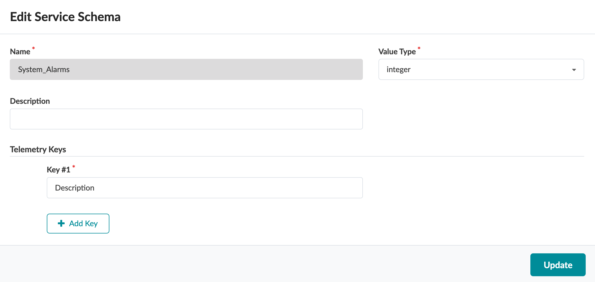
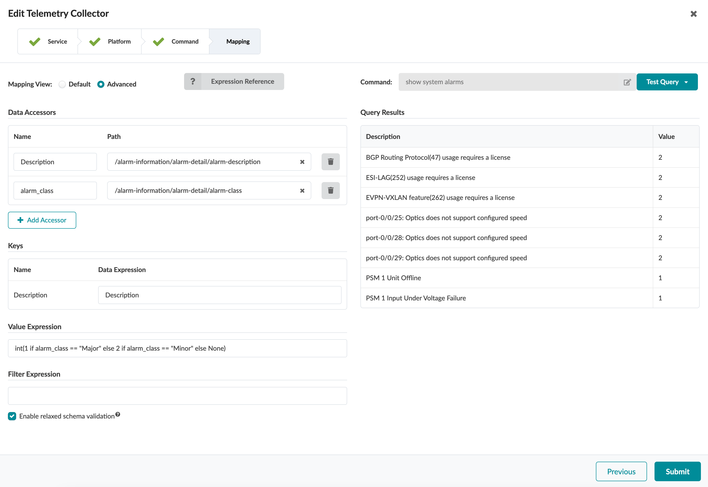
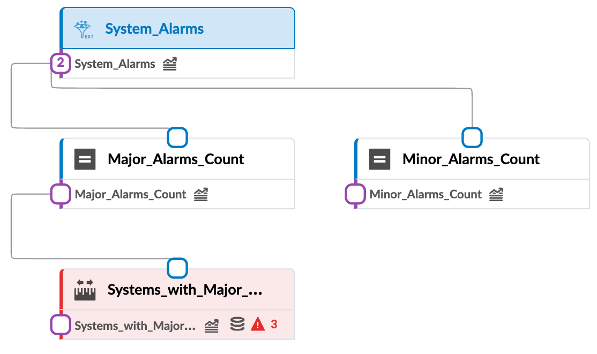
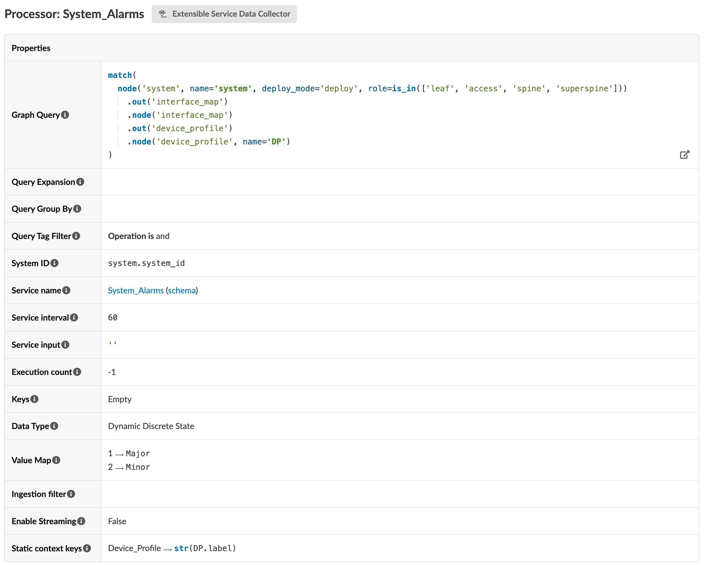
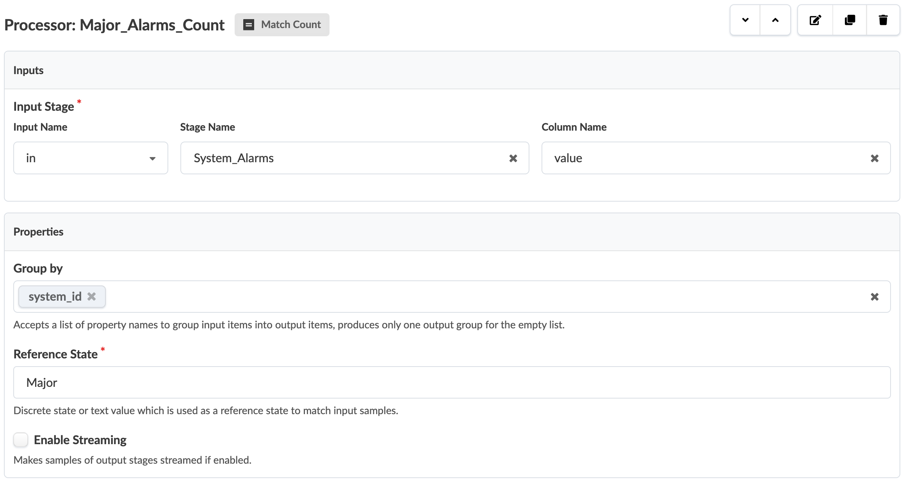
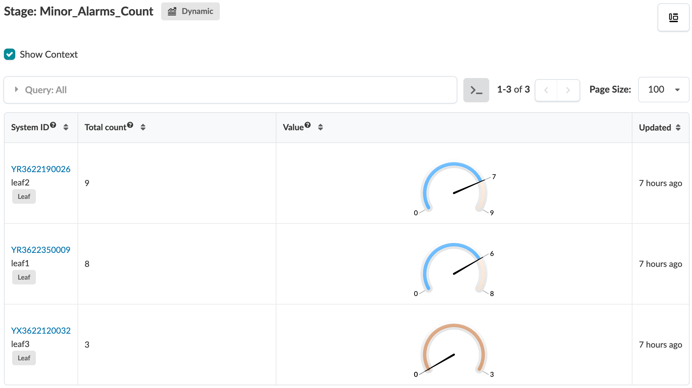
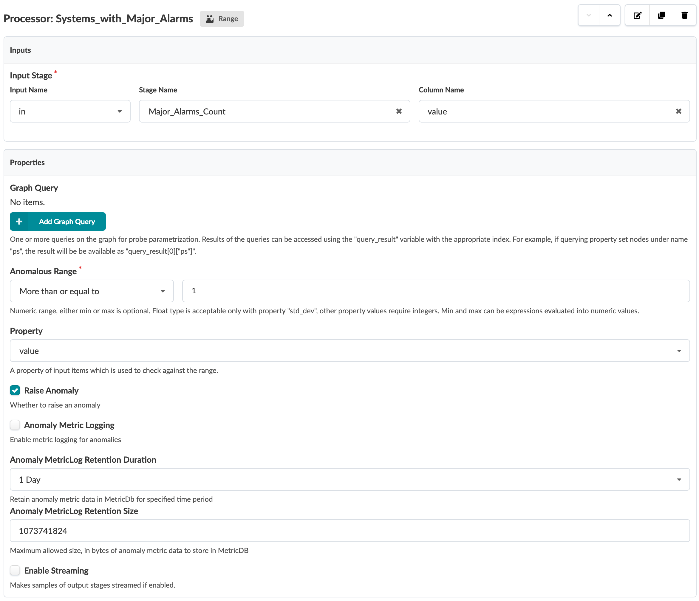
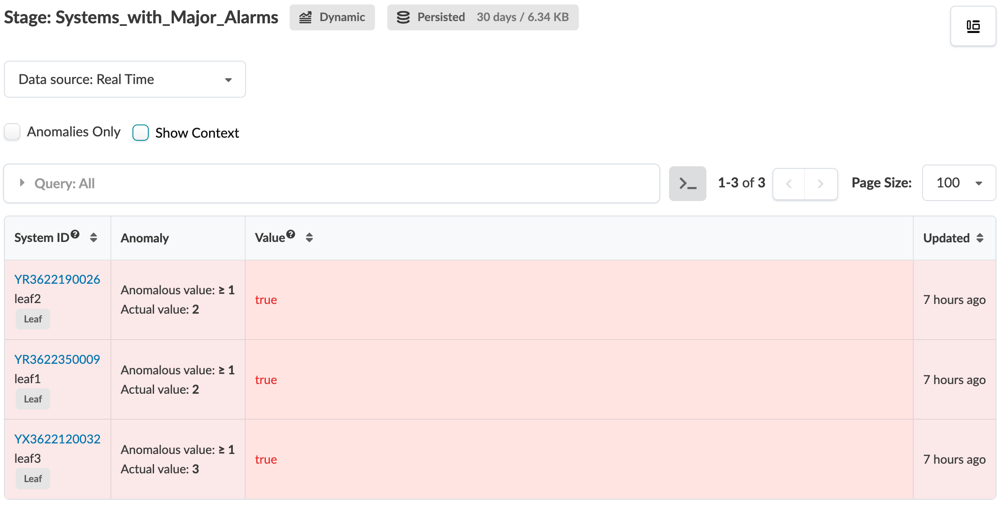
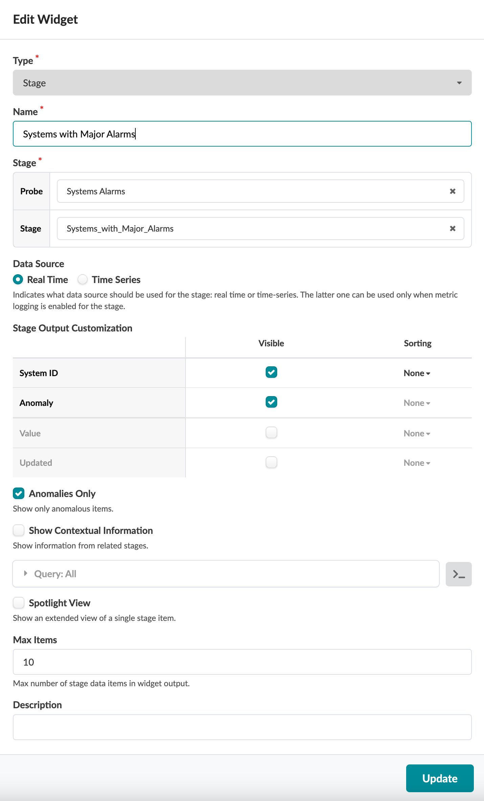

# System Alarms

Table of Contents:
- [System Alarms](#system-alarms)
  - [Description of the use-case](#description-of-the-use-case)
  - [Identification of the source data (raw data)](#identification-of-the-source-data-raw-data)
  - [Content](#content)
    - [Configlets](#configlets)
    - [Property Sets](#property-sets)
    - [Telemetry Service Schema](#telemetry-service-schema)
    - [Telemetry Collectors](#telemetry-collectors)
    - [Probes](#probes)
      - [Probe pipeline structure](#probe-pipeline-structure)
      - [Probe processors details](#probe-processors-details)
    - [Widgets](#widgets)
    - [Dashboards](#dashboards)

<br>

## Description of the use-case

- Collect device's DDoS policer violation statistics for all protocols and raise an anomaly whenevr a protocol has an increment of the violation count. 
- Keep track of these anomalies in MetricDB so user can back in time and look for any protocol DDoS violation.

<br>

## Identification of the source data (raw data)

- CLI Command: `show system alarms` - [Junos documentation page](https://www.juniper.net/documentation/us/en/software/junos/cli-reference/topics/ref/command/show-system-alarms.html). 
- Sample Text Output:
```
7 alarms currently active
Alarm time               Class  Description
2024-02-19 06:00:20 UTC  Minor  EVPN-VXLAN feature(262) usage requires a license
2024-02-19 06:00:20 UTC  Minor  ESI-LAG(252) usage requires a license
2024-02-19 06:00:20 UTC  Minor  VxLAN(164) usage requires a license
2024-02-19 06:00:20 UTC  Minor  BGP Routing Protocol(47) usage requires a license
2024-01-25 19:41:15 UTC  Major  FPC Management1 Ethernet Link Down
2024-01-25 19:40:53 UTC  Major  FPC0: PEM 0 Not Powered
2024-01-25 19:40:46 UTC  Minor  Rescue configuration is not set
```

<details>
    <summary>Sample XML Output:</summary>

```xml<rpc-reply xmlns:junos="http://xml.juniper.net/junos/23.2R2.4/junos">
    <alarm-information xmlns="http://xml.juniper.net/junos/23.2R0/junos-alarm">
        <alarm-summary>
            <active-alarm-count>7</active-alarm-count>
        </alarm-summary>
        <alarm-detail>
            <alarm-time junos:seconds="1708322420">
                2024-02-19 06:00:20 UTC
            </alarm-time>
            <alarm-class>Minor</alarm-class>
            <alarm-description>EVPN-VXLAN feature(262) usage requires a license</alarm-description>
            <alarm-short-description>evpn-vxlan</alarm-short-description>
            <alarm-type>System</alarm-type>
        </alarm-detail>
        <alarm-detail>
            <alarm-time junos:seconds="1708322420">
                2024-02-19 06:00:20 UTC
            </alarm-time>
            <alarm-class>Minor</alarm-class>
            <alarm-description>ESI-LAG(252) usage requires a license</alarm-description>
            <alarm-short-description>esi-lag</alarm-short-description>
            <alarm-type>System</alarm-type>
        </alarm-detail>
        <alarm-detail>
            <alarm-time junos:seconds="1708322420">
                2024-02-19 06:00:20 UTC
            </alarm-time>
            <alarm-class>Minor</alarm-class>
            <alarm-description>VxLAN(164) usage requires a license</alarm-description>
            <alarm-short-description>vxlan</alarm-short-description>
            <alarm-type>System</alarm-type>
        </alarm-detail>
        <alarm-detail>
            <alarm-time junos:seconds="1708322420">
                2024-02-19 06:00:20 UTC
            </alarm-time>
            <alarm-class>Minor</alarm-class>
            <alarm-description>BGP Routing Protocol(47) usage requires a license</alarm-description>
            <alarm-short-description>bgp</alarm-short-description>
            <alarm-type>System</alarm-type>
        </alarm-detail>
        <alarm-detail>
            <alarm-time junos:seconds="1706211675">
                2024-01-25 19:41:15 UTC
            </alarm-time>
            <alarm-class>Major</alarm-class>
            <alarm-description>FPC Management1 Ethernet Link Down</alarm-description>
            <alarm-short-description>FPC MGMT1 Link Down</alarm-short-description>
            <alarm-type>Chassis</alarm-type>
        </alarm-detail>
        <alarm-detail>
            <alarm-time junos:seconds="1706211653">
                2024-01-25 19:40:53 UTC
            </alarm-time>
            <alarm-class>Major</alarm-class>
            <alarm-description>FPC0: PEM 0 Not Powered</alarm-description>
            <alarm-short-description>PEM 0 No Power</alarm-short-description>
            <alarm-type>Chassis</alarm-type>
        </alarm-detail>
        <alarm-detail>
            <alarm-time junos:seconds="1706211646">
                2024-01-25 19:40:46 UTC
            </alarm-time>
            <alarm-class>Minor</alarm-class>
            <alarm-description>Rescue configuration is not set</alarm-description>
            <alarm-short-description>no-rescue</alarm-short-description>
            <alarm-type>Configuration</alarm-type>
        </alarm-detail>
    </alarm-information>
    <cli>
        <banner>{master:0}</banner>
    </cli>
</rpc-reply>
```
</details>
  
<br>

- Fields of interest:

| Field | Information |
| --- | --- |
| `Class` | Severity class for this alarm: `Minor` or `Major`.|
| `Description` | Information about the alarm. |

<br>

## Content

### Configlets
No configlet  used in this example.

<br>

### Property Sets
No Property Sets  used in this example.

<br>

### Telemetry Service Schema 
```
├── telemetry-service-definitions
│   └── system-alarms-System_Alarms.json
```



- The reason why the schemas are defined with a value type of **Integer** and not String is because we would like to represent the alarm class as Discrete states in the IBA probe which requires a mapping based on integer values, that will be further explained in the next section.

<br>

### Telemetry Collectors
```
├── telemetry-collectors
    └── system-alarms-System_Alarms.json
```



<br>

Pay attention to the accessor value `alarm_class`. This is not one of the keys defined in the service schema. It is an accessor key which purpose is internal to the collector logic. It is used to capture a specific xPath, `/alarm-information/alarm-detail/alarm-class` in this case, for further processing by the `Value` field. `Value` is then defined with a python expression to convert the string value coming from `alarm-class` into an integer value. That integer value will then be leveraged by the "Value Map" processor attribute of the `Extensible_Service_Data_Collector_Processor` IBA procesor and publish it in the probe pipeline as an enum.
Note that the selection of the integer values for any specific string value is totaly arbitrary. It is up to the collector and probe author to determine any schema as long as that schema is the same on the IBA side since the data will need to be converted back to string values (See next section for probe's configuration).

```python
int(1 if Alarm_Class == "Major" else 2 if Alarm_Class == "Minor" else None)
```

<br>

### Probes

#### Probe pipeline structure

<br>



<br>

#### Probe processors details
```
├── probes
    └── systems-alarms.json
```
Source Processor configuration:



<br>

Output stage:


<br>

Match_Count processor configuration for Major Alarms:

`Match_Count` processor configuration to filter on all alarms matching the reference state `Major` and group the result by System_ID. 

<br>



<br>

Output stage:


<br>

Match_Count processor configuration for Minor Alarms:

`Match_Count` processor configuration to filter on all alarms matching the reference state `Minor` and group the result by System_ID. 


<br>

Output stage:



<br>

Range processor to raise anomalies:

`Range_Check` processor configuration to raise anomalies for every device exhibiting major alarms



<br>

Output stage:



<br>


### Widgets
```
└── widgets
    ├── major-alarms.json
    └── systems-with-major-alarms.json
```

Widget for Systems with Major Alarms:



<br>

Widget for Major Alarms descriptions:


<br>

### Dashboards

```
├── dashboards
    └── system-alarms.json
```


