# DDoS Protection Protocols

Table of Contents:
- [DDoS Protection Protocols](#ddos-protection-protocols)
  - [Description of the use-case](#description-of-the-use-case)
  - [Identification of the source data (raw data)](#identification-of-the-source-data-raw-data)
  - [Content](#content)
    - [Configlets](#configlets)
    - [Property Sets](#property-sets)
    - [Telemetry Service Schema](#telemetry-service-schema)
    - [Telemetry Collectors](#telemetry-collectors)
    - [Probes](#probes)
      - [Probe pipeline structure](#probe-pipeline-structure)
      - [Probe processors details](#probe-processors-details)
    - [Dashboards](#dashboards)

<br>


## Description of the use-case

- Collect device's DDoS policer violation statistics for all protocols and raise an anomaly whenever a protocol has an increment of the violation count. 
- Keep track of these anomalies in MetricDB so the user can go back in time and look for any protocol DDoS violation.

<br>

## Identification of the source data (raw data)

- CLI Command: `show ddos-protection protocols statistics biref` - [Junos documentation page](https://www.juniper.net/documentation/us/en/software/junos/cli-reference/topics/ref/command/show-ddos-protocols-statistics.html). 
- Sample Text Output:
```
Packet types: 47, Received traffic: 18, Currently violated: 0

Protocol    Packet      Received        Dropped        Rate     Violation State
group       type        (packets)       (packets)      (pps)    counts
vchassis    aggregate   0               0              0        0         ok   
vchassis    unclass..   0               0              0        0         ok   
igmp        aggregate   33921           0              0        0         ok   
ospf        aggregate   0               0              0        0         ok   
rsvp        aggregate   1251909         0              0        0         ok   
rip         aggregate   0               0              0        0         ok   
bfd         aggregate   3227751         0              1        0         ok   
ldp         aggregate   1251909         0              0        0         ok   
bgp         aggregate   1251909         0              0        0         ok   
lacp        aggregate   6344856         0              2        0         ok   
stp         aggregate   411995          0              0        0         ok   
lldp        aggregate   411995          0              0        0         ok   
arp         aggregate   5779            0              0        0         ok   
pvstp       aggregate   411995          0              0        0         ok   
isis        aggregate   0               0              0        0         ok   
ttl         aggregate   716             0              0        0         ok   
ip-opt      aggregate   0               0              0        0         ok   
redirect    aggregate   0               0              0        0         ok   
fw-host     aggregate   0               0              0        0         ok   
ntp         aggregate   0               0              0        0         ok   
ndpv6       aggregate   0               0              0        0         ok   
uncls       aggregate   0               0              0        0         ok   
l2pt        aggregate   0               0              0        0         ok   
vxlan       aggregate   4129            0              0        0         ok   
localnh     aggregate   14455           0              0        0         ok   
vcipc-udp   aggregate   0               0              0        0         ok   
sample-source aggregate 0               0              0        0         ok   
sample-dest aggregate   0               0              0        0         ok   
l3mtu-fail  aggregate   716             0              0        0         ok   
garp-reply  aggregate   0               0              0        0         ok   
ipmc-reserved aggregate 0               0              0        0         ok   
resolve     aggregate   1222328046      1202679308     0        1         ok   
l3dest-miss aggregate   0               0              0        0         ok   
l3nhop      aggregate   223             0              0        0         ok   
l3mc-sgvhit-icl aggregate 0             0              0        0         ok   
martian-address aggregate 0             0              0        0         ok   
urpf-fail   aggregate   0               0              0        0         ok   
ipmcast-miss aggregate  0               0              0        0         ok   
nonucast-switch aggregate 0             0              0        0         ok   
unknown-l2mc aggregate  0               0              0        0         ok   
fip-snooping aggregate  0               0              0        0         ok   
pim-data    aggregate   0               0              0        0         ok   
pim-ctrl    aggregate   0               0              0        0         ok   
ospf-hello  aggregate   0               0              0        0         ok   
dhcpv4v6    aggregate   14408           0              0        0         ok   
overlay     arp         30047749        0              0        0         ok   
overlay     ndpv6       0               0              0        0         ok   
```

<details>
    <summary>Sample XML Output:</summary>

```xml
<rpc-reply xmlns:junos="http://xml.juniper.net/junos/23.2R2.4/junos">
    <ddos-protocols-information xmlns="http://xml.juniper.net/junos/23.2R0/junos-jddosd" junos:style="statistics">
        <total-packet-types>47</total-packet-types>
        <packet-types-rcvd-packets>18</packet-types-rcvd-packets>
        <packet-types-in-violation>0</packet-types-in-violation>
        <ddos-protocol-group>
            <ddos-protocol>
                <ddos-system-statistics junos:style="brief">
                    <group-name>vchassis</group-name>
                    <packet-type>aggregate</packet-type>
                    <packet-received>0</packet-received>
                    <packet-dropped>0</packet-dropped>
                    <packet-arrival-rate>0</packet-arrival-rate>
                    <policer-violation-count>0</policer-violation-count>
                    <protocol-states>ok</protocol-states>
                </ddos-system-statistics>
            </ddos-protocol>
            <ddos-protocol>
                <ddos-system-statistics junos:style="brief">
                    <group-name>vchassis</group-name>
                    <packet-type>unclass..</packet-type>
                    <packet-received>0</packet-received>
                    <packet-dropped>0</packet-dropped>
                    <packet-arrival-rate>0</packet-arrival-rate>
                    <policer-violation-count>0</policer-violation-count>
                    <protocol-states>ok</protocol-states>
                </ddos-system-statistics>
            </ddos-protocol>
        </ddos-protocol-group>
        <ddos-protocol-group>
            <ddos-protocol>
                <ddos-system-statistics junos:style="brief">
                    <group-name>igmp</group-name>
                    <packet-type>aggregate</packet-type>
                    <packet-received>33922</packet-received>
                    <packet-dropped>0</packet-dropped>
                    <packet-arrival-rate>0</packet-arrival-rate>
                    <policer-violation-count>0</policer-violation-count>
                    <protocol-states>ok</protocol-states>
                </ddos-system-statistics>
            </ddos-protocol>
        </ddos-protocol-group>
        <ddos-protocol-group>
            <ddos-protocol>
                <ddos-system-statistics junos:style="brief">
                    <group-name>ospf</group-name>
                    <packet-type>aggregate</packet-type>
                    <packet-received>0</packet-received>
                    <packet-dropped>0</packet-dropped>
                    <packet-arrival-rate>0</packet-arrival-rate>
                    <policer-violation-count>0</policer-violation-count>
                    <protocol-states>ok</protocol-states>
                </ddos-system-statistics>
            </ddos-protocol>
        </ddos-protocol-group>
        <ddos-protocol-group>
            <ddos-protocol>
                <ddos-system-statistics junos:style="brief">
                    <group-name>rsvp</group-name>
                    <packet-type>aggregate</packet-type>
                    <packet-received>1251922</packet-received>
                    <packet-dropped>0</packet-dropped>
                    <packet-arrival-rate>0</packet-arrival-rate>
                    <policer-violation-count>0</policer-violation-count>
                    <protocol-states>ok</protocol-states>
                </ddos-system-statistics>
            </ddos-protocol>
        </ddos-protocol-group>
        <ddos-protocol-group>
            <ddos-protocol>
                <ddos-system-statistics junos:style="brief">
                    <group-name>rip</group-name>
                    <packet-type>aggregate</packet-type>
                    <packet-received>0</packet-received>
                    <packet-dropped>0</packet-dropped>
                    <packet-arrival-rate>0</packet-arrival-rate>
                    <policer-violation-count>0</policer-violation-count>
                    <protocol-states>ok</protocol-states>
                </ddos-system-statistics>
            </ddos-protocol>
        </ddos-protocol-group>
        <ddos-protocol-group>
            <ddos-protocol>
                <ddos-system-statistics junos:style="brief">
                    <group-name>bfd</group-name>
                    <packet-type>aggregate</packet-type>
                    <packet-received>3227782</packet-received>
                    <packet-dropped>0</packet-dropped>
                    <packet-arrival-rate>1</packet-arrival-rate>
                    <policer-violation-count>0</policer-violation-count>
                    <protocol-states>ok</protocol-states>
                </ddos-system-statistics>
            </ddos-protocol>
        </ddos-protocol-group>
        <ddos-protocol-group>
            <ddos-protocol>
                <ddos-system-statistics junos:style="brief">
                    <group-name>ldp</group-name>
                    <packet-type>aggregate</packet-type>
                    <packet-received>1251922</packet-received>
                    <packet-dropped>0</packet-dropped>
                    <packet-arrival-rate>0</packet-arrival-rate>
                    <policer-violation-count>0</policer-violation-count>
                    <protocol-states>ok</protocol-states>
                </ddos-system-statistics>
            </ddos-protocol>
        </ddos-protocol-group>
        <ddos-protocol-group>
            <ddos-protocol>
                <ddos-system-statistics junos:style="brief">
                    <group-name>bgp</group-name>
                    <packet-type>aggregate</packet-type>
                    <packet-received>1251922</packet-received>
                    <packet-dropped>0</packet-dropped>
                    <packet-arrival-rate>0</packet-arrival-rate>
                    <policer-violation-count>0</policer-violation-count>
                    <protocol-states>ok</protocol-states>
                </ddos-system-statistics>
            </ddos-protocol>
        </ddos-protocol-group>
        <ddos-protocol-group>
            <ddos-protocol>
                <ddos-system-statistics junos:style="brief">
                    <group-name>lacp</group-name>
                    <packet-type>aggregate</packet-type>
                    <packet-received>6344915</packet-received>
                    <packet-dropped>0</packet-dropped>
                    <packet-arrival-rate>2</packet-arrival-rate>
                    <policer-violation-count>0</policer-violation-count>
                    <protocol-states>ok</protocol-states>
                </ddos-system-statistics>
            </ddos-protocol>
        </ddos-protocol-group>
        <ddos-protocol-group>
            <ddos-protocol>
                <ddos-system-statistics junos:style="brief">
                    <group-name>stp</group-name>
                    <packet-type>aggregate</packet-type>
                    <packet-received>412000</packet-received>
                    <packet-dropped>0</packet-dropped>
                    <packet-arrival-rate>0</packet-arrival-rate>
                    <policer-violation-count>0</policer-violation-count>
                    <protocol-states>ok</protocol-states>
                </ddos-system-statistics>
            </ddos-protocol>
        </ddos-protocol-group>
        <ddos-protocol-group>
            <ddos-protocol>
                <ddos-system-statistics junos:style="brief">
                    <group-name>lldp</group-name>
                    <packet-type>aggregate</packet-type>
                    <packet-received>412000</packet-received>
                    <packet-dropped>0</packet-dropped>
                    <packet-arrival-rate>0</packet-arrival-rate>
                    <policer-violation-count>0</policer-violation-count>
                    <protocol-states>ok</protocol-states>
                </ddos-system-statistics>
            </ddos-protocol>
        </ddos-protocol-group>
        <ddos-protocol-group>
            <ddos-protocol>
                <ddos-system-statistics junos:style="brief">
                    <group-name>arp</group-name>
                    <packet-type>aggregate</packet-type>
                    <packet-received>5779</packet-received>
                    <packet-dropped>0</packet-dropped>
                    <packet-arrival-rate>0</packet-arrival-rate>
                    <policer-violation-count>0</policer-violation-count>
                    <protocol-states>ok</protocol-states>
                </ddos-system-statistics>
            </ddos-protocol>
        </ddos-protocol-group>
        <ddos-protocol-group>
            <ddos-protocol>
                <ddos-system-statistics junos:style="brief">
                    <group-name>pvstp</group-name>
                    <packet-type>aggregate</packet-type>
                    <packet-received>412000</packet-received>
                    <packet-dropped>0</packet-dropped>
                    <packet-arrival-rate>0</packet-arrival-rate>
                    <policer-violation-count>0</policer-violation-count>
                    <protocol-states>ok</protocol-states>
                </ddos-system-statistics>
            </ddos-protocol>
        </ddos-protocol-group>
        <ddos-protocol-group>
            <ddos-protocol>
                <ddos-system-statistics junos:style="brief">
                    <group-name>isis</group-name>
                    <packet-type>aggregate</packet-type>
                    <packet-received>0</packet-received>
                    <packet-dropped>0</packet-dropped>
                    <packet-arrival-rate>0</packet-arrival-rate>
                    <policer-violation-count>0</policer-violation-count>
                    <protocol-states>ok</protocol-states>
                </ddos-system-statistics>
            </ddos-protocol>
        </ddos-protocol-group>
        <ddos-protocol-group>
            <ddos-protocol>
                <ddos-system-statistics junos:style="brief">
                    <group-name>ttl</group-name>
                    <packet-type>aggregate</packet-type>
                    <packet-received>716</packet-received>
                    <packet-dropped>0</packet-dropped>
                    <packet-arrival-rate>0</packet-arrival-rate>
                    <policer-violation-count>0</policer-violation-count>
                    <protocol-states>ok</protocol-states>
                </ddos-system-statistics>
            </ddos-protocol>
        </ddos-protocol-group>
        <ddos-protocol-group>
            <ddos-protocol>
                <ddos-system-statistics junos:style="brief">
                    <group-name>ip-opt</group-name>
                    <packet-type>aggregate</packet-type>
                    <packet-received>0</packet-received>
                    <packet-dropped>0</packet-dropped>
                    <packet-arrival-rate>0</packet-arrival-rate>
                    <policer-violation-count>0</policer-violation-count>
                    <protocol-states>ok</protocol-states>
                </ddos-system-statistics>
            </ddos-protocol>
        </ddos-protocol-group>
        <ddos-protocol-group>
            <ddos-protocol>
                <ddos-system-statistics junos:style="brief">
                    <group-name>redirect</group-name>
                    <packet-type>aggregate</packet-type>
                    <packet-received>0</packet-received>
                    <packet-dropped>0</packet-dropped>
                    <packet-arrival-rate>0</packet-arrival-rate>
                    <policer-violation-count>0</policer-violation-count>
                    <protocol-states>ok</protocol-states>
                </ddos-system-statistics>
            </ddos-protocol>
        </ddos-protocol-group>
        <ddos-protocol-group>
            <ddos-protocol>
                <ddos-system-statistics junos:style="brief">
                    <group-name>fw-host</group-name>
                    <packet-type>aggregate</packet-type>
                    <packet-received>0</packet-received>
                    <packet-dropped>0</packet-dropped>
                    <packet-arrival-rate>0</packet-arrival-rate>
                    <policer-violation-count>0</policer-violation-count>
                    <protocol-states>ok</protocol-states>
                </ddos-system-statistics>
            </ddos-protocol>
        </ddos-protocol-group>
        <ddos-protocol-group>
            <ddos-protocol>
                <ddos-system-statistics junos:style="brief">
                    <group-name>ntp</group-name>
                    <packet-type>aggregate</packet-type>
                    <packet-received>0</packet-received>
                    <packet-dropped>0</packet-dropped>
                    <packet-arrival-rate>0</packet-arrival-rate>
                    <policer-violation-count>0</policer-violation-count>
                    <protocol-states>ok</protocol-states>
                </ddos-system-statistics>
            </ddos-protocol>
        </ddos-protocol-group>
        <ddos-protocol-group>
            <ddos-protocol>
                <ddos-system-statistics junos:style="brief">
                    <group-name>ndpv6</group-name>
                    <packet-type>aggregate</packet-type>
                    <packet-received>0</packet-received>
                    <packet-dropped>0</packet-dropped>
                    <packet-arrival-rate>0</packet-arrival-rate>
                    <policer-violation-count>0</policer-violation-count>
                    <protocol-states>ok</protocol-states>
                </ddos-system-statistics>
            </ddos-protocol>
        </ddos-protocol-group>
        <ddos-protocol-group>
            <ddos-protocol>
                <ddos-system-statistics junos:style="brief">
                    <group-name>uncls</group-name>
                    <packet-type>aggregate</packet-type>
                    <packet-received>0</packet-received>
                    <packet-dropped>0</packet-dropped>
                    <packet-arrival-rate>0</packet-arrival-rate>
                    <policer-violation-count>0</policer-violation-count>
                    <protocol-states>ok</protocol-states>
                </ddos-system-statistics>
            </ddos-protocol>
        </ddos-protocol-group>
        <ddos-protocol-group>
            <ddos-protocol>
                <ddos-system-statistics junos:style="brief">
                    <group-name>l2pt</group-name>
                    <packet-type>aggregate</packet-type>
                    <packet-received>0</packet-received>
                    <packet-dropped>0</packet-dropped>
                    <packet-arrival-rate>0</packet-arrival-rate>
                    <policer-violation-count>0</policer-violation-count>
                    <protocol-states>ok</protocol-states>
                </ddos-system-statistics>
            </ddos-protocol>
        </ddos-protocol-group>
        <ddos-protocol-group>
            <ddos-protocol>
                <ddos-system-statistics junos:style="brief">
                    <group-name>vxlan</group-name>
                    <packet-type>aggregate</packet-type>
                    <packet-received>4129</packet-received>
                    <packet-dropped>0</packet-dropped>
                    <packet-arrival-rate>0</packet-arrival-rate>
                    <policer-violation-count>0</policer-violation-count>
                    <protocol-states>ok</protocol-states>
                </ddos-system-statistics>
            </ddos-protocol>
        </ddos-protocol-group>
        <ddos-protocol-group>
            <ddos-protocol>
                <ddos-system-statistics junos:style="brief">
                    <group-name>localnh</group-name>
                    <packet-type>aggregate</packet-type>
                    <packet-received>14455</packet-received>
                    <packet-dropped>0</packet-dropped>
                    <packet-arrival-rate>0</packet-arrival-rate>
                    <policer-violation-count>0</policer-violation-count>
                    <protocol-states>ok</protocol-states>
                </ddos-system-statistics>
            </ddos-protocol>
        </ddos-protocol-group>
        <ddos-protocol-group>
            <ddos-protocol>
                <ddos-system-statistics junos:style="brief">
                    <group-name>vcipc-udp</group-name>
                    <packet-type>aggregate</packet-type>
                    <packet-received>0</packet-received>
                    <packet-dropped>0</packet-dropped>
                    <packet-arrival-rate>0</packet-arrival-rate>
                    <policer-violation-count>0</policer-violation-count>
                    <protocol-states>ok</protocol-states>
                </ddos-system-statistics>
            </ddos-protocol>
        </ddos-protocol-group>
        <ddos-protocol-group>
            <ddos-protocol>
                <ddos-system-statistics junos:style="brief">
                    <group-name>sample-source</group-name>
                    <packet-type>aggregate</packet-type>
                    <packet-received>0</packet-received>
                    <packet-dropped>0</packet-dropped>
                    <packet-arrival-rate>0</packet-arrival-rate>
                    <policer-violation-count>0</policer-violation-count>
                    <protocol-states>ok</protocol-states>
                </ddos-system-statistics>
            </ddos-protocol>
        </ddos-protocol-group>
        <ddos-protocol-group>
            <ddos-protocol>
                <ddos-system-statistics junos:style="brief">
                    <group-name>sample-dest</group-name>
                    <packet-type>aggregate</packet-type>
                    <packet-received>0</packet-received>
                    <packet-dropped>0</packet-dropped>
                    <packet-arrival-rate>0</packet-arrival-rate>
                    <policer-violation-count>0</policer-violation-count>
                    <protocol-states>ok</protocol-states>
                </ddos-system-statistics>
            </ddos-protocol>
        </ddos-protocol-group>
        <ddos-protocol-group>
            <ddos-protocol>
                <ddos-system-statistics junos:style="brief">
                    <group-name>l3mtu-fail</group-name>
                    <packet-type>aggregate</packet-type>
                    <packet-received>716</packet-received>
                    <packet-dropped>0</packet-dropped>
                    <packet-arrival-rate>0</packet-arrival-rate>
                    <policer-violation-count>0</policer-violation-count>
                    <protocol-states>ok</protocol-states>
                </ddos-system-statistics>
            </ddos-protocol>
        </ddos-protocol-group>
        <ddos-protocol-group>
            <ddos-protocol>
                <ddos-system-statistics junos:style="brief">
                    <group-name>garp-reply</group-name>
                    <packet-type>aggregate</packet-type>
                    <packet-received>0</packet-received>
                    <packet-dropped>0</packet-dropped>
                    <packet-arrival-rate>0</packet-arrival-rate>
                    <policer-violation-count>0</policer-violation-count>
                    <protocol-states>ok</protocol-states>
                </ddos-system-statistics>
            </ddos-protocol>
        </ddos-protocol-group>
        <ddos-protocol-group>
            <ddos-protocol>
                <ddos-system-statistics junos:style="brief">
                    <group-name>ipmc-reserved</group-name>
                    <packet-type>aggregate</packet-type>
                    <packet-received>0</packet-received>
                    <packet-dropped>0</packet-dropped>
                    <packet-arrival-rate>0</packet-arrival-rate>
                    <policer-violation-count>0</policer-violation-count>
                    <protocol-states>ok</protocol-states>
                </ddos-system-statistics>
            </ddos-protocol>
        </ddos-protocol-group>
        <ddos-protocol-group>
            <ddos-protocol>
                <ddos-system-statistics junos:style="brief">
                    <group-name>resolve</group-name>
                    <packet-type>aggregate</packet-type>
                    <packet-received>1222328046</packet-received>
                    <packet-dropped>1202679308</packet-dropped>
                    <packet-arrival-rate>0</packet-arrival-rate>
                    <policer-violation-count>1</policer-violation-count>
                    <protocol-states>ok</protocol-states>
                </ddos-system-statistics>
            </ddos-protocol>
        </ddos-protocol-group>
        <ddos-protocol-group>
            <ddos-protocol>
                <ddos-system-statistics junos:style="brief">
                    <group-name>l3dest-miss</group-name>
                    <packet-type>aggregate</packet-type>
                    <packet-received>0</packet-received>
                    <packet-dropped>0</packet-dropped>
                    <packet-arrival-rate>0</packet-arrival-rate>
                    <policer-violation-count>0</policer-violation-count>
                    <protocol-states>ok</protocol-states>
                </ddos-system-statistics>
            </ddos-protocol>
        </ddos-protocol-group>
        <ddos-protocol-group>
            <ddos-protocol>
                <ddos-system-statistics junos:style="brief">
                    <group-name>l3nhop</group-name>
                    <packet-type>aggregate</packet-type>
                    <packet-received>223</packet-received>
                    <packet-dropped>0</packet-dropped>
                    <packet-arrival-rate>0</packet-arrival-rate>
                    <policer-violation-count>0</policer-violation-count>
                    <protocol-states>ok</protocol-states>
                </ddos-system-statistics>
            </ddos-protocol>
        </ddos-protocol-group>
        <ddos-protocol-group>
            <ddos-protocol>
                <ddos-system-statistics junos:style="brief">
                    <group-name>l3mc-sgvhit-icl</group-name>
                    <packet-type>aggregate</packet-type>
                    <packet-received>0</packet-received>
                    <packet-dropped>0</packet-dropped>
                    <packet-arrival-rate>0</packet-arrival-rate>
                    <policer-violation-count>0</policer-violation-count>
                    <protocol-states>ok</protocol-states>
                </ddos-system-statistics>
            </ddos-protocol>
        </ddos-protocol-group>
        <ddos-protocol-group>
            <ddos-protocol>
                <ddos-system-statistics junos:style="brief">
                    <group-name>martian-address</group-name>
                    <packet-type>aggregate</packet-type>
                    <packet-received>0</packet-received>
                    <packet-dropped>0</packet-dropped>
                    <packet-arrival-rate>0</packet-arrival-rate>
                    <policer-violation-count>0</policer-violation-count>
                    <protocol-states>ok</protocol-states>
                </ddos-system-statistics>
            </ddos-protocol>
        </ddos-protocol-group>
        <ddos-protocol-group>
            <ddos-protocol>
                <ddos-system-statistics junos:style="brief">
                    <group-name>urpf-fail</group-name>
                    <packet-type>aggregate</packet-type>
                    <packet-received>0</packet-received>
                    <packet-dropped>0</packet-dropped>
                    <packet-arrival-rate>0</packet-arrival-rate>
                    <policer-violation-count>0</policer-violation-count>
                    <protocol-states>ok</protocol-states>
                </ddos-system-statistics>
            </ddos-protocol>
        </ddos-protocol-group>
        <ddos-protocol-group>
            <ddos-protocol>
                <ddos-system-statistics junos:style="brief">
                    <group-name>ipmcast-miss</group-name>
                    <packet-type>aggregate</packet-type>
                    <packet-received>0</packet-received>
                    <packet-dropped>0</packet-dropped>
                    <packet-arrival-rate>0</packet-arrival-rate>
                    <policer-violation-count>0</policer-violation-count>
                    <protocol-states>ok</protocol-states>
                </ddos-system-statistics>
            </ddos-protocol>
        </ddos-protocol-group>
        <ddos-protocol-group>
            <ddos-protocol>
                <ddos-system-statistics junos:style="brief">
                    <group-name>nonucast-switch</group-name>
                    <packet-type>aggregate</packet-type>
                    <packet-received>0</packet-received>
                    <packet-dropped>0</packet-dropped>
                    <packet-arrival-rate>0</packet-arrival-rate>
                    <policer-violation-count>0</policer-violation-count>
                    <protocol-states>ok</protocol-states>
                </ddos-system-statistics>
            </ddos-protocol>
        </ddos-protocol-group>
        <ddos-protocol-group>
            <ddos-protocol>
                <ddos-system-statistics junos:style="brief">
                    <group-name>unknown-l2mc</group-name>
                    <packet-type>aggregate</packet-type>
                    <packet-received>0</packet-received>
                    <packet-dropped>0</packet-dropped>
                    <packet-arrival-rate>0</packet-arrival-rate>
                    <policer-violation-count>0</policer-violation-count>
                    <protocol-states>ok</protocol-states>
                </ddos-system-statistics>
            </ddos-protocol>
        </ddos-protocol-group>
        <ddos-protocol-group>
            <ddos-protocol>
                <ddos-system-statistics junos:style="brief">
                    <group-name>fip-snooping</group-name>
                    <packet-type>aggregate</packet-type>
                    <packet-received>0</packet-received>
                    <packet-dropped>0</packet-dropped>
                    <packet-arrival-rate>0</packet-arrival-rate>
                    <policer-violation-count>0</policer-violation-count>
                    <protocol-states>ok</protocol-states>
                </ddos-system-statistics>
            </ddos-protocol>
        </ddos-protocol-group>
        <ddos-protocol-group>
            <ddos-protocol>
                <ddos-system-statistics junos:style="brief">
                    <group-name>pim-data</group-name>
                    <packet-type>aggregate</packet-type>
                    <packet-received>0</packet-received>
                    <packet-dropped>0</packet-dropped>
                    <packet-arrival-rate>0</packet-arrival-rate>
                    <policer-violation-count>0</policer-violation-count>
                    <protocol-states>ok</protocol-states>
                </ddos-system-statistics>
            </ddos-protocol>
        </ddos-protocol-group>
        <ddos-protocol-group>
            <ddos-protocol>
                <ddos-system-statistics junos:style="brief">
                    <group-name>pim-ctrl</group-name>
                    <packet-type>aggregate</packet-type>
                    <packet-received>0</packet-received>
                    <packet-dropped>0</packet-dropped>
                    <packet-arrival-rate>0</packet-arrival-rate>
                    <policer-violation-count>0</policer-violation-count>
                    <protocol-states>ok</protocol-states>
                </ddos-system-statistics>
            </ddos-protocol>
        </ddos-protocol-group>
        <ddos-protocol-group>
            <ddos-protocol>
                <ddos-system-statistics junos:style="brief">
                    <group-name>ospf-hello</group-name>
                    <packet-type>aggregate</packet-type>
                    <packet-received>0</packet-received>
                    <packet-dropped>0</packet-dropped>
                    <packet-arrival-rate>0</packet-arrival-rate>
                    <policer-violation-count>0</policer-violation-count>
                    <protocol-states>ok</protocol-states>
                </ddos-system-statistics>
            </ddos-protocol>
        </ddos-protocol-group>
        <ddos-protocol-group>
            <ddos-protocol>
                <ddos-system-statistics junos:style="brief">
                    <group-name>dhcpv4v6</group-name>
                    <packet-type>aggregate</packet-type>
                    <packet-received>14408</packet-received>
                    <packet-dropped>0</packet-dropped>
                    <packet-arrival-rate>0</packet-arrival-rate>
                    <policer-violation-count>0</policer-violation-count>
                    <protocol-states>ok</protocol-states>
                </ddos-system-statistics>
            </ddos-protocol>
        </ddos-protocol-group>
        <ddos-protocol-group>
            <ddos-protocol>
                <ddos-system-statistics junos:style="brief">
                    <group-name>overlay</group-name>
                    <packet-type>arp</packet-type>
                    <packet-received>30047749</packet-received>
                    <packet-dropped>0</packet-dropped>
                    <packet-arrival-rate>0</packet-arrival-rate>
                    <policer-violation-count>0</policer-violation-count>
                    <protocol-states>ok</protocol-states>
                </ddos-system-statistics>
            </ddos-protocol>
            <ddos-protocol>
                <ddos-system-statistics junos:style="brief">
                    <group-name>overlay</group-name>
                    <packet-type>ndpv6</packet-type>
                    <packet-received>0</packet-received>
                    <packet-dropped>0</packet-dropped>
                    <packet-arrival-rate>0</packet-arrival-rate>
                    <policer-violation-count>0</policer-violation-count>
                    <protocol-states>ok</protocol-states>
                </ddos-system-statistics>
            </ddos-protocol>
        </ddos-protocol-group>
    </ddos-protocols-information>
    <cli>
        <banner>{master:0}</banner>
    </cli>
</rpc-reply>
```
</details>
  
<br>

- Fields of interest:

| Field | Information |
| --- | --- |
| `Protocol group` | Name of protocol group. |
| `Packet type` | Type of packet within the protocol group. |
| `Received (packets)` | Total number of packets received. |
| `Dropped (packets)` | Total number of packets dropped. |
| `Rate (pps)` | Current packet arrival rate. |
| `Violation counts` | Number of violations of the policer bandwidth. |
| `State` | Current state of the protocol (ok/violated). |

<br>

## Content

### Configlets
No configlet  is used in this example.

<br>

### Property Sets
No Property Sets  are used in this example.

<br>

### Telemetry Service Schema 
```
├── Content
│   └──  Final_Service_Schema_DDoS_Protection_Protocols.json
```

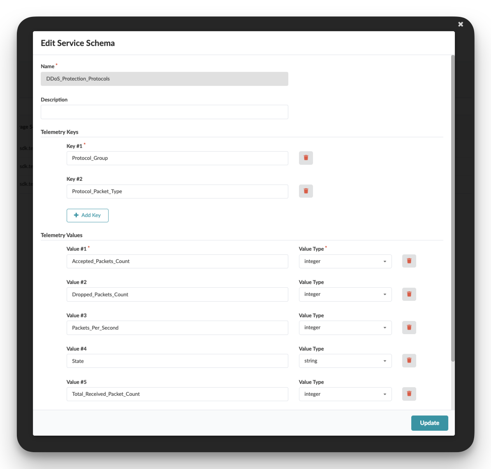

<br>

```json
{
  "key": {
    "Protocol_Group": "string",
    "Protocol_Packet_Type": "string"
  },
  "value": {
    "Accepted_Packets_Count": "integer",
    "Dropped_Packets_Count": "integer",
    "Packets_Per_Second": "integer",
    "State": "string",
    "Total_Received_Packet_Count": "integer",
    "Violation_Count": "integer"
  }
}
```

<br>

### Telemetry Collectors


> **Note**  
> The collectors are imported as part of the service schema

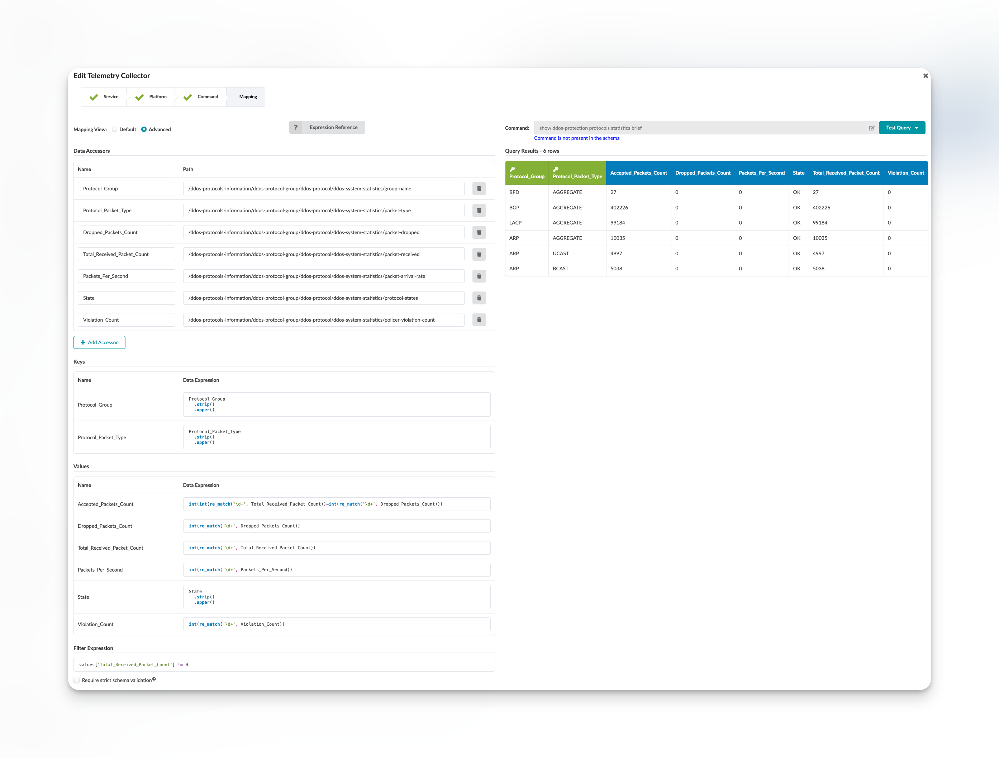

Pay attention to the expression used in the `Value` and the logic to convert the text string provided by the `policer-violation-count` field into an integer value. The  `policer-violation-count` field returns a value in a decimal format, such as `0.0`, which seems odd, considering this represent a count which in theory should only be decimal.
The collector is configured to convert that into an integer value using a regular expression passed to the `re_match` function. 


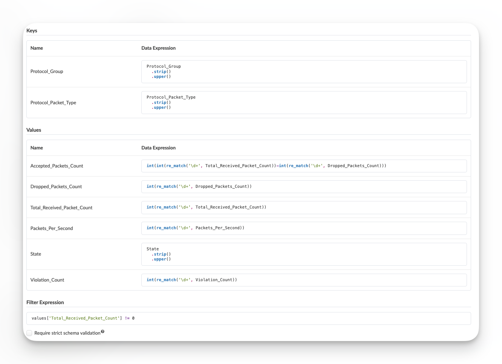

1. `Protocol_Group`:
```python
Protocol_Group
    .strip()   # Removes whitespace from beginning and end
    .upper()   # Converts the string to uppercase
```

2. `Protocol_Packet_Type`:
```python
Protocol_Packet_Type
    .strip()   # Removes whitespace from beginning and end
    .upper()   # Converts the string to uppercase
```

**Values Section:**
1. `Accepted_Packets_Count`:
```python
int(int(re_match('\d+', Total_Received_Packet_Count)) - int(re_match('\d+', Dropped_Packets_Count)))
# Takes the total received packets and subtracts dropped packets
# re_match('\d+', ...) extracts one or more digits from the string
# Result is converted to integer
```

2. `Dropped_Packets_Count`:
```python
int(re_match('\d+', Dropped_Packets_Count))
# Extracts one or more digits from Dropped_Packets_Count string
# Converts the result to integer
```

3. `Total_Received_Packet_Count`:
```python
int(re_match('\d+', Total_Received_Packet_Count))
# Extracts one or more digits from Total_Received_Packet_Count string
# Converts the result to integer
```

4. `Packets_Per_Second`:
```python
int(re_match('\d+', Packets_Per_Second))
# Extracts one or more digits from Packets_Per_Second string
# Converts the result to integer
```

5. `State`:
```python
State
    .strip()   # Removes whitespace from beginning and end
    .upper()   # Converts the string to uppercase
```

6. `Violation_Count`:
```python
int(re_match('\d+', Violation_Count))
# Extracts one or more digits from Violation_Count string
# Converts the result to integer
```

**Filter Expression:**
```python
values['Total_Received_Packet_Count'] != 0
# Ensures that Total_Received_Packet_Count is not zero
# This is used to filter out any entires that have seen 0 packets
```

The common patterns here are:
- String values (Protocol_Group, Protocol_Packet_Type, State) are stripped of whitespace and converted to uppercase
- Numeric values use `re_match('\d+', ...)` to extract digits from strings and convert them to integers
- `Accepted_Packets_Count` is calculated by subtracting dropped packets from total received packets
- The filter ensures we only process records with non-zero received packets


```python
int(re_match('\d+', value)) 
```

<br>

### Probes


> **Note**  
> Probes are imported as part of the dashboard `.json` file.


#### Probe Pipeline Structure

<br>

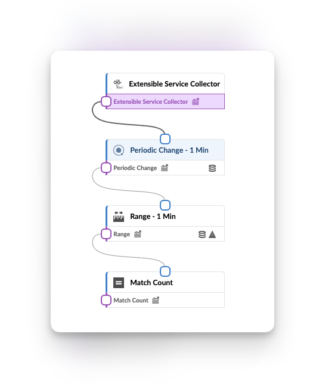

The probe pipeline consists of a Source processor and four processing stages that perform distinct tasks for DDoS protection monitoring.

<br>

#### Probe Processors Details

**Source Processor Configuration:**

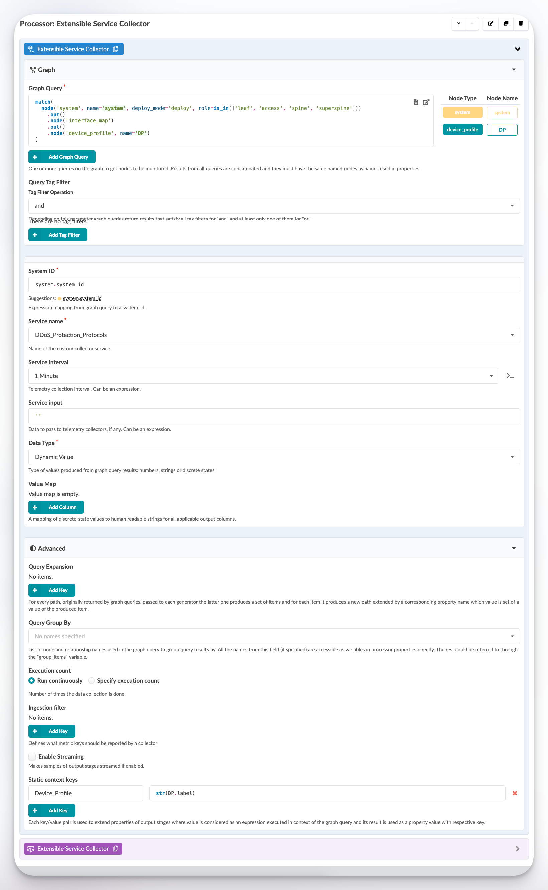

The Source processor performs a graph query selecting all systems in the current blueprint that are deployed with roles: leaf, access, spine, or super spine. Additional device profile information is incorporated using:
- Device profile data (labelled as 'DP' in the query)
- Static context keys with:
  - Column: device_profile
  - Value: Extracted from DP.label (wrapped in string format)

<br>

Output stage:

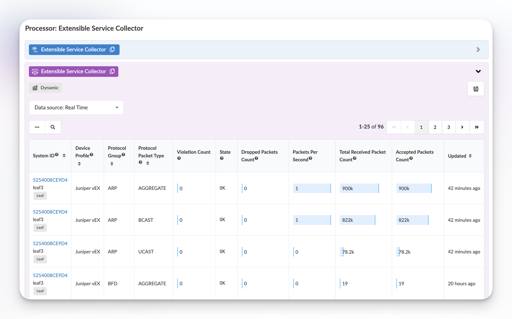

<br>

**Match Count Processor Configuration:**

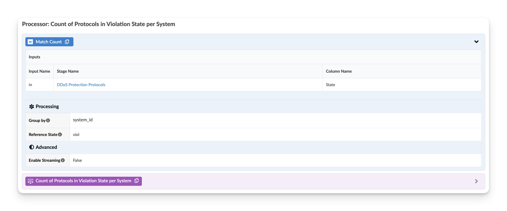

This processor monitors DDoS protection filter states on Juniper switches:
- Tracks states: OK or Violation (VIOL)
- Counts violations across different control plane packet types per switch
- Measures increments between collection cycles

<br>

Output stage:

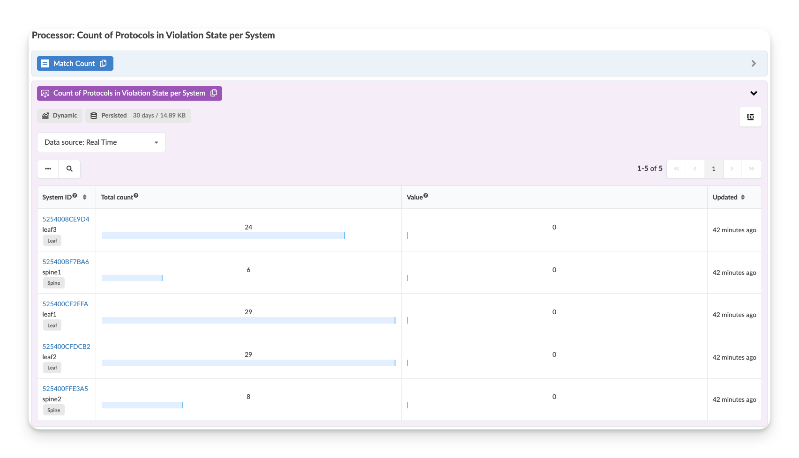

<br>

**Match String Processor Configuration:**

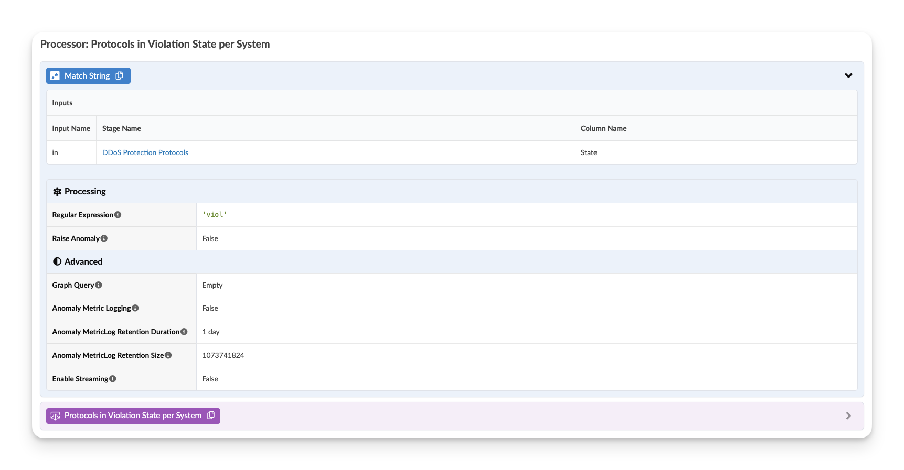

This processor:
- Monitors the state from the source processor
- Flags as 'true' if any control plane protection filters enter violation state
- Does not generate anomalies at this stage

<br>

Output stage:

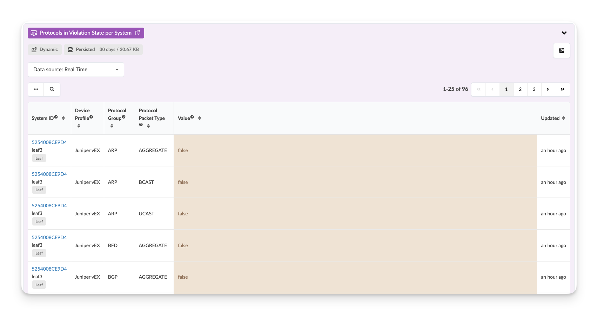

<br>

**Periodic Change Processor Configuration:**


This processor:
- Groups data by system and protocol group
- Feeds into the Range processor
- Monitors changes in violation count

Output stage:

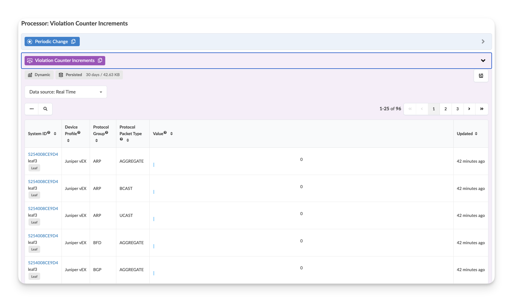

**Range Processor Configuration:**

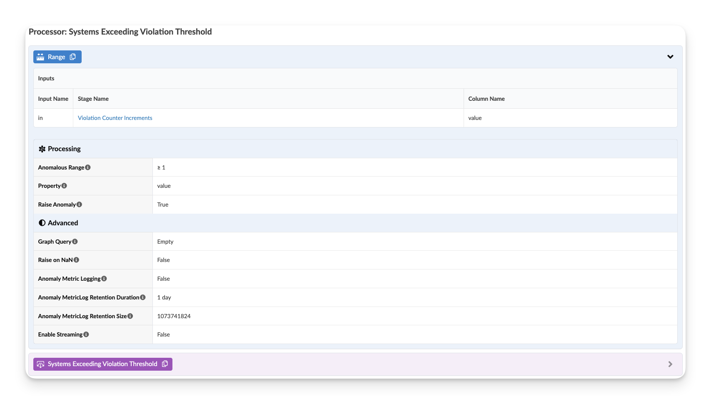

This processor:
- Monitors violation count changes
- Raises anomalies when count ≥ 1
- Example: Raises anomaly if SSH control plane protection filter violations increment from 0 to 1

Output stage:

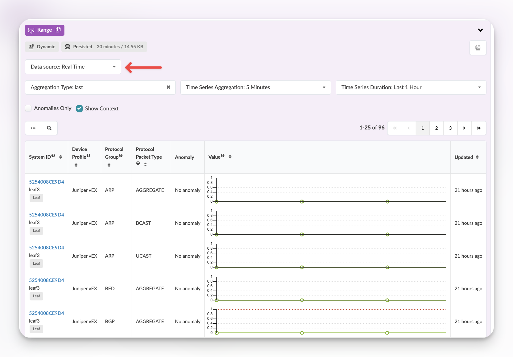

**Note:** Several stages in this probe have anomaly metric log retention enabled, allowing data to be stored in the metric DB for time series analysis.


### Dashboards

The "DDoS Protection Protocols" dashboard provides a comprehensive view of DDoS protection monitoring through these primary widgets:

1. "Count of Protocols in Violation State grouped per System (Real-Time)"
   - Shows real-time status of devices with violations
   - Only displays non-zero violation counts to reduce noise
   - Displays as fuel gauges for quick visual reference
   - Filter: Shows only systems with active violations
   - Key metrics:
     - System ID
     - Total Count of active control planes
     - The number that are in the violation state per system

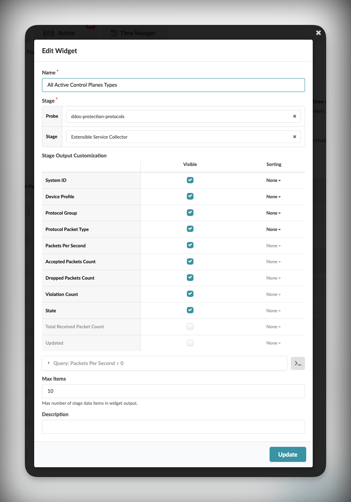

2. "Breakdown of protocols in violation state (Real-Time)"
   - Detailed view of systems in violation state
   - Shows correlation between discards and violations
   - Displays violation thresholds and current counts
   - Example: Can show 600K discards resulting in 12 violations
   - Metrics include:
     - Violation Count
     - Packet Statistics
     - Protocol Details

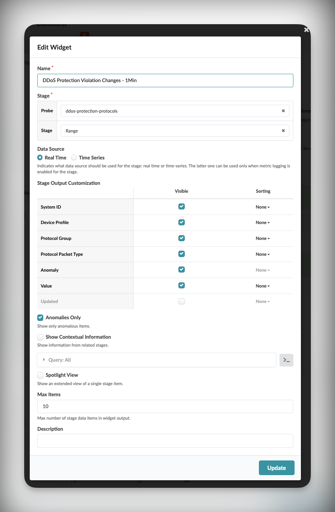

3. "Systems Exceeding Violation Threshold - Last 7 days"
   - Historical view of violation states
   - Aggregation: 1-hour intervals
   - Shows discrete state changes (OK/VIOL)
   - Retention period: 7 days
   - Enables trend analysis and pattern identification

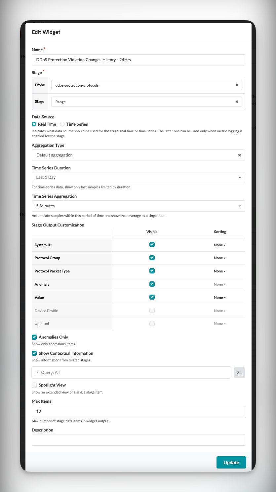

Usage Notes:
- In normal conditions, widgets may show "No data" indicating no violations
- Users can drill down from summary views to detailed information
- Historical views maintain visibility of past events after real-time alerts clear
- Dashboard designed to minimize alert fatigue while ensuring visibility of actual violations
- Filters persist when drilling down from widgets to probes


Key Dashboard Features:
- Left side widgets focus on real-time monitoring
- Right side provides a historical perspective
- Default view shows only active violations to reduce noise

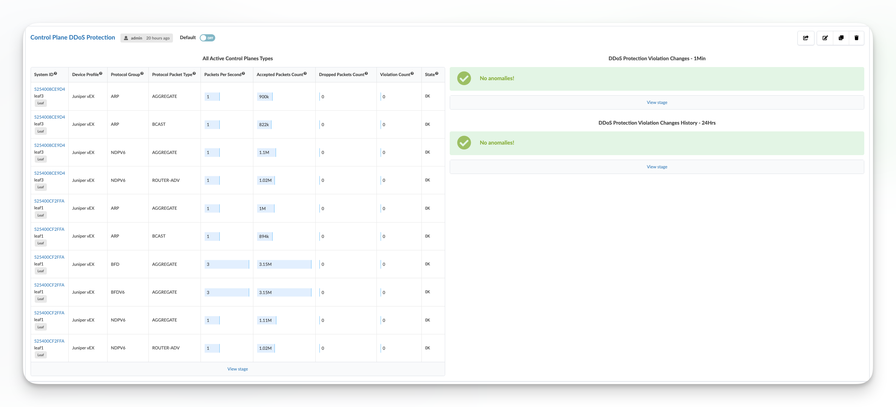
