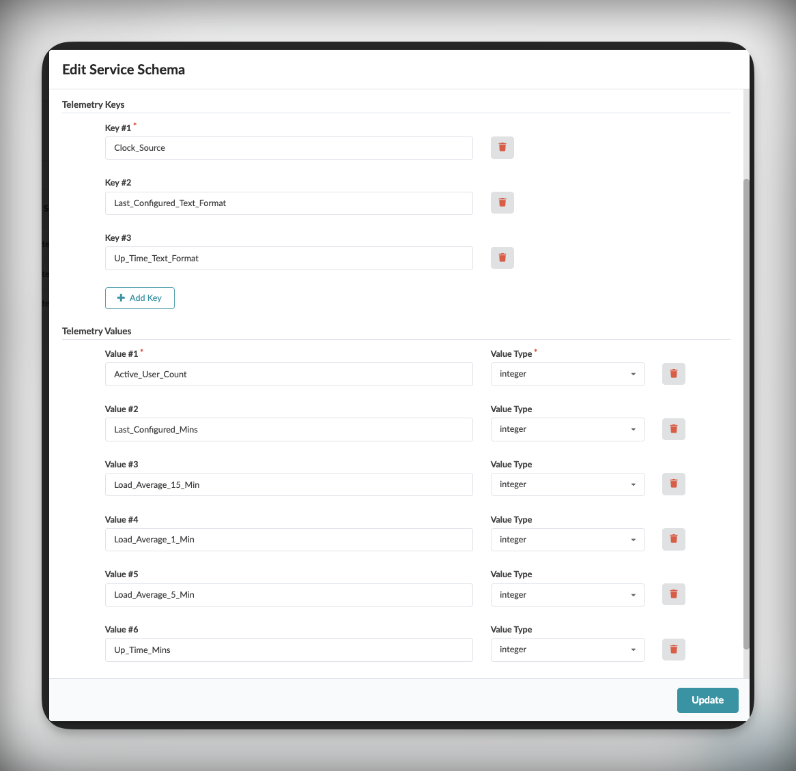
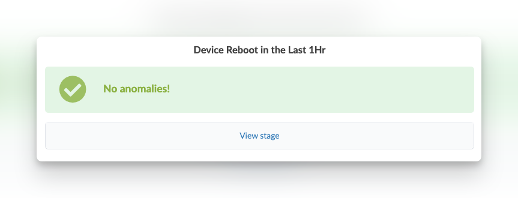
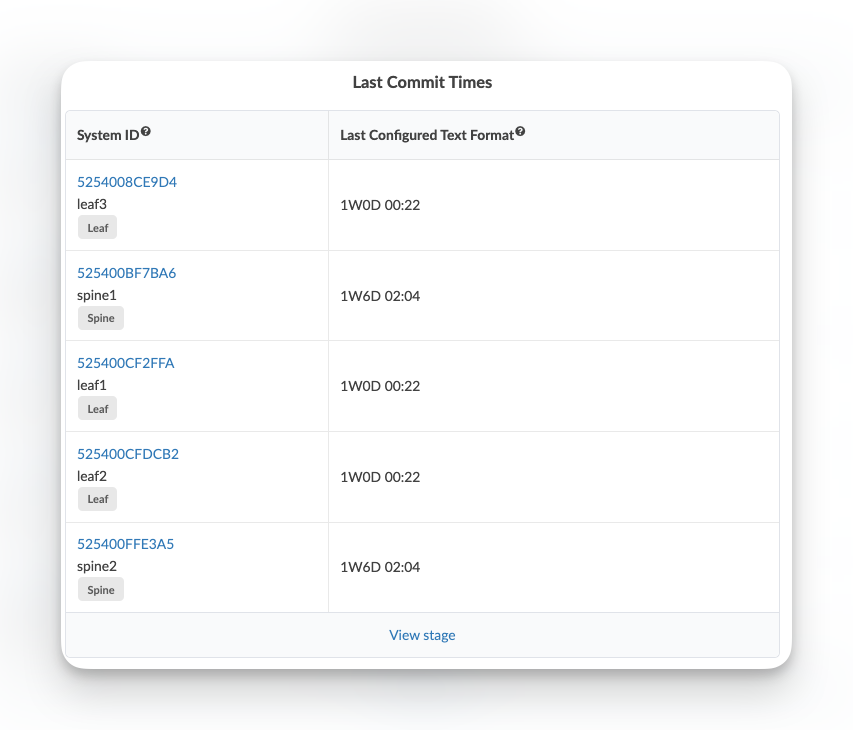
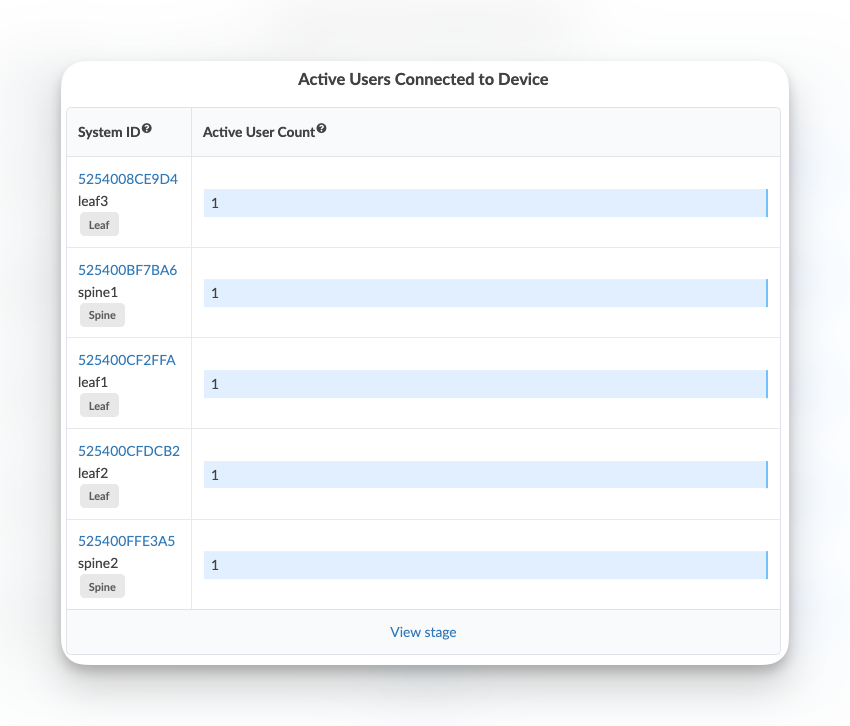
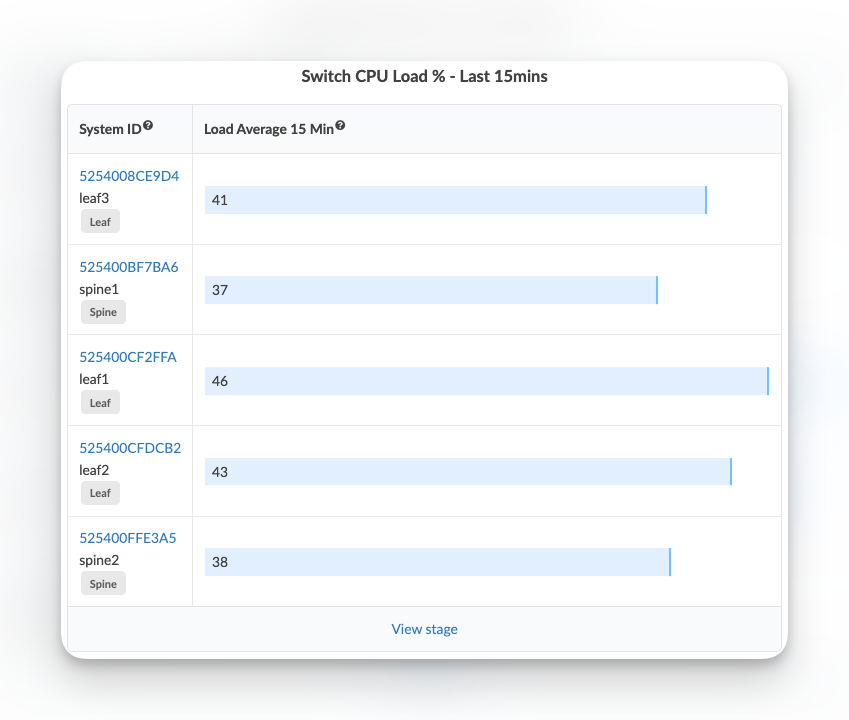
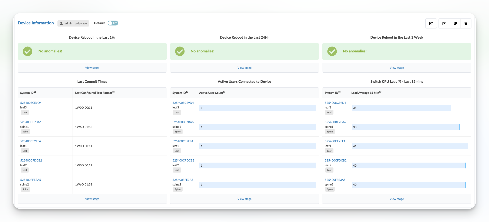

# Device Uptime

Table of Contents:
- [Device Uptime](#device-uptime)
  - [Description of the use-case](#description-of-the-use-case)
  - [Identification of the source data (raw data)](#identification-of-the-source-data-raw-data)
  - [Content](#content)
    - [Configlets](#configlets)
    - [Property Sets](#property-sets)
    - [Telemetry Service Schema](#telemetry-service-schema)
    - [Telemetry Collectors](#telemetry-collectors)
    - [Probes](#probes)
      - [Probe pipeline structure](#probe-pipeline-structure)
      - [Probe processors details](#probe-processors-details)
    - [Dashboards](#dashboards)

<br>

## Description of the use-case

- Collect device's system uptime, active logged in users, last commit times for all devices in my blueprint, and raise an anomaly if the device rebooted in the last 1h, one day, or one week. 
- Store the historical result so I can see when the anomalies occurred.

<br>

## Identification of the source data (raw data)

- CLI Command: `show system uptime` - [Junos documentation page](https://www.juniper.net/documentation/us/en/software/junos/junos-overview/topics/ref/command/show-system-uptime.html#:~:text=The%20show%20system%20uptime%20command%20by%20itself%20shows%20system%2Dwide,%7C%20re1%20%7C%20fpc0%20%7C%20all%20). 
- Sample Text Output:
```
Current time: 2023-12-14 11:31:56 UTC
Time Source:  LOCAL CLOCK 
System booted: 2023-10-30 17:31:27 UTC (6w2d 18:00 ago)
Protocols started: 2023-10-30 17:32:34 UTC (6w2d 17:59 ago)
Last configured: 2023-12-06 10:46:26 UTC (1w1d 00:45 ago) by aosadmin
11:31AM  up 44 days, 18 hrs, 0 users, load averages: 1.30, 0.95, 0.83
```

<details>
    <summary>Sample XML Output:</summary>

```xml
<rpc-reply xmlns:junos="http://xml.juniper.net/junos/23.2R1.14/junos">
    <system-uptime-information xmlns="http://xml.juniper.net/junos/23.2R0/junos">
        <current-time>
            <date-time junos:seconds="1702553555">2023-12-14 11:32:35 UTC</date-time>
        </current-time>
        <time-source> LOCAL CLOCK </time-source>
        <system-booted-time>
            <date-time junos:seconds="1698687087">2023-10-30 17:31:27 UTC</date-time>
            <time-length junos:seconds="3866468">6w2d 18:01</time-length>
        </system-booted-time>
        <protocols-started-time>
            <date-time junos:seconds="1698687154">2023-10-30 17:32:34 UTC</date-time>
            <time-length junos:seconds="3866401">6w2d 18:00</time-length>
        </protocols-started-time>
        <last-configured-time>
            <date-time junos:seconds="1701859586">2023-12-06 10:46:26 UTC</date-time>
            <time-length junos:seconds="693969">1w1d 00:46</time-length>
            <user>aosadmin</user>
        </last-configured-time>
        <uptime-information>
            <date-time junos:seconds="1702553555">11:32AM</date-time>
            <up-time junos:seconds="3866460">44 days, 18:01</up-time>
            <active-user-count junos:format="0 users">0</active-user-count>
            <load-average-1>1.24</load-average-1>
            <load-average-5>0.97</load-average-5>
            <load-average-15>0.84</load-average-15>
            <user-table>
            </user-table>
        </uptime-information>
    </system-uptime-information>
    <cli>
        <banner></banner>
    </cli>
</rpc-reply>
```
</details>
  
<br>

| Field | Information |
| --- | --- |
| `Time Source` | System time source (LOCAL CLOCK/NTP CLOCK) |
| `Last Configured` | Time since last configuration change |
| `Up Time` | System uptime in various formats |
| `Active User Count` | Number of active users |
| `Load Average` | System load averages for 1, 5, and 15 minutes |

<br>

## Content

### Configlets
No configlet  used in this example.

<br>

### Property Sets
No Property Sets  used in this example.

<br>

### Telemetry Service Schema 
```
├── telemetry-service-definitions
    └── Final_Service_Schema_Switch_System_Information.json
```



Structure of the service schema:
```json
{
  "key": {
    "Clock_Source": "string",
    "Last_Configured_Text_Format": "string",
    "Up_Time_Text_Format": "string"
  },
  "value": {
    "Active_User_Count": "integer",
    "Last_Configured_Mins": "integer",
    "Load_Average_15_Min": "integer",
    "Load_Average_1_Min": "integer",
    "Load_Average_5_Min": "integer",
    "Up_Time_Mins": "integer"
  }
}
```
<br>

### Telemetry Collectors

> **Note**  
> The collectors are imported as part of the service schema


Pay attention to the expression used in the `Value` section and the logic to convert the text string provided by various uptime and time format fields into standardized values. The complex expressions are required due to the variety of different formats returned by these fields, such as:
- "24 days, 23:45"
- "1w2d 00:26:08"
- "2d 00:26:08"
- "00:26:08"
- "36 mins"

> **NOTE**
> Python based expressions are supported as long as they are expressed in a one-liner. For example to express an `If This Than That` condition, it will need to be slightly tweaked to be `That if This`, or `That If This Else SomeThingElse`. In other words, the conditional logic should be expressed as `<value_if_true> if <condition> else <value_if_false>`.


**Keys Section Processing:**

1. `Clock_Source`:
```python
# Example input: "LOCAL CLOCK" or "NTP CLOCK"
str(
  Clock_Source  # "LOCAL CLOCK"
    .upper()    # "LOCAL CLOCK"
)
```

2. `Last_Configured_Text_Format`:
```python
# Example input: "1w2d 00:26:08" or "24 days, 23:45"
str(
  Last_Configured_Text_Format  # "1w2d 00:26:08"
    .upper()                  # "1W2D 00:26:08"
)
```

3. `Up_Time_Text_Format`:
```python
# Example input: "44 days, 18:01" or "6w2d 18:01"
str(
  Up_Time_Text_Format  # "44 days, 18:01"
    .upper()          # "44 DAYS, 18:01"
)
```

**Values Section Processing:**

1. Active User Count:
```python
# Example input: "0" or "5"
int(Active_User_Count)  # Converts "0" to 0
```

2. Load Averages (1, 5, and 15 minutes):
```python
# Example input: "1.24" or "0.97" or "0.84"
int(re_search('\\.(\d+)', Load_Average_X_Min)) or 0
# "1.24" -> extracts "24"
# "0.97" -> extracts "97"
# If no match found -> returns 0
```

3. Time Conversions (for both Last_Configured_Mins and Up_Time_Mins):
```python
# Example inputs:
# "1w2d 00:26:08" -> 12,986 minutes (1 week + 2 days + 0 hours + 26 minutes)
# "24 days, 23:45" -> 35,985 minutes (24 days + 23 hours + 45 minutes)
# "36 mins" -> 36 minutes

int(re_search('(\d+)w', Text_Format) or 0) * 10080  # "1w" -> 1 * 10080 = 10080 minutes
+ int(re_search('(\d+)\sd', Text_Format) or 0) * 1440  # "2d" -> 2 * 1440 = 2880 minutes
+ int(re_search('(\d+):', Text_Format.split()[-1]) or 0) * 60  # "00:" -> 0 * 60 = 0 minutes
+ int(re_search(':(\d+)', Text_Format.split()[-1]) or 0)  # ":26" -> 26 minutes
```

The collector uses these expressions to normalize all time-based data into minutes for consistent processing by the probe pipeline. This standardization is crucial for accurate time calculations and threshold comparisons in the probe processors.
<br>

### Probes

> **Note**  
> Probes are imported as part of the dashboard `.json` file.

#### Probe pipeline structure

<br>


<br>

#### Probe processors details

Source Processor configuration:


<br>

Output stage:


<br>

To implement the anomaly raising logic for reboot in last **1h** / **1 day** / **1 week** without duplicating the anomalies (i.e having a device which rebooted 45mn ago to appear in both 1h and 1day) we will configure the Range check processors in secitons: one section for uptime <= `60` mn, a second section for uptime > `60` mn and <= `1440` mn (total minutes count for a **day**) and a third section for uptime > `1440` mn and <= `10080` mn (total minutes count for a **week**).

<br>

`Range` processor configuration to raise anomaly for device which rebooted in the last hour:


<br>

`Range` processor configuration to raise anomaly for device which rebooted in the last day (and more than one hour ago):


<br>

`Range` processor configuration to raise anomaly for device `Range` processor configuration to raise anomaly for device which rebooted in the last Week (and more than one day ago):


<br>

### Dashboards

The "Device Information" dashboard provides system information not shown the input dashboards via four main widgets:

1. "Device Reboot"
   - Three seperate widgets that alert if a device has rebooted in the last:
     - One hour
     - Twenty-Four hours
     - One week
   - Only show anomalous events




2. "Time Since Last Commit"
   - Gives the last time a commit was done on each device
   - No anomalies will be raised by this, they are informtation only



3. "Active Users Connected to Devcie"
   - Shows the current number of active users connected to the switch (NetCONF, SSH, etc)
   - No anomalies will be raised by this, they are informtation only
   - Will display at least one user as Apstra had connected to switch when collecting this data



4. "Switch CPU Load % - Last 15mins"
   - Shows the average CPU usage reported by the switch in the last 15 minutes of operation
   - No anomalies will be raised by this, they are informtation only
   - Shows a percentage



Dashboard Layout:
- Vertical layout with three equal sections
- Each section dedicated to a specific resource type


